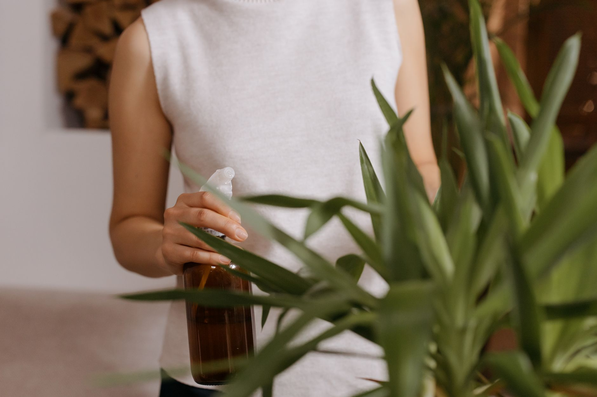

Most houseplant problems that show up in November and December were actually set in motion weeks earlier, in September and October, when the care routine didn't change even though the plant's environment already had. Shorter days, weaker light, and drier indoor air from the heating system all shift what a plant needs, and a watering can that worked fine in July can drown a plant by winter. The good news is that the adjustment is mostly about doing less, not more — you're dialing routines back to match a plant that's slowing down, not fighting a new problem.

## Why Your Plants Need Less Water Now

As daylight hours shrink, most houseplants photosynthesize less and use water more slowly, which means the soil stays wet longer between waterings even if you don't change how much you give them. Watering on the same weekly schedule you used all summer is the single most common way houseplants get overwatered in fall and winter — the roots are sitting in moisture they simply aren't using up as fast anymore. Switch from a calendar-based schedule to checking the soil directly: stick a finger an inch or two down, or lift the pot to gauge its weight, and only water when it's actually dry at that depth. For most houseplants that means stretching from a weekly watering to something closer to every 10-14 days, though the exact interval depends heavily on the plant, the pot, and how warm your home runs.

## Chasing the Light as It Moves

The sun's angle drops through fall, and a spot that got bright indirect light all summer can end up in weak, indirect shade by late October — the same window, delivering noticeably less light. Walk around your home at different times of day and actually look at where the brightest spots have shifted to; south-facing windows generally hold onto more usable light through winter than east- or west-facing ones, which lose their direct sun window as the sun's arc lowers. Plants that tolerated a few feet of distance from a bright window in summer often need to move right up against the glass in winter to get an equivalent amount of light. If a plant was already borderline on light in summer, treat fall as the deadline to either relocate it or accept slower, sparser growth until spring.

## When (and Whether) to Use a Grow Light

For plants in rooms that just don't have a bright winter spot, a simple grow light on a timer is a reasonable fix rather than a last resort. Full-spectrum LED grow lights are inexpensive, run cool enough to sit close to foliage, and don't need to be dramatic — a small clip-on or desktop unit positioned a foot or so above the plant, running for 10-12 hours a day, is enough to meaningfully offset weak natural light. A timer matters more than the light itself, since consistency is what plants respond to, and remembering to switch a lamp on and off by hand rarely stays consistent past the first week. Not every plant needs one; a healthy plant that's simply growing slower in winter is normal and doesn't need supplemental light to survive the season, but a plant that's dropping leaves or stretching toward the window (leggy, sparse growth reaching one direction) is telling you it doesn't have enough.

## Adjust Feeding — or Stop Altogether

Most houseplants enter a natural dormant or semi-dormant period once light drops, and feeding a plant that isn't actively growing doesn't help it — it just lets unused fertilizer salts build up in the soil, which can burn roots over time. For most common houseplants, stop feeding entirely from around late fall through winter and resume in spring when you see new growth starting again. If you have a plant that's a genuine exception and keeps producing visible new leaves through winter (often true for plants under strong grow lights or in very bright, warm rooms), a light feeding at quarter or half the usual strength once a month is reasonable, but default to skipping fertilizer rather than assuming your plant needs it.

## Watch Humidity as Heating Kicks In

Indoor heating systems pull moisture out of the air, often dropping indoor humidity well below what most tropical houseplants prefer, right at the same time plants are already stressed by lower light. Crispy brown leaf tips and edges that show up in winter are usually a humidity problem, not a watering problem — resist the instinct to water more heavily in response, since that just adds overwatering on top of dry air. Grouping plants together raises the humidity in their immediate area, a small humidifier nearby helps more directly, and keeping plants away from heating vents and radiators avoids blasting them with the driest, hottest air in the room. Misting offers only brief relief and isn't a real substitute for raising ambient humidity, but it's a fine supplement if you're already doing one of the other two.

## Signs Your Plant Hasn't Adjusted Well

A plant that's struggling with the seasonal shift usually shows one of a few patterns: yellowing lower leaves and a soil surface that stays damp for over a week point to overwatering for the new, slower pace of growth. Leggy stems stretching toward a window, or smaller new leaves than the plant produced in summer, point to insufficient light. Crisp, brown leaf edges without any yellowing usually mean the air is too dry rather than the plant being underwatered. None of these are emergencies — they're feedback. Because winter growth is slow, a correction you make now (watering less, moving the plant closer to light, adding humidity) typically takes a few weeks to show visible improvement, so give a fix time to work before assuming it failed and trying something else.
