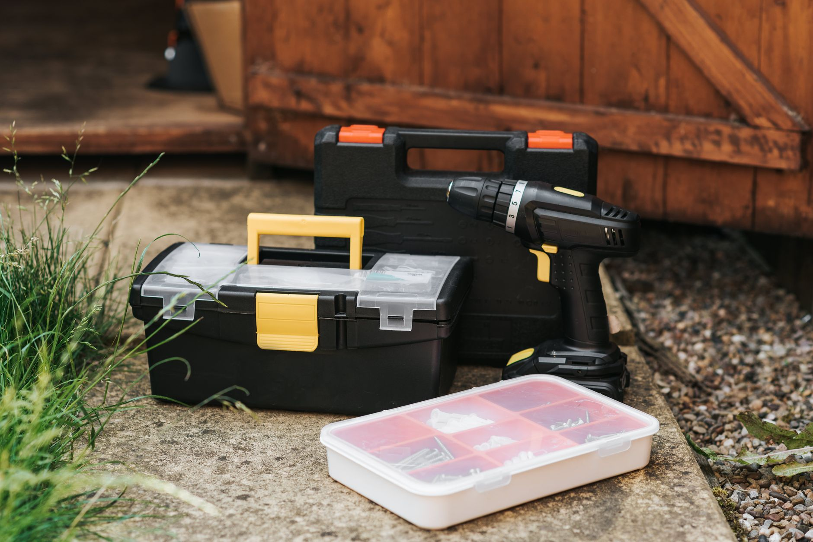

Combo kits bundle several tools on one battery platform at a lower combined price than buying each separately — but only if you'll actually use most of what's in the box.

## Why Combo Kits Make Sense

The battery and charger are usually the most expensive part of a cordless tool. A combo kit spreads that cost across 3-6 tools instead of one, which is why a drill-only purchase often costs nearly as much per-tool as a 4-piece kit. Once you own a battery platform, every additional bare tool (a tool sold without its own battery) tends to cost noticeably less than the same tool bought standalone with a battery included, since you're only paying for the motor and housing. That's the real long-term value of committing to a combo kit: it's not just the upfront bundle discount, it's cheaper expansion later.

It also simplifies charging and storage. Instead of juggling different battery shapes, voltages, and chargers for a drill from one brand and a saw from another, everything in a combo kit shares the same batteries and the same charging dock. That matters more than it sounds like on a busy project weekend, when you don't want to be hunting for the one charger that fits.

## What to Check Before Buying

- **Which tools are actually included** — kits vary widely; some bundle a drill, impact driver, and light, others add a reciprocating saw or circular saw. Read the box contents line by line rather than assuming based on the kit's name.
- **Battery amp-hours (Ah)** — higher Ah means longer runtime per charge. Entry kits often ship with smaller batteries (1.5-2.0Ah) that you may want to upgrade later. If the listing doesn't specify Ah, treat that as a yellow flag and look it up before buying.
- **Brushless vs. brushed motors** — brushless costs more but runs cooler, lasts longer under regular use, and typically delivers more power per charge. For occasional use, a brushed motor is still perfectly fine and shouldn't be a dealbreaker at a lower price point.
- **Battery platform compatibility** — if you already own tools from a brand, check that a new kit's batteries are cross-compatible with your existing ones. Voltage labeling can be inconsistent between product lines from the same manufacturer, so confirm compatibility rather than assuming from the number on the box.
- **Number of batteries included** — two batteries is the practical minimum so one can charge while the other is in use. A kit with only one battery effectively pauses your project every time it runs down.

## What's Actually in the Box

Most beginner-friendly kits include a drill/driver, impact driver, two batteries, a charger, and a carrying case or bag. Mid-tier kits add a circular saw or reciprocating saw; higher-end kits sometimes include an oscillating multi-tool or work light. Pay attention to whether accessories like drill bits, driver bits, or a saw blade are included — some budget kits ship with bare tools and expect you to buy consumables separately, which changes the real total cost.

The case itself is worth a look too. A molded case with cutouts for each tool keeps everything organized and protects the tools in a truck bed or garage shelf, while a simple soft bag offers less protection but takes up less space. Neither is objectively better — it depends on how and where you'll be storing the kit.

## Common Mistakes When Buying a Combo Kit

A frequent misstep is buying into a battery platform based on the kit price alone, without checking what future tools on that platform cost or how widely available they are locally. If a brand's individual bare tools are hard to find or expensive where you shop, you'll pay for that later even if the starter kit itself was a bargain.

Another common mistake is overbuying. A 6-tool kit looks like a better deal per tool than a 3-tool kit, but if you'll only ever reach for the drill and the impact driver, the extra tools are dead weight taking up shelf space — and you paid for the privilege. Match the kit size to projects you actually do, not projects you might someday do.

Finally, don't ignore warranty terms in the excitement of a sale price. Some manufacturers extend the standard warranty if you register the tools within a set window after purchase, which costs nothing but a few minutes and can matter if a battery or motor fails down the line.

## Storage and Maintenance

Cordless tool batteries degrade faster when stored fully depleted or left on the charger indefinitely after they're topped up. Where possible, store batteries at a partial charge if you won't be using the tools for an extended stretch, and keep them somewhere temperature-stable rather than a hot garage or a freezing shed, since extreme temperatures shorten battery lifespan.

Wipe down tools after dusty or wet work, and check chuck jaws and driver bits periodically for debris buildup — a gritty chuck is a common reason a drill starts slipping on bits well before the motor itself has any real wear.

## Our Recommendation

For most homeowners starting out, a 4-piece kit (drill, impact driver, two batteries, charger) hits the sweet spot — enough capability for real projects without paying for specialty tools you'll rarely touch. If you already know a bigger renovation or an outdoor project is coming up, it's worth stepping up to a kit that includes a circular saw or reciprocating saw from the start, since adding that tool later as a bare-tool purchase will cost close to what the upgraded kit would have.
