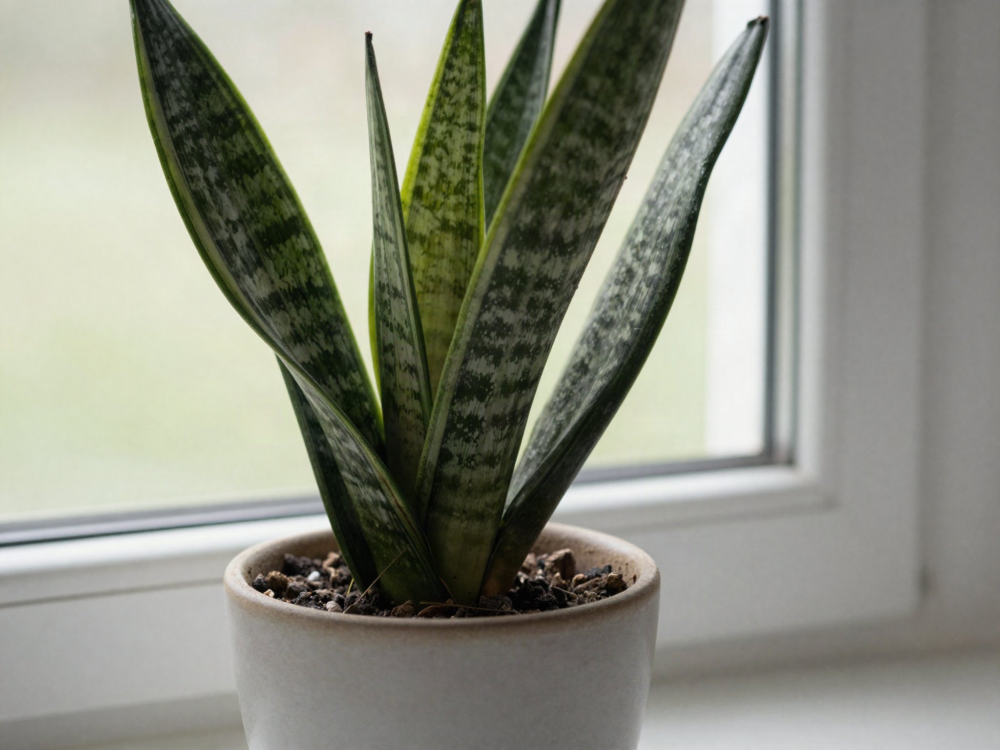

"Low light" doesn't mean "no light" — every plant needs some, even if it's just ambient light from a north-facing window. But these ten species tolerate dim corners better than almost anything else you can buy.

## 1. Snake Plant (Dracaena trifasciata)

Nearly indestructible. Tolerates low light and irregular watering, and its upright leaves work well in tight spaces like hallways.

## 2. ZZ Plant (Zamioculcas zamiifolia)

Stores water in its rhizomes, so it thrives on neglect. Glossy leaves reflect what little light is available, helping it photosynthesize efficiently.

## 3. Pothos (Epipremnum aureum)

A trailing vine that adapts to almost any light condition. Variegated varieties need slightly more light to keep their patterning.

## 4. Cast Iron Plant (Aspidistra elatior)

Literally bred for Victorian parlors with gas lighting. Slow-growing but extremely tolerant of low light and inconsistent care.

## 5. Peace Lily (Spathiphyllum)

Tells you when it's thirsty by drooping dramatically, then perks back up within hours of watering — useful feedback for beginners.

## Care Tips for Low-Light Spaces

- Water less often than you think — low light slows growth and water uptake.
- Wipe dust off leaves monthly so what light there is can actually reach the plant.
- Rotate pots a quarter turn every couple of weeks for even growth.
