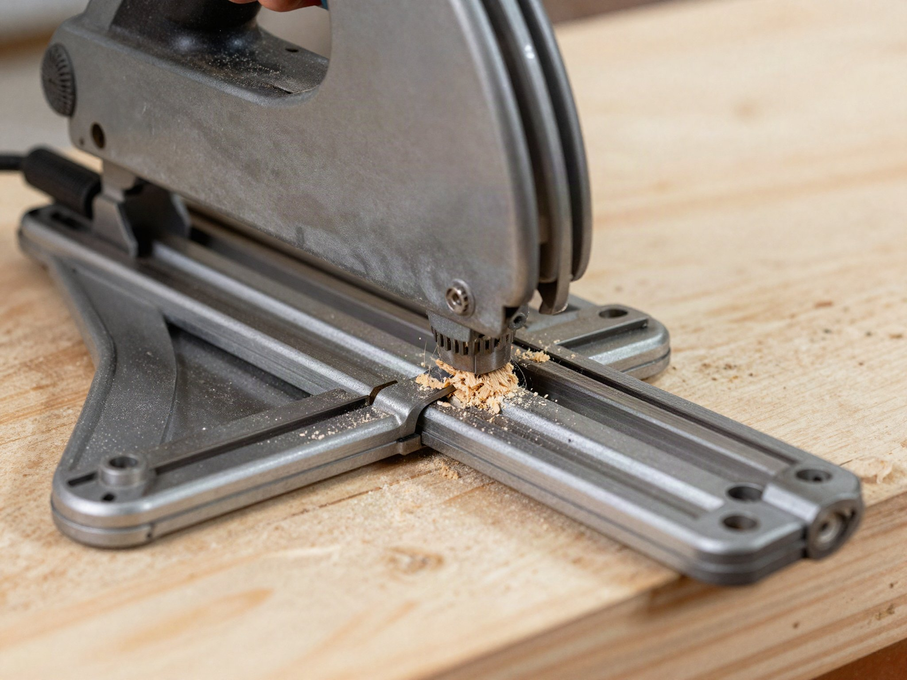

Both tools cut wood in a straight line, but they're built for different jobs — and buying the wrong one means fighting your tool on every project.

## Circular Saws: The Generalist

A circular saw is the more versatile, budget-friendly option. It's handheld, works freehand or with a simple straightedge clamped to your material, and handles everything from framing lumber to rough plywood cuts. It's also the saw most people already own, since it's often the first power saw a homeowner buys, long before they've decided whether woodworking is a serious hobby or a one-project fling.

**Best for:** framing, deck building, general construction, cutting lumber to rough length, and quick cuts where the edge won't be visible in the finished project.

**Downside:** cut accuracy depends entirely on your steadiness and the quality of your guide — freehand cuts on plywood often leave visible tear-out on the top face. Blade wander is also more common with a circular saw, especially on longer cuts, since there's nothing physically keeping the base plate on a fixed line the way a track does.

## Track Saws: The Precision Tool

A track saw rides along a guide rail that clamps or sticks to your material, producing dead-straight, splinter-free cuts even on expensive plywood and veneered panels. Many models also plunge-cut, letting you start a cut in the middle of a panel without a pre-drilled hole. The riving knife and anti-kickback features on most track saws also make them noticeably safer to use solo, which matters when you're breaking down large sheets without a second pair of hands to steady the material.

**Best for:** cabinetry, furniture building, cutting sheet goods (plywood, MDF) for a clean finish, breaking down full 4x8 sheets by yourself, and any cut where the edge will be visible in the finished piece.

**Downside:** more expensive, and the track adds setup time you don't need for rough framing cuts. Tracks also need to be stored somewhere they won't warp or get damaged, which is an extra consideration circular saw owners don't have to think about.

## Cut Quality in Practice

The difference isn't just theoretical. A track saw's zero-clearance edge on the rail's rubber strip supports the wood fibers right at the cut line, which is what prevents the splintering you commonly see on the top face of plywood cut with a circular saw and a straightedge. If you've ever had to fill and sand a chipped edge on a bookshelf or cabinet side, that's the exact problem a track saw solves.

Circular saws can get closer to that result with a sharp, fine-tooth blade and a sacrificial strip of tape along the cut line, but it's a workaround, not a built-in feature. For rough framing where the cut gets covered by siding or drywall, none of this matters — which is exactly why circular saws remain the standard tool for that kind of work.

## Portability and Setup

A circular saw is ready to use the moment you pick it up: set the blade depth, line up your straightedge, and cut. A track saw needs the rail positioned and clamped or stuck down before you make a single cut, which adds a few minutes per setup. On a job site cutting dozens of studs to length, that extra setup time adds up fast and makes the circular saw the clear choice.

On the other hand, a track saw's rail system makes repeat cuts at the same width faster and more consistent once it's set up, since you're not re-measuring and re-marking a straightedge for every pass the way you would with a circular saw.

## Price and Value

Circular saws start around $50-80 for a serviceable homeowner model; a decent track saw with a rail typically starts at $250-400, and a full setup with multiple track lengths can run higher. If you're only building the occasional shelf or deck, that price gap is hard to justify. If cabinetry or furniture-grade work is a regular part of what you do, the track saw's cut quality tends to pay for itself in saved sandpaper, filler, and redo time.

## Blade Choice Matters Either Way

Whichever saw you buy, the blade you put on it affects cut quality as much as the saw itself. A high tooth-count blade (40+ teeth) designed for plywood or fine cuts will noticeably reduce tear-out on either tool, while a low tooth-count framing blade is built for speed through dimensional lumber, not clean edges. Swapping blades based on the material is a cheap way to improve results without buying a second saw.

## Our Recommendation

If your projects are mostly framing, decking, or rough carpentry, a circular saw covers you at a fraction of the cost. If you're building furniture, cabinets, or anything from plywood where the cut edge shows, a track saw pays for itself the first time you don't have to fill and sand tear-out. Many serious DIYers eventually own both — the circular saw for site work, the track saw for shop-quality cuts.
