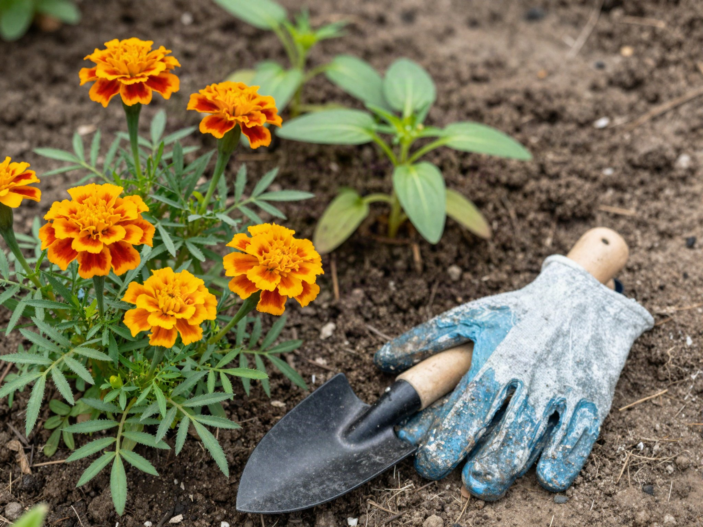

Companion planting is the practice of growing certain plants near each other because they help one another — repelling pests, improving flavor, attracting pollinators, or making better use of space. It's not folklore; a lot of it comes down to basic pest ecology and root structure.

## Classic Combinations That Work

**Tomatoes + Basil + Marigolds.** Basil is thought to improve tomato flavor and repel aphids and hornworms, while marigolds release compounds in the soil that deter nematodes. This trio is the most reliable starting point for new vegetable gardeners.

**Carrots + Onions.** Onions mask the scent that carrot flies use to find their target crop, and carrots don't compete with onions for the same soil nutrients.

**Corn + Beans + Squash** (the "Three Sisters"). Corn gives beans something to climb, beans fix nitrogen in the soil that corn and squash both use, and squash's broad leaves shade out weeds and retain soil moisture.

**Lettuce + Tall Vegetables.** Planting lettuce in the shade of taller plants like tomatoes or corn keeps it from bolting in hot weather.

**Radishes + Cucumbers or Squash.** Radishes are thought to distract cucumber beetles away from the vining crop, and since radishes mature so quickly, they're harvested and out of the way before the cucumbers or squash need the extra space.

**Nasturtiums + Almost Anything.** Nasturtiums act as a "trap crop," drawing aphids to themselves and away from nearby vegetables. They're also edible, easy to grow from seed, and tolerate poor soil better than most flowers, making them a low-effort addition to any bed.

## Why Companion Planting Actually Works

The mechanisms behind these pairings generally fall into a handful of categories: pest confusion (strong-smelling plants like onions or herbs mask the scent cues pests use to find their target crop), trap cropping (a sacrificial plant that pests prefer, pulling pressure away from your main crop), physical structure (tall plants providing shade or a climbing surface for others), and soil chemistry (nitrogen-fixing plants like beans enriching soil for heavy feeders planted nearby). Understanding which category a pairing falls into makes it easier to improvise combinations beyond a fixed list — if you know onions work by scent confusion, you can reasonably guess that other alliums like garlic or chives will have a similar effect.

## Combinations to Avoid

- **Beans near onions or garlic** — alliums stunt bean growth.
- **Tomatoes near corn** — both attract the corn earworm, which happily moves between the two.
- **Potatoes near tomatoes or squash** — all three are susceptible to blight, and planting them close together increases the risk of it spreading.

## Quick-Reference Companion Planting Chart

Bookmark this for planning day — it covers the most common vegetables and the pairings that actually hold up.

| Plant | Good Companions | Avoid Planting Near |
| --- | --- | --- |
| Tomatoes | Basil, marigolds, carrots, onions | Corn, potatoes, fennel |
| Carrots | Onions, leeks, rosemary, sage | Dill (mature), parsnips |
| Cucumbers | Beans, corn, radishes, sunflowers | Aromatic herbs, potatoes |
| Peppers | Basil, onions, spinach, carrots | Fennel, kohlrabi |
| Beans | Corn, squash, cucumbers, celery | Onions, garlic, chives |
| Squash | Corn, beans, radishes, nasturtiums | Potatoes |
| Onions | Carrots, beets, lettuce, tomatoes | Beans, peas, asparagus |
| Lettuce | Carrots, radishes, tall plants for shade | Broccoli, other brassicas |
| Potatoes | Beans, corn, cabbage, marigolds | Tomatoes, squash, sunflowers |

This isn't exhaustive — regional growing conditions and specific varieties can shift things — but it's a solid starting point for a first layout.

## Herbs and Flowers Worth Tucking In

Beyond the classic vegetable pairings, a handful of herbs and flowers pull more than their weight throughout the bed. Dill and fennel attract beneficial predatory insects like ladybugs and parasitic wasps that help control aphid populations, though dill should be kept away from carrots once it matures since the two cross-pollinate and can affect flavor. Borage is popular with pollinators and is often planted near strawberries and squash to boost fruit set. Chamomile, planted sparingly, is sometimes credited with improving the vigor of nearby plants, though its effect is subtler than something like marigolds' pest deterrence.

Interplanting flowers isn't just about companion effects, either — a bed with flowering plants mixed among the vegetables draws in more pollinators overall, which benefits every fruiting plant nearby, not just the ones directly next to the flowers.

## Spacing and Timing Considerations

Companion planting only works if the plants involved can actually coexist physically. A common mistake is planting a fast-spreading vine like squash too close to a slower-growing companion, only to have the squash's broad leaves shade it out completely by midsummer. Check mature spread, not just seedling size, before finalizing a layout.

Timing matters too. Succession planting — staggering a fast-maturing companion like radishes or lettuce alongside a slower one like tomatoes or peppers — lets you harvest the quick crop before the slower one needs the space, effectively doubling up on a single bed without overcrowding either plant.

## How to Plan Your Layout

Sketch your bed before planting season starts. Group plants by their water and sun needs first, then layer in companion pairings — a companion planting chart won't help if the two plants also need completely different amounts of water. Rotate your layout each year to avoid depleting the same nutrients from the same spot in the soil, and keep a simple record (even just a photo of your sketch) so next year's rotation is easy to plan without relying on memory.

If you're gardening in containers rather than in-ground beds, most of these principles still apply, though you'll need to be more conservative about pairing aggressive spreaders with anything else in the same pot — container space is limited enough that even friendly companions can end up competing for root room.

Companion planting isn't a guarantee against pests or disease, but it stacks the odds in your favor while making better use of a small garden footprint.
