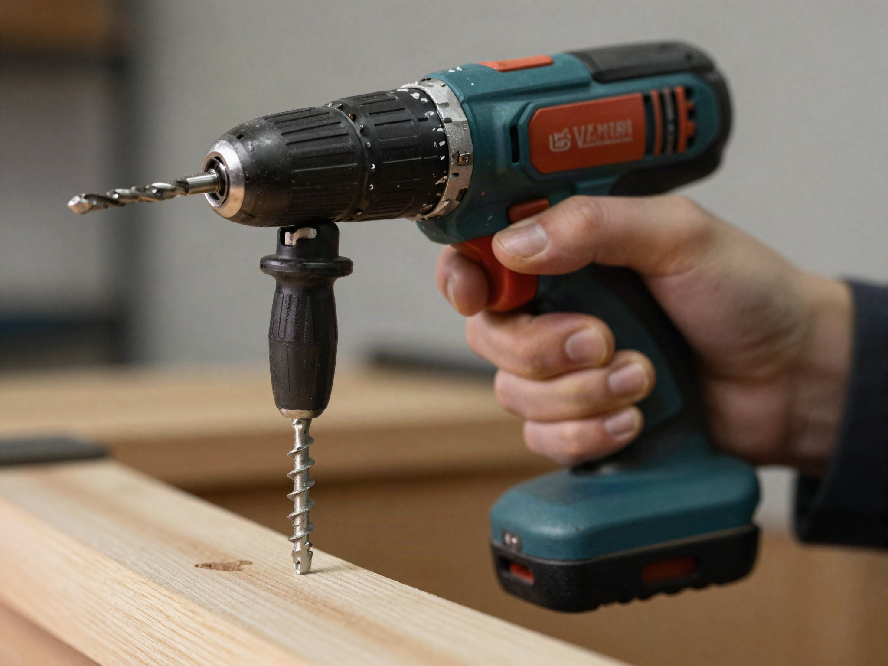

Drill specs are designed to sound impressive on a shelf tag, but only a few numbers actually matter for how a drill performs. Here's what to actually check before you buy.

## Voltage Isn't Everything

More voltage generally means more power, but a well-designed 12V drill can outperform a poorly designed 20V one for everyday tasks like furniture assembly and small repairs. Voltage matters most once you're driving long lag screws or drilling into masonry, where sustained torque under load makes the real difference, not the number printed on the battery.

- **12V**: Light duty — furniture, shelving, small household projects. These drills are also noticeably lighter and easier to use one-handed for long stretches, which matters if you're doing overhead work or holding awkward angles.
- **18V–20V**: The sweet spot for most homeowners — decking, framing anchors, mixing paint, and most general repair work around the house.
- **20V+ / high-torque**: Reserved for heavy trade use — repeated concrete anchor drilling, large-diameter spade or hole-saw bits, or driving hundreds of screws a day. Most homeowners never need this tier.

## Drill/Driver vs. Impact Driver vs. Hammer Drill

These three tools look similar but solve different problems, and understanding the difference prevents buying the wrong one. A standard drill/driver is the most versatile — it drills holes and drives screws with adjustable clutch settings that prevent overdriving. An impact driver adds rotational hammering force specifically for driving screws, which makes it faster and less prone to camming out on long fasteners, but it's a poor choice for precise drilling since it lacks a clutch. A hammer drill adds forward-and-back percussion for drilling into masonry and concrete, which a standard drill/driver simply can't do efficiently no matter how much torque it has. Many combo kits pair a drill/driver with an impact driver specifically because the two cover almost everything a homeowner needs.

## Brushless vs. Brushed Motors

Brushless motors cost more but run cooler, last longer, and squeeze more runtime out of the same battery, since there's no physical brush contact generating friction and heat inside the motor. If you'll use the drill regularly — weekend projects, ongoing repairs, or anything beyond occasional furniture assembly — it's worth the premium. For light, infrequent use, a brushed motor will still get the job done and typically costs noticeably less upfront.

## Chuck Size

A 1/2" chuck accepts larger bits than a 3/8" chuck, which matters if you plan to drill large holes for plumbing or wiring. Most homeowner-grade drills use 1/2" today, so it's rarely a deciding factor anymore. What's worth checking instead is whether the chuck is keyless (turns by hand) or requires a chuck key — nearly all modern drills are keyless, but if you're buying used or inheriting an older tool, a missing chuck key can turn a simple bit change into a real hassle.

## Clutch Settings and Torque Control

Look for a drill with a numbered clutch collar, typically offering somewhere between 15 and 25 torque settings plus a dedicated drill mode. Lower settings slip before the screw is fully driven, which prevents stripping screw heads or driving a fastener too deep into soft material like drywall or thin plywood. New users often ignore this feature entirely and drive everything on the highest setting, which is exactly how stripped screws and cracked material happen. Spend a few minutes testing settings on scrap material before starting a real project.

## Weight and Ergonomics

A drill that feels fine in a store for thirty seconds can feel very different after an hour of overhead work or repetitive drilling. Heavier batteries and larger motors add capability but also add fatigue, especially for smaller hands or extended use. If possible, hold a drill in person before buying, or at minimum check the listed weight against a drill you've already used and liked.

## Battery Platform Matters More Than the Drill

If you already own tools from a brand, staying on the same battery platform saves significant money over time. A "bare tool" (drill only, no battery) is often the better buy if you already have compatible batteries and a charger. This is also worth considering before your very first purchase — if you're likely to add an impact driver, saw, or other cordless tool down the line, picking a platform with a wide selection of bare tools available will save money on every future purchase, not just this one.

## Maintenance That Actually Extends Drill Life

Keep the chuck free of dust and debris, since a gritty chuck is a common cause of bits slipping under load well before the motor shows any real wear. Avoid leaving batteries on the charger indefinitely once they're topped up, and store them at room temperature rather than in a hot garage or a freezing shed — extreme temperatures shorten battery lifespan more than regular use does. If the drill has vents, keep them clear of sawdust buildup, which can trap heat and stress the motor over time.

## Our Recommendation for Beginners

For most first-time buyers, an 18V brushless drill/driver combo kit with two batteries hits the best balance of price and capability — enough torque for real projects without the weight and cost of a professional-grade tool. Add an impact driver to that same battery platform once you find yourself driving more than a handful of screws at a time, and you'll have covered the overwhelming majority of household repair and DIY work with just two tools.
