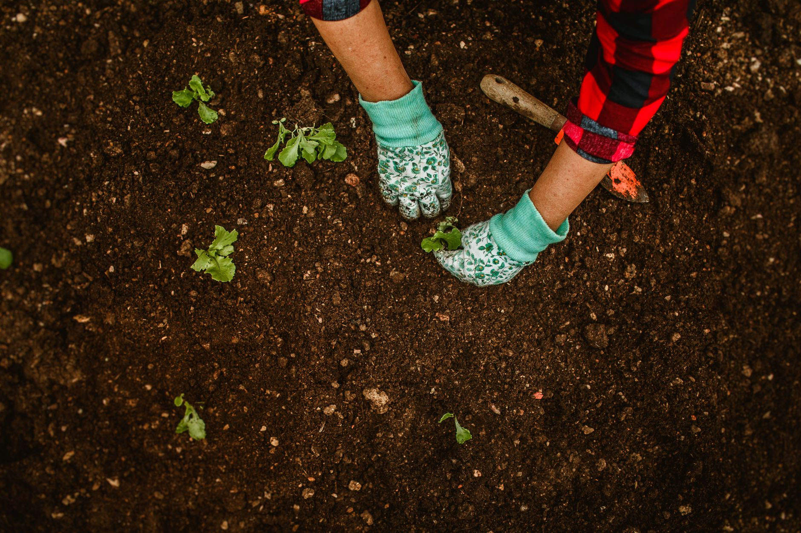

Early fall is one of the best windows for dividing overgrown perennials, right alongside early spring, and for a lot of gardeners it's actually the more convenient of the two. The soil is still warm enough for roots to establish, the weather has usually cooled off enough that plants aren't stressed by heat, and you get to see exactly which clumps grew too big, bloomed poorly, or need moving before the whole bed goes dormant and disappears under mulch.

## Why Divide in Fall at All

Perennials that have been in the ground for a few years often start showing the same signs: a dead, woody center with growth only around the outer edge, fewer or smaller blooms than in previous years, or a clump that's simply outgrown its spot and is crowding its neighbors. Dividing solves all of that at once — it thins overcrowded roots, removes the unproductive center, and gives you free plants to fill in bare spots or share. Fall division has a practical edge over spring: you're not racing against a plant that's already pushing out new growth, and the divisions have a full season of root development ahead before they're asked to support top growth again next year.

## Which Perennials Are Safe to Divide Now

Not every perennial responds well to fall disturbance, so it helps to sort by bloom time rather than treat all perennials the same. Spring- and summer-blooming perennials — hostas, daylilies, peonies, irises, and most ornamental grasses — are generally safe and often prefer fall division, since they're done flowering and storing energy for the year. Fall bloomers, on the other hand, are better left until spring: dividing a plant like a mum or aster while it's actively flowering or budding interrupts that cycle and can weaken or kill it going into winter. A rough rule of thumb: if a perennial finished blooming more than a month ago, fall is a reasonable time to split it; if it's blooming right now, wait until spring.

## Timing It Against Your First Frost

The general target is to divide and transplant at least 4-6 weeks before your area's average first hard frost, which gives new roots enough time to establish before the ground freezes. Dividing too close to frost leaves roots without enough of a head start, and a plant that hasn't rooted in well is much more vulnerable to being heaved out of the ground by freeze-thaw cycles over winter. If you're not sure when your first frost typically lands, a quick check of regional frost date charts for your area is worth doing before you start digging, since it varies enough by region that a fixed calendar date isn't a reliable guide.

## Digging Up the Clump

Start by cutting back the foliage to 4-6 inches, which makes the clump easier to handle and reduces water loss through the leaves while roots are recovering. Then dig a wide circle around the plant, well outside the drip line of the foliage, rather than starting close to the base — perennial root systems often spread further than the visible top growth suggests, and digging too close severs more roots than necessary. Work the shovel or garden fork down and under the clump at an angle from multiple sides, gradually loosening it, then lift the whole root ball out in one piece rather than prying at just one edge.

## Splitting the Root Ball

How you split a clump depends on what kind of root system it has. Fibrous-rooted perennials like hostas and daylilies can often be pulled apart by hand once the soil is loosened, or cut with a sharp spade or knife straight through the crown into sections, each with several visible growth points (called "eyes" on the crown) and a healthy portion of roots attached. Rhizome-forming perennials like irises are typically divided by cutting the rhizome into pieces with a knife, discarding old, woody sections and keeping the firmer, younger growth with roots and a fan of leaves attached. Whatever the method, aim for divisions that are large enough to establish quickly rather than splitting into the smallest possible pieces — a handful of good-sized divisions will outperform a dozen tiny ones that struggle to survive the winter.

## Replanting and Aftercare

Replant divisions at the same depth they were growing at previously, since planting too deep or too shallow is a common cause of poor establishment. Water thoroughly right after planting to settle the soil around the roots and eliminate air pockets, then keep the soil consistently moist (not soggy) for the first few weeks while new roots form. A 2-3 inch layer of mulch applied once the ground starts to cool, but before it freezes, helps regulate soil temperature through winter and reduces the risk of the new roots being pushed up by frost heaving. Hold off on fertilizing at planting time — the goal right now is root establishment, not top growth, and a boost of fertilizer typically does more to encourage foliage than roots.

## Perennials Better Left Alone in Fall

A few types are worth skipping until spring regardless of when they last bloomed. Perennials with any known sensitivity to cold or wet soil, tender or borderline-hardy varieties for your zone, and anything planted or divided within the current growing season (it hasn't had time to build the root reserves needed to survive a division and a winter back to back) all do better with a spring split instead. When in doubt about a specific plant's tolerance for fall division, it's safer to wait a season than to risk losing an otherwise healthy perennial.
