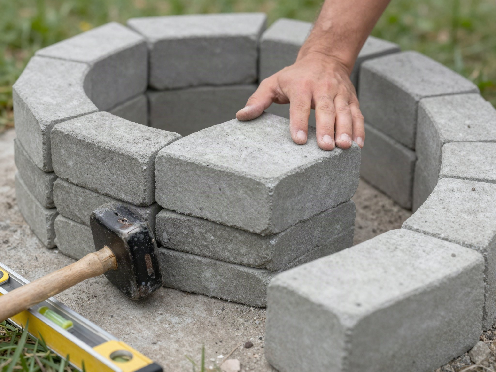

A stacked-stone fire pit is one of the highest-impact weekend projects you can build: no mortar, no power tools required, and it turns a plain backyard corner into the spot everyone gathers around. Here's the dry-stack method that holds up for years.

## What You'll Need

- 40-60 concrete fire pit blocks or capstones (enough for a 3-4 foot interior diameter, check your local retailer's calculator for your exact ring size)
- Fire pit liner (steel ring) or lava rock/gravel base
- Level
- Rubber mallet
- Spray paint or a garden hose (to mark the circle)
- Shovel
- Wheelbarrow or bucket (for moving gravel)
- Landscape fabric (optional, to keep gravel from mixing with the soil below)
- Work gloves — the blocks are heavier than they look after the first dozen

## Step 1: Choose and Mark the Site

Pick a spot at least 10 feet from your house, fences, trees, and anything overhanging, including low tree branches you might not think to check at eye level. Confirm the ground is reasonably flat before committing to the spot — a site on a noticeable slope means far more digging and leveling work later. Use a hose or rope to lay out your circle, then spray-paint along it as a guide. Step back and look at the marked circle from a few angles before digging; it's much easier to nudge a rope than to redo an excavated hole.

## Step 2: Dig and Level the Base

Dig out the marked circle about 6 inches deep and fill with a few inches of gravel, tamping it down firmly. If you're dealing with heavy clay soil or a lot of tree roots, budget extra time for this step — it's consistently the slowest part of the build, even though it looks like the simplest on paper. A level base is the single biggest factor in whether your finished ring looks professional or lopsided — check it in multiple directions (not just side to side, but diagonally too) before moving on. Laying landscape fabric under the gravel is optional but helps keep weeds from pushing up through the base over time.

## Step 3: Set the Steel Liner

Drop your steel fire ring into the center of the excavated area. This protects the inner stones from direct heat damage and keeps the fire contained. Center it carefully within your marked circle, since this liner effectively sets the reference point for every course of block you stack around it — an off-center liner means fighting an uneven gap all the way up.

## Step 4: Stack Your First Course

Place your first ring of blocks around the liner, checking level as you go and tapping stones into place with a rubber mallet. This first course matters more than any other, since every block above it inherits any unevenness from the base row. Take your time here even if it feels slow — it's much faster to fix a wobbly block now than after three more courses are stacked on top of it.

## Step 5: Build Up the Remaining Courses

Stack 2-3 more courses on top, staggering the joints between rows like brickwork so the wall locks together without mortar. Most kits are designed to sit 12-16 inches tall total, which is roughly bench height when you're seated in a low outdoor chair nearby — a helpful gut check if you're deciding how many courses to add. Some paver systems include a locking lip or interlocking edge on each block; if yours does, make sure each new block seats fully into the one below it before moving to the next, since a block that isn't seated properly will throw off the stagger pattern above it.

## Step 6: Add Fuel Bed and Finish

Fill the base of the ring with lava rock or fire glass, about 2-3 inches deep. This helps distribute heat evenly and looks a lot better than bare steel. If you want a finished capstone edge, this is also the point to add a top course of flat capstones, which gives the pit a cleaner look and doubles as a spot to rest a drink or a marshmallow stick.

## Building In a Seating Area

While the fire pit itself is the centerpiece, the space around it matters just as much for how much you'll actually use it. A ring of gravel, pavers, or a simple mulch border a few feet out from the fire pit gives chairs a stable, level surface to sit on and keeps grass from getting worn down or scorched by nearby heat. Leave enough clearance for people to walk around the pit comfortably — a common mistake is building the seating area too tight, which makes it awkward to add or remove chairs once people are already seated.

## Seasonal Maintenance

A stacked-stone fire pit is low-maintenance, but it isn't zero-maintenance. Check the courses each spring for any blocks that shifted over winter from frost heave, especially in climates with hard freezes, and re-level or restack anything that's moved before it gets worse. Clear ash out regularly rather than letting it build up — a deep ash bed traps moisture against the steel liner and speeds up rust. If you live somewhere with heavy rain, consider a simple fire pit cover to keep the fuel bed dry between uses, since wet lava rock or fire glass takes longer to reach full heat.

## Safety Notes

Check local ordinances before building — some municipalities require permits or restrict open fires entirely, and rules can vary significantly even between neighboring towns. Keep a hose or extinguisher within reach, never leave a fire unattended, and let the pit cool completely before covering it. Avoid building directly on a wood deck or near dry landscaping, and always check local burn bans during dry seasons before lighting a fire, even in a pit built specifically for that purpose.
