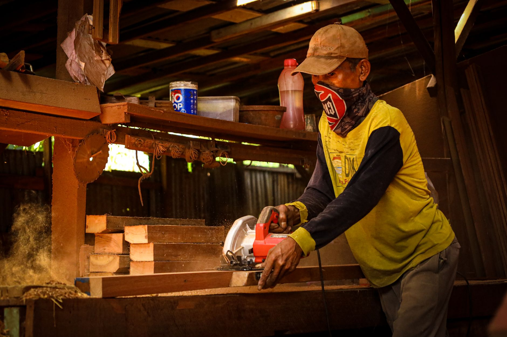

Just because the first frost is coming doesn't mean the garden has to shut down. A cold frame is essentially a bottomless box with a clear, sloped lid that sits directly over a garden bed, trapping daytime heat in the soil and air beneath it so cold-tolerant crops keep growing well past the point where an exposed bed would freeze solid. It's one of the simplest structures you can build this weekend, uses materials most people already have lying around, and can add weeks or months to your growing season depending on your climate and what you're growing under it.

## How a Cold Frame Actually Works

A cold frame isn't heated by anything other than the sun — it works purely by trapping solar energy during the day and slowing the rate at which that heat escapes at night. The clear lid lets sunlight in and holds warm air close to the soil, while the box's solid sides block wind and reduce heat loss compared to open ground. The soil itself also acts as a heat battery, absorbing warmth during sunny hours and releasing it slowly overnight, which is why a bed that's been in a cold frame for a few weeks stays noticeably milder than the surrounding yard even on a frosty morning. This combination typically buys you several degrees of frost protection, sometimes more with a well-sealed frame, which is often the exact difference between a bed of dead lettuce and one you're still harvesting from in December.

## What You'll Need

- 1x8 or 1x10 lumber for the box sides (cedar or pressure-treated hold up best against constant soil contact)
- An old window sash, patio door glass, or a sheet of clear polycarbonate for the lid
- 2x2 lumber for corner supports and a lid frame if you're building the lid from scratch
- Exterior wood screws
- Hinges (two or three, depending on lid size)
- A short length of wood or a notched stick to prop the lid open for ventilation
- Weatherstripping or foam tape (optional, for sealing gaps)
- Exterior paint or sealant
- [Circular saw](/blog/circular-saw-vs-track-saw/) or handsaw, drill, tape measure, square

## Step 1: Choose the Size and the Lid Material

Before cutting anything, decide what you're covering — a frame sized to fit an existing [raised bed](/blog/how-to-build-a-raised-garden-bed/) or a manageable patch of garden is easier to plan around than picking dimensions first and hoping a bed fits under it later. A common approach is to build the frame around whatever clear material you already have access to, since an old window sash or a salvaged sliding glass door panel is often the most expensive single piece if you had to buy it new. If you're sourcing new material, twin-wall polycarbonate is lighter than glass, insulates a bit better, and won't shatter if something falls on it, making it the more forgiving choice for a first build.

## Step 2: Cut the Box Sides at a Slope

The defining feature of a cold frame is a sloped top — taller in the back, shorter in the front — which does two things at once: it sheds rain and snow instead of letting it pool on the lid, and it angles the glazing to catch more direct winter sunlight, which sits lower in the sky than in summer. A back height of 12-18 inches and a front height of 8-12 inches gives a workable slope for most climates; the exact numbers matter less than making sure the lid actually drains and that the angle roughly faces the sun's winter path. Cut the two side panels with the sloped top edge, and cut the front and back panels to full height on their respective sides, all sized to whatever bed footprint you settled on in Step 1.

## Step 3: Assemble the Box

Screw the four sides together at the corners, reinforcing each joint with a 2x2 cleat on the inside face for a sturdier connection than screws driven straight into end grain. Set the assembled box in place over your bed and check that it sits level and that all four corners meet the soil evenly — a frame that rocks on uneven ground lets cold air leak in at the gaps and defeats a good portion of its purpose. If the ground underneath isn't level, it's easier to dig out or build up the soil slightly than to shim the box, since a shimmed frame tends to shift over a winter of freeze-thaw cycles.

## Step 4: Build or Attach the Lid

If you're using a salvaged window sash, attach it directly to the back edge of the box with hinges, sized so it swings up and open from the back for easy access to the bed. If you're building the lid from scratch, frame it out of 2x2 lumber sized to match the sloped opening, then secure the polycarbonate panel into that frame with screws and washers spaced every few inches so wind doesn't work it loose over time. Either way, the lid should overhang the box slightly on all sides so rain runs off away from the joints rather than dripping straight down into the gap between lid and frame.

## Step 5: Seal Gaps and Finish the Wood

Run a strip of weatherstripping or foam tape along the top edge of the box where the lid closes down onto it — this single detail does more for heat retention than almost anything else in the build, since a poorly sealed lid lets warm air leak out exactly where you need it to stay put. Paint or seal all exterior wood surfaces to handle a season of direct ground contact and moisture, paying particular attention to the bottom edges, which sit closest to damp soil and are the first place rot typically starts.

## Managing Temperature and Ventilation

A closed cold frame on a sunny day heats up fast, and it's entirely possible to cook your plants even when it's freezing outside if the lid stays shut through a bright afternoon. Prop the lid open a few inches on sunny days once outside temperatures climb into the 40s and above, using a notched stick or a simple hinged prop, and close it back down as temperatures drop in the late afternoon. Checking the frame once a day through fall and winter, adjusting the lid based on that day's forecast, is really the only maintenance a cold frame needs — there's no watering schedule or heating element to manage, just paying attention to what the sky is doing.

## What to Grow Under It

Cold frames are best suited to crops that already tolerate cool conditions rather than trying to push warm-season vegetables past their season — spinach, kale, lettuce, arugula, and other leafy greens do particularly well, along with root vegetables like carrots and beets that you can leave in the ground and harvest as needed through winter. Starting seedlings a bit earlier in late winter is another common use, giving transplants a head start in a protected environment before the ground outside is workable. Whatever you plant, give it enough of a head start before the coldest weather sets in — a cold frame extends a growing season, but it isn't a substitute for the plant having established some size and root structure first.
