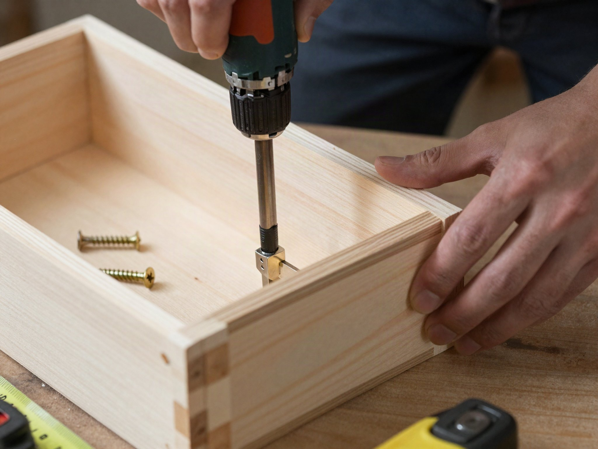

A simple wood planter box dresses up a bare deck or patio corner and gives you a container garden that doesn't depend on a full backyard bed. This design uses basic butt joints and screws — no complicated joinery required.

## What You'll Need

- Cedar or redwood boards, 1"x6" (rot-resistant, no sealant required)
- 2"x2" posts for the corners
- Exterior-grade wood screws
- Landscape fabric (to line the inside)
- Drill/driver
- Miter or circular saw
- Waterproof liner or drainage gravel

## Cut List (for a 24" x 10" x 10" box)

- 4 side boards at 24" (front/back)
- 4 side boards at 10" (ends)
- 4 corner posts at 10"
- 1 bottom panel, cut to fit inside the frame

## Step 1: Build the Corner Frame

Attach the 1x6 boards to the 2x2 corner posts, alternating front/back and end boards to form a box shape. Pre-drill each screw hole to prevent the cedar from splitting.

## Step 2: Attach the Bottom

Screw the bottom panel to the underside of the frame. Drill 4-6 drainage holes spaced evenly across the bottom before installing it — this is much easier to do before the panel is attached.

## Step 3: Line the Interior

Line the inside with landscape fabric, stapled to the inner walls. This keeps soil from washing out through the drainage holes while still letting excess water drain freely.

## Step 4: Fill and Plant

Add a layer of gravel or broken pottery at the bottom for extra drainage, then fill with quality potting mix (not garden soil, which compacts too densely in a contained box) and plant.

## Mounting to a Deck Railing

For a railing-mounted version instead of a freestanding box, add a cleat to the back side sized to hook over your specific railing width, and always test the fit before filling it with soil — a loaded planter is much heavier and harder to adjust.
