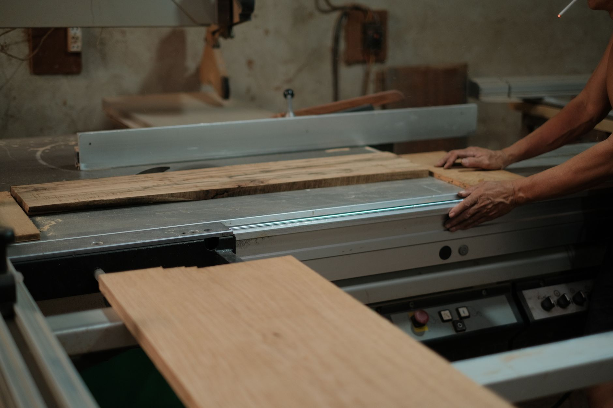

A pile of firewood dumped straight on the lawn or against the side of the house dries slowly, rots from the bottom up, and turns into a magnet for termites and other pests you don't want anywhere near your foundation. A proper rack solves all of that with a handful of boards and an afternoon of work: it lifts the wood off damp ground, keeps rows loosely stacked for airflow, and gives you a roof to shed rain and snow without smothering the pile underneath. This is an open-sided ladder-style rack, the simplest and most forgiving design to build, and it scales easily to whatever amount of wood you actually burn through a season.

## What You'll Need

- Pressure-treated 4x4 lumber (posts — pressure-treated matters here since these sit in direct contact with soil moisture over years)
- 2x4 lumber (rails, cross-bracing, and the roof frame)
- 1x4 or 1x6 boards, or corrugated metal roofing panels, for the top cover
- Deck screws (3" and 2 1/2") and a handful of lag bolts for the main joints
- Wood glue rated for exterior use (optional, but adds strength at load-bearing joints)
- Circular saw or handsaw
- Post hole digger or auger, if setting posts in the ground
- Gravel or concrete mix, if you're setting posts permanently
- Drill, level, tape measure, square
- Exterior stain or sealant

## Step 1: Decide on Size and Placement

A rack roughly 8 feet long, 4 feet tall, and 16-18 inches deep holds close to half a cord of stacked wood, which is a reasonable size for most backyards and easy to size up or down by simply adding or removing sections along the length. Depth matters more than it seems: too shallow and rows tip over reaching for logs at the back, too deep and you're stacking wood that never sees airflow. Pick a spot a few feet away from the house itself, ideally somewhere that gets some sun and a breeze rather than a shaded, still corner, since both speed up seasoning meaningfully. Avoid low spots in the yard where water pools after rain, even with the rack raising the wood off the ground — a rack sitting in a puddle still fights an uphill battle.

## Step 2: Set the Posts

Mark post locations along your chosen length, spacing them every 4 feet or so for a rack that won't sag under a full load of wood. For a permanent structure, dig holes roughly 18-24 inches deep, set the 4x4 posts in gravel or concrete, and check each one is plumb with a level before the concrete sets. If you'd rather keep things simpler or expect to move the rack later, you can skip digging entirely and instead bolt the posts to a treated 4x4 sill resting directly on a level, well-drained spot — less permanent, but plenty stable for a rack that isn't holding an enormous amount of weight. Either way, let concrete cure fully before loading any weight onto the posts.

## Step 3: Build the Side Rails and Back

Attach horizontal 2x4 rails to the front and back faces of the posts, one near the base and one near the top, running the full length of the rack. These rails are what actually contain the stacked wood and keep a row from spilling forward as it settles. On the back side, add one or two more rails between the base and top rail so wood stacked toward the rear has something to lean against — you don't need solid backing, just enough horizontal support to keep logs from rolling through gaps. Leave the front completely open; that open face is what lets you load and pull wood easily and is also a big part of what keeps air moving through the stack.

## Step 4: Add the Roof Frame

Cut a set of 2x4 rafters that span the depth of the rack, angled slightly from back to front (or side to side, depending on your design) so rain and snow actually run off instead of pooling on a flat top. A slope of just an inch or two of drop over the depth of the rack is enough. Attach the rafters to the tops of the posts, spacing them every 16-24 inches along the length for a roof that won't sag once it's covered. If your rack is long, a center support post under the roofline keeps the span from bowing over time.

## Step 5: Cover the Roof

Screw 1x6 boards edge to edge across the rafters for a simple wood roof, or use a corrugated metal or polycarbonate roofing panel for a cover that sheds water more reliably and needs no maintenance beyond an occasional check of the fasteners. Whichever material you choose, let the roof overhang the front and sides by an inch or two — a flush-cut roof lets wind-driven rain hit the top rows of wood directly, defeating a good chunk of the point of covering it at all. Keep the sides of the rack open the entire way; a wood roof paired with open sides is the combination that actually dries a woodpile, since a fully enclosed structure traps humidity instead of releasing it.

## Step 6: Finish and Load It

Give the frame a coat of exterior stain or sealant, focusing extra attention on cut ends and any spot where lumber meets the ground, since those are where rot typically starts first on an outdoor structure. Once it's dry, load the rack by stacking split wood loosely rather than jamming pieces in tight — the same airflow principle that dries a ground pile applies here, and a rack packed too densely won't season wood any faster than no rack at all. Stack the oldest, most-seasoned wood toward the front where it's easiest to grab, and work newer splits in behind it so you're naturally burning through wood in the order it dried.

## Sizing Up for a Bigger Woodpile

If half a cord doesn't cover a full winter's use, the same design extends easily — add another 8-foot section end to end, sharing a post between sections, rather than building a second freestanding rack a few feet away. A continuous rack uses less lumber overall for the same total capacity and gives you one long, easy-to-navigate row instead of two separate piles competing for yard space. If you're not sure how much you'll need, it's easier to build one section this year and extend it next fall than to guess high and end up with an oversized structure taking up more yard than necessary.
