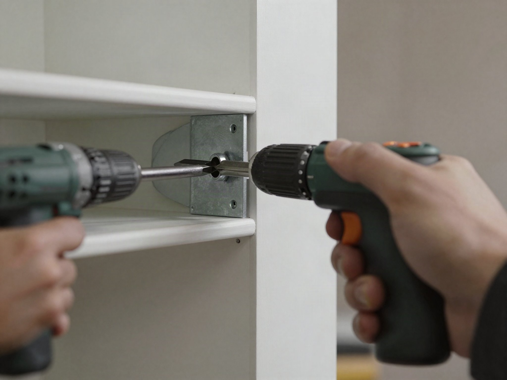

A floating shelf looks like it's held up by nothing, but the trick is a hidden steel bracket hidden entirely inside the shelf itself, anchored straight into a wall stud. Here's how to build one that won't sag under real weight.

## What You'll Need

- 1 pine or hardwood board, 1"x8" cut to your desired length
- Hidden floating shelf bracket (steel rod or blade-style, sized to your board thickness)
- Stud finder
- Drill with bits matching your bracket's hardware
- Wood glue
- Sandpaper and finish of choice (stain, paint, or clear coat)

## Step 1: Find and Mark Your Studs

Use a stud finder to locate at least one wall stud within your shelf's span — this is non-negotiable for anything meant to hold real weight. Mark the stud center with a pencil.

## Step 2: Drill the Board

Measure and mark matching holes on the back edge of your shelf board where the hidden bracket's rods will insert. Drill straight and steady; an angled hole here is the most common reason the finished shelf sits crooked on the wall.

## Step 3: Mount the Bracket to the Wall

Attach the hidden bracket to the wall using lag screws driven into the stud you located earlier.

## Step 4: Slide the Shelf Into Place

Add a small amount of wood glue into the drilled holes, then slide the board onto the wall-mounted bracket rods. Use a level to check it's straight before the glue sets, and let it cure fully (usually 24 hours) before loading it up.

## Step 5: Finish

Sand any rough edges and apply your finish of choice before or after mounting — staining beforehand is easier since you won't be working around a wall.

## Weight Limits

A single stud-anchored hidden bracket typically holds 25-50 lbs depending on the hardware — plenty for books, small plants, and decor, but check your specific bracket's rating before loading up heavier items like a TV or large planters.
