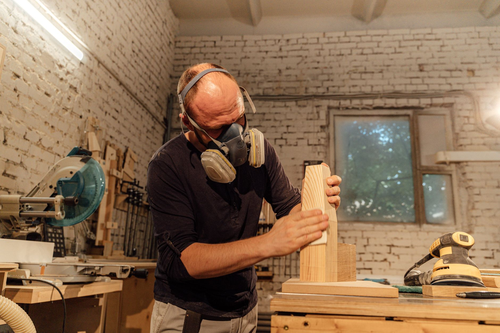

A dedicated workbench is the project that makes every project after it easier. This design uses standard 2x4 lumber and a plywood top — no fancy joinery, just a strong, square frame that won't wobble under real use.

## What You'll Need

- 2x4 lumber (legs, frame, and bracing — a typical 4' bench needs about ten 8' boards)
- 3/4" plywood for the top (and a second sheet for a lower shelf, optional)
- 3" wood screws
- Wood glue
- Circular saw or have your lumber pre-cut
- Square and level

## Step 1: Cut Your Frame Pieces

For a 4' x 2' bench at standard 34" working height, cut four legs to 34" minus the thickness of your top, plus the long and short frame rails that will connect them. Label pieces as you cut to avoid mixing up lengths.

## Step 2: Build the Leg Assemblies

Attach the legs to the side rails first, forming two "H" shaped end assemblies. Check every joint with a square before driving screws — a workbench that's slightly out of square will rack (wobble diagonally) under load.

## Step 3: Connect the Assemblies

Join the two end assemblies with the long front and back rails, forming the full frame. Add diagonal corner braces if you want extra rigidity — not strictly required with a well-built frame, but cheap insurance against wobble.

## Step 4: Attach the Top

Center the plywood top on the frame and screw down through the top into the rails below, using glue along the frame edges for extra strength.

## Step 5: Add a Lower Shelf (Optional)

A second sheet of plywood attached near the bottom of the legs adds storage and, more importantly, extra rigidity — a shelf that ties the four legs together resists racking far better than legs alone.

## Finishing Touches

A coat of polyurethane on the top protects against spills and stains, though many woodworkers leave a shop bench unfinished so it can take abuse without worrying about the finish.
