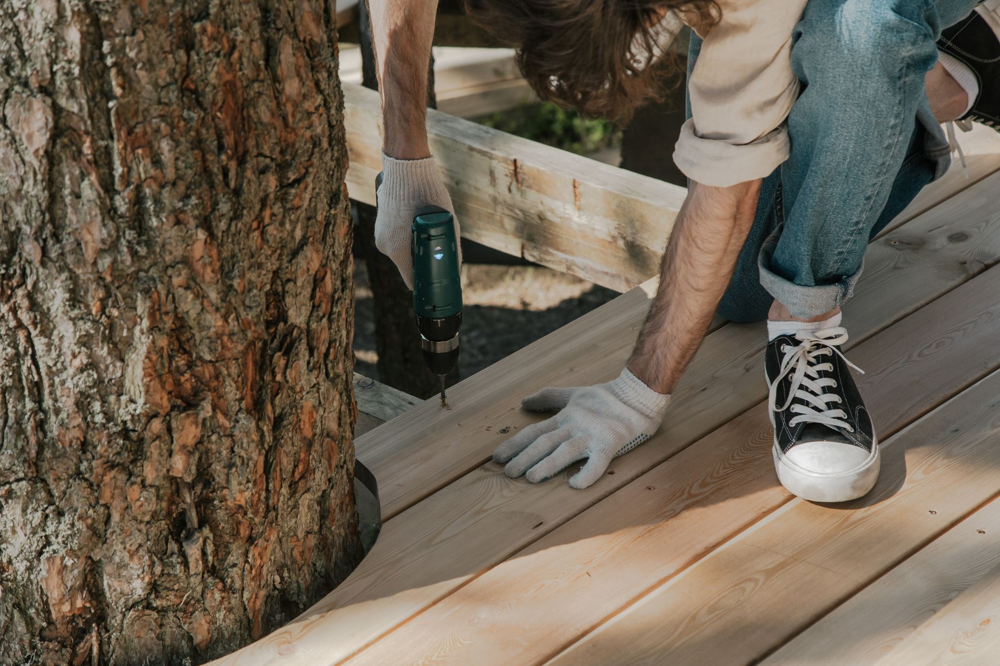

Once the weather turns, an entryway without somewhere to sit and set down wet boots turns into a pile of shoes by the door within a week. A mudroom bench solves both problems at once: a seat for pulling boots on or off, and an open cubby underneath to corral them instead of letting them scatter across the floor. This is a straightforward box build with a bench top on top — no fancy joinery, and it's easy to size to whatever wall space you actually have.

## What You'll Need

- 3/4" plywood (for the sides, back, and shelves — a 4x8 sheet is enough for most builds)
- 1x4 or 1x3 boards for face trim and the front edge of the seat (optional, but it hides plywood edges nicely)
- 2x2 lumber for internal cleats that support the seat and shelf
- Wood screws (1 1/4" and 2 1/2")
- Wood glue
- Circular saw or have your plywood cut at the store
- Drill, level, tape measure, square
- Sandpaper (120 and 220 grit)
- Paint, stain, or clear finish
- Optional: a bench cushion, hooks for a wall rail above, and a stud finder if you plan to anchor it to the wall

## Step 1: Size the Bench to Your Space

Measure the width of wall you have to work with and subtract a couple inches on each side for clearance if the bench sits between other furniture or a doorway swing. A comfortable sitting height is 17-19 inches, matching a typical chair seat, and depth of 14-16 inches is usually enough for boot storage underneath without the bench sticking out awkwardly into a narrow hallway. If the space is tight, a bench as short as 24 inches wide still fits a couple pairs of shoes underneath and gives one person a place to sit — you don't need a full-width build for this to be worth doing.

## Step 2: Cut the Box Pieces

The core structure is a simple open-front box: two side panels, a back panel, and a bottom shelf, all cut from 3/4" plywood. Cut the two sides to your chosen height and depth, the back panel to span the full width at the same height, and the bottom shelf to fit between the sides. Label each piece as you cut so you're not guessing which panel goes where once you're ready to assemble — plywood pieces of similar size look more alike than you'd expect once they're off the sheet.

## Step 3: Assemble the Box

Attach 2x2 cleats along the inside of each side panel where the bottom shelf will sit, then screw the shelf onto the cleats from below — this gives the shelf real support instead of relying on screws driven straight through the plywood sides, which tends to work loose under repeated weight over time. Attach the back panel next, squaring the whole box with a framing square before driving screws, since an out-of-square box makes the top and any face trim harder to fit cleanly later. Wood glue at every joint adds meaningful strength beyond screws alone.

## Step 4: Add a Center Divider (Optional)

If the bench is wide enough, a vertical divider down the middle of the cubby splits it into two more organized sections — handy for separating kids' shoes from adults', or muddy boots from cleaner shoes. Cut a piece of plywood to match the interior height and depth, and secure it to the bottom shelf and back panel with cleats the same way you attached the shelf. This step is easy to skip on a narrower bench where one open cubby works fine.

## Step 5: Build and Attach the Seat

Cut the seat top from plywood, sized to overhang the box slightly on the front and sides (an inch or so looks intentional rather than sloppy) so the front trim board, if you're adding one, has clean plywood edge to attach to. Screw the seat down into cleats installed along the inside top edges of the side and back panels, checking it sits flat and doesn't rock before moving on. A person sitting to pull on boots puts real, repeated weight on this joint, so don't skip the cleats in favor of screwing straight through the top into thin plywood edges.

## Step 6: Add Face Trim and Sand Everything

If you're using 1x3 or 1x4 trim, attach it along the visible front edges of the box and seat to cover raw plywood edges — this is a small step that makes a big difference in how finished the piece looks. Once trim is on, sand every surface starting with 120-grit to smooth cut edges and screw areas, then finish with 220-grit for a surface that's comfortable to sit on and pleasant to touch.

## Step 7: Finish and Anchor

Paint or stain to match your entryway, letting each coat cure fully before use. If the bench will regularly be sat on or bumped into while people are getting shoes on, anchor it to the wall with an L-bracket screwed into a stud — a heavier bench is fairly stable on its own, but anchoring removes any risk of it tipping forward under an off-center sitting position, especially with kids climbing on and off. This step takes a few extra minutes and is worth it for a piece that will see daily traffic.

## Making It Work Harder for the Space

A row of hooks mounted on the wall directly above the bench turns it into a full entryway station for coats, bags, and leashes without taking up any additional floor space. If your mudroom deals with genuinely wet or muddy boots rather than just everyday shoes, consider lining the cubby floor with a removable plastic tray or mat that can be pulled out and hosed off, rather than letting mud and salt residue sit directly against bare wood all winter. And if storage space allows, a shallow basket on the seat itself is a good spot for gloves, hats, or a dog's leash — small items that otherwise end up loose on the bench or migrating to random spots around the house.
