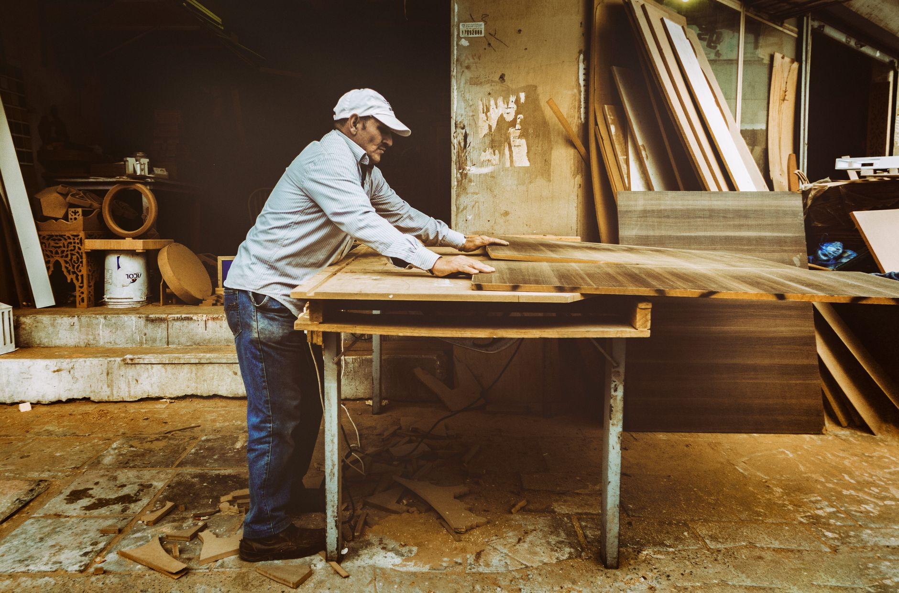

Wood pallets are often free for the taking behind hardware stores and warehouses (always ask first — some are on a return deposit system), and a single standard pallet is roughly the right footprint for a coffee table.

## What You'll Need

- 1 standard wood pallet, ideally heat-treated (stamped "HT," not "MB" which indicates chemical fumigation)
- Sandpaper (80 and 220 grit)
- Wood stain or paint
- 4 caster wheels
- Wood screws
- Optional: a sheet of plywood or glass for a flatter top surface

## Step 1: Choose and Clean Your Pallet

Look for a pallet with minimal cracking or splintering and boards that are still tightly attached. Give it a thorough scrub if it's been sitting outside, and let it dry fully before working on it.

## Step 2: Sand Everything

Pallet wood is rough by design. Start with 80-grit to knock down splinters and rough spots, then finish with 220-grit for a smooth, safe surface — this step matters most on the top, where hands and drinks will rest.

## Step 3: Fill Gaps (Optional)

If you want a flatter, more finished top instead of the natural gapped-slat look, cut a piece of plywood to size and screw it directly on top of the pallet boards.

## Step 4: Attach the Casters

Flip the pallet over and screw a caster wheel into each corner block — the solid wood corner sections of a pallet are thick enough to hold screws securely, unlike the thinner slat boards.

## Step 5: Finish

Apply wood stain for a warmer look or paint for a more solid, modern finish. Two coats with light sanding in between gives the most even result. Let it cure fully (check your product's dry time) before placing anything on top.

## A Note on Safety

Skip any pallet with unknown chemical stains, strong odors, or a "MB" stamp — methyl bromide fumigation isn't something you want off-gassing in your living room.
