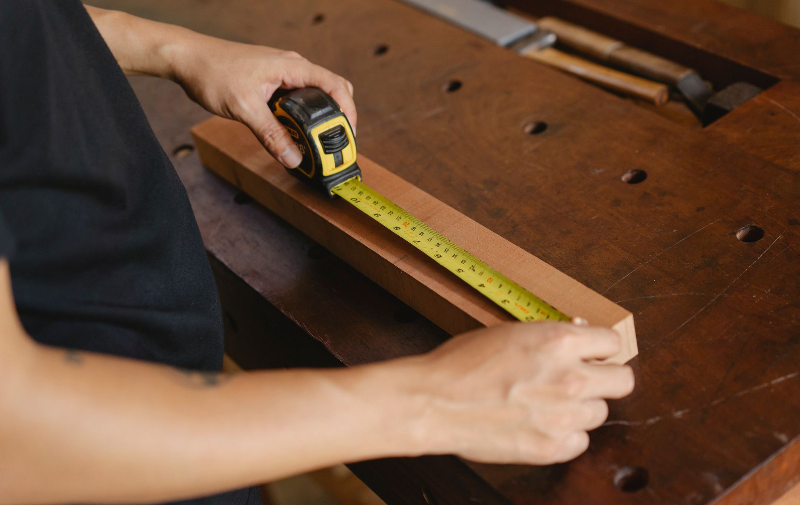

Fall drops more raw material for composting on your property than any other season, between the leaves coming down, the last of the garden getting cleared out, and kitchen scraps piling up as you cook more at home. A pile dumped loose in the corner of the yard will eventually break down, but it also sprawls, attracts pests, and looks like a mess the whole time it's working. A simple bin built from wood pallets solves all three problems for close to nothing, since pallets are usually free for the asking and already come with most of the structure you need built in. This is a four-sided bin with one side that opens for turning and unloading, sized to hold a real volume of material without becoming unwieldy to build or move.

## What You'll Need

- 4 wood pallets, roughly the same size (look for ones marked "HT" for heat-treated rather than "MB" for methyl bromide fumigated — HT is safe for this kind of outdoor use)
- 4 wooden stakes or short 4x4 posts, one for each corner
- Galvanized screws or exterior screws (2 1/2" to 3")
- Heavy-duty hinges (2-3) for the front access panel
- A hook-and-eye latch or simple sliding bolt
- Wire mesh or hardware cloth (optional, for tighter gaps and rodent resistance)
- Drill/driver, hammer or mallet, level, tape measure
- Sledgehammer or post driver, if setting stakes into the ground

## Step 1: Choose Your Pallets and Site

Standard 48x40-inch pallets work well for this build and are the easiest size to find secondhand behind hardware stores, garden centers, and warehouses — always ask before taking one, since some businesses reuse or return them. Look for pallets in reasonably solid condition with slats that aren't rotted or badly split, since these will be holding up decomposing material and taking on moisture for years. Pick a bin site on bare soil rather than concrete or a deck, since direct ground contact lets excess moisture drain and gives worms and other beneficial organisms easy access to the pile. A spot with partial sun and a bit of distance from the house keeps decomposition moving without turning your patio into ground zero for the smell on a hot day.

## Step 2: Set the Corner Posts

Stand a stake or short post at each corner of your planned square, roughly 40 inches apart to match the width of a standard pallet, and drive them a foot or so into the ground with a sledgehammer or post driver. Check that each post is plumb before moving on, since leaning posts make the rest of the build fight you the whole way through. These posts are what the pallets attach to, so they need to be solid enough to hold weight — if your soil is loose or sandy, set them a few inches deeper than you think you need.

## Step 3: Attach Three Sides

Stand a pallet upright against three of the four sides, positioning it so its edge lines up with the corner posts, and screw through the pallet's outer frame into the post at both the top and bottom on each shared corner. Three fixed sides give the bin its basic shape and rigidity; the fourth stays separate so you have a way in. Keep the pallets oriented with slats running horizontally if you want easier hand access between boards, or vertically if you'd rather the structure read as a more finished, fence-like panel — either works structurally, so it comes down to what you want it to look like in the yard.

## Step 4: Hinge the Front Panel

Attach the fourth pallet to one of the corner posts using two or three heavy-duty hinges, so it swings open like a gate rather than being screwed permanently in place. This is what makes the bin usable day to day — you need a way to dump scraps in without climbing over a wall, and eventually a way to shovel finished [compost](/blog/how-to-compost-at-home/) out from the bottom. Add a simple hook-and-eye latch or sliding bolt on the opposite side to keep the panel closed against wind and curious animals, while still letting you flip it open in seconds when you're adding material or turning the pile.

## Step 5: Tighten Up the Gaps (Optional but Worth It)

Pallet slats leave gaps wide enough for smaller scraps to fall through and for rodents to see an open invitation. Stapling a layer of wire mesh or hardware cloth to the inside faces of the three fixed pallets cuts both problems down significantly without blocking the airflow that makes a pallet bin work in the first place. It's an extra hour of work, but it's the difference between a bin that stays tidy and one that sheds material onto the lawn every time the wind picks up.

## Step 6: Load It and Keep the Ratio Right

Start the pile with a layer of coarser material like small sticks or dry [leaves](/blog/how-to-rake-leaves-efficiently/) at the bottom, which helps air circulate up through the pile from underneath. From there, alternate "brown" material — dry leaves, cardboard, straw — with "green" material — kitchen scraps, grass clippings, coffee grounds — aiming for noticeably more brown than green by volume. Fall works in your favor here, since leaves give you a nearly unlimited supply of browns right when kitchen scraps start piling up from more cooking and baking at home. Skip meat, dairy, and oily food waste, which break down slowly and are what actually draws pests to a bin.

## Turning and Troubleshooting

Open the front panel every couple of weeks and turn the pile with a garden fork, moving material from the outside edges into the center where decomposition runs hottest. A pile that smells sour or ammonia-like usually has too much green material and needs more dry browns mixed in; a pile that isn't heating up or breaking down at all is often too dry and needs a light watering, especially during a stretch of dry fall weather. If you find yourself generating more material than one bin can hold, the same design scales easily — build a second, identical bin right next to the first, using one shared pallet wall between them, and move material from one side to the other as it finishes breaking down. By the time spring planting rolls around, the bottom of a well-managed bin should be giving you a batch of finished compost ready to dig into beds.
