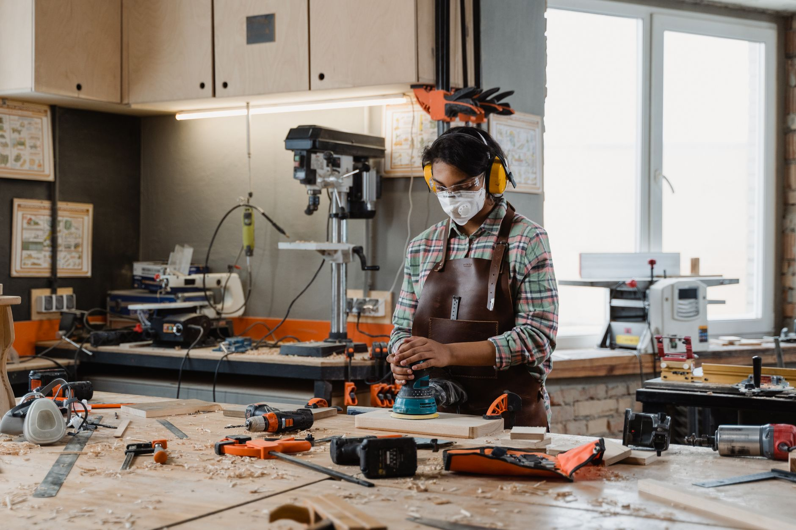

Potting plants on a patio table or a folding stand gets old fast: everything slides around, soil ends up everywhere except the pot, and you're bent over the whole time. A dedicated potting bench fixes all three — a stable waist-height surface, a shelf for the bags and pots that otherwise clutter the garage, and a spot to sieve soil over a bucket instead of the lawn. This build adds the one detail that changes daily use the most: a hardware-cloth cutout in the top so loose soil and old roots fall straight through into a bucket instead of piling up on the work surface.

**Quick answer:** Build a 48 × 24-inch frame from pressure-treated or cedar 2x4s, standing about 38–40 inches tall — taller than a standard workbench, since you'll be standing and scooping rather than sitting. Cut a 10 × 14-inch opening in the top, staple ½-inch hardware cloth underneath it, and set a 5-gallon bucket on the lower shelf directly below. Add a slatted or solid top, a lower shelf about 10 inches off the ground for soil bags and pots, and a back rail with hooks for hand tools. Plan on a weekend for the full build, less if you skip the sieve cutout.

## Project Overview

| Detail | Estimate |
|---|---|
| **Finished size** | 48 in wide × 24 in deep × 38–40 in tall |
| **Difficulty** | Beginner to intermediate (the sieve cutout is the trickiest part) |
| **Build time** | 4–7 hours over a weekend |
| **Main costs** | Lumber, screws, hardware cloth; a galvanized top adds the most to the budget |
| **Best built from** | Pressure-treated pine, cedar, or redwood |

## What You'll Need

**Materials**
- Six 8-ft pressure-treated or cedar 2x4s (frame and legs)
- One 4 × 8 sheet of ¾-in exterior plywood, or 1x6 cedar boards for a slatted top (see surface options below)
- One 2 × 4-ft sheet of ½-in galvanized hardware cloth
- A handful of 1-in heavy-duty staples or fender washers and short screws to secure the hardware cloth
- 3-in and 1¼-in exterior-rated (coated or stainless) screws
- Exterior wood glue
- A 1x4 or scrap pegboard, about 48 × 12 in, for the back tool rail
- 4–6 galvanized cup hooks or a short pegboard hook set
- A 5-gallon bucket (to sit under the sieve opening)

**Tools**
- Circular saw or miter saw
- [Drill/driver](/blog/cordless-drill-buying-guide/) with a countersink bit
- Jigsaw (for cutting the sieve opening)
- Speed square, level, tape measure, clamps
- Staple gun (if using hardware cloth stapled rather than screwed with washers)

Use pressure-treated or naturally rot-resistant wood throughout — standard pine or spruce will swell, cup and rot within a season or two of soil and water contact. If the bench will sit near edible beds, cedar or redwood avoids the chemical-treatment questions some gardeners have around pressure-treated lumber in growing areas, at a higher material cost.

## Cut List

| Part | Quantity | Length | Notes |
|---|---|---|---|
| Legs | 4 | 38 in | Finished bench height minus top thickness |
| Long rails (top and lower frames) | 4 | 48 in | Front and back of each frame |
| Short rails (top and lower frames) | 4 | 21 in | Fits between long rails (24 in minus 2 × 1½ in) |
| Back rail supports | 2 | 16 in | Vertical posts that carry the tool rail above the back edge |
| Top boards (if slatted) | 6–7 | 48 in | 1x6 cedar, ripped or gapped to leave the sieve opening |
| Lower shelf | 1 | 24 × 48 in plywood | Notch corners around the legs |
| Tool rail | 1 | 48 × 12 in | 1x4 ladder or pegboard panel |

Label every piece with tape as you cut — mixing up a long rail and a leg is the most common beginner mistake on a project with this many similar-length boards.

## Step 1: Build the Two Main Frames

Lay out two long rails and two short rails per frame, short rails between the long ones. Apply glue, then drive two 3-in screws through each long rail into the ends of the short rails, pre-drilling near the board ends so they don't split. Measure both diagonals on each frame; when they're equal, the frame is square. Build both frames — one becomes the top support, the other the lower shelf support — the same way.

## Step 2: Attach the Legs

Stand a leg inside each corner of the top frame, flush with its top edge, and glue and screw through the rails into each leg from two directions. Check every leg for square before driving the final screws — an out-of-square leg here throws off the whole bench. Flip the assembly onto its legs, mark each leg about 10 inches up from the floor, slide the lower frame over the legs to those marks, level it, and glue and screw it in place. This lower frame is what keeps the bench from racking side to side under use.

## Step 3: Cut and Frame the Sieve Opening

This is the step that separates a potting bench from a plain workbench, and it's simpler than it looks.

1. Mark a 10 × 14-inch rectangle on your top boards or plywood, oriented with the long side front-to-back — centered, or offset if you'll usually work from one spot — then cut it with a jigsaw before attaching the top to the frame.
2. Flip the top over and staple ½-inch hardware cloth across the underside of the opening, overlapping the edges by at least an inch, then secure the overlap with fender washers and short screws every few inches so it doesn't sag or tear loose under wet soil.
3. Attach the top to the frame as described in Step 4, then confirm a 5-gallon bucket fits on the lower shelf directly beneath the opening — adjust the opening's position now, before everything is permanent, if it doesn't line up.

The hardware cloth does the actual sieving: scoop soil mix over the opening, and clumps and roots stay on top while loose soil falls through into the bucket below. It's the same mesh size used to line a [pallet compost bin](/blog/diy-pallet-compost-bin/) against rodents.

## Step 4: Attach the Top

Set your chosen top material on the frame, flush on all sides, and screw down into the rails every 8–12 inches with countersunk screws. With slatted cedar boards, leave a consistent ⅛- to ¼-inch gap between boards so water drains — except right around the sieve opening, where boards should sit tight against the hardware-cloth frame.

## Step 5: Add the Lower Shelf and Tool Rail

Notch the corners of the shelf plywood so it fits around the legs, drop it onto the lower frame, and screw it down — this is where bagged soil, pots and watering cans live, so it takes the heaviest daily load. For the tool rail, screw the two 16-inch back posts to the rear legs, then mount the 1x4 ladder or pegboard panel across them at a height where tools hang clear of your head. Space hooks for your actual tools rather than evenly, grouping what you reach for most near the center.

## Choosing a Work Surface

The top material affects how the bench handles water and years of use more than anything else in the build.

| Surface | Pros | Cons | Best for |
|---|---|---|---|
| **Slatted cedar boards** | Drains instantly, breathes, matches a natural garden look, easy to replace one board at a time | Gaps can lose very fine soil or small seeds, more surface to eventually weather | Most home gardeners; the standard choice |
| **Solid exterior plywood** | Flat, continuous surface good for flats and trays, no small gaps to lose items through | Needs sealing or paint to resist standing water, can cup or delaminate over years if the finish fails | Seed-starting and tray-heavy routines |
| **Galvanized sheet metal over plywood** | Fully waterproof, wipes clean, resists scratches from tools and pot edges | Highest material cost, can get hot in direct sun, needs edge trim so sheet edges aren't sharp | Heavy daily use or a bench that stays in full sun |

Whichever surface you choose, keep the sieve opening framed in solid wood rather than sheet metal — metal edges around an open cutout are a sharp-edge risk.

## Where to Put It

Location matters as much as construction.

- **Against a wall, fence or garage** gives the tool rail something to tie into and shelters the bench from wind, but check for roof runoff first — a bench under a gutter without a downspout will flood the lower shelf in every storm.
- **Freestanding near the garden** keeps you close to the beds you're filling, at the cost of wall support; add a diagonal brace between a back leg and the lower frame if it feels wobbly once loaded.
- **Under a roof overhang or lean-to** is the best of both if you have the option. If you'd rather build that shelter than place the bench under an existing one, the post-and-rail techniques in our [garage workbench guide](/blog/diy-garage-workbench/) carry over directly.

Wherever it lands, keep it within hose reach and close to your [raised garden beds](/blog/how-to-build-a-raised-garden-bed/) so you're not hauling full trays across the yard.

## Common Mistakes

| Mistake | Why it backfires | Better approach |
|---|---|---|
| Building the sieve opening too large | Weakens the top, leaves too little solid work surface | Keep it to roughly 10 × 14 in |
| Skipping the frame-square check | An out-of-square frame compounds into a racked bench once legs are attached | Measure diagonals on every frame before moving on |
| Using untreated pine outdoors | Swells, cups and starts rotting within a season | Use pressure-treated, cedar or redwood throughout |
| Mounting the tool rail before checking hook clearance | Hanging tools end up at head height or blocking the surface | Dry-fit your actual tools before drilling hook holes |
| Setting the bench where roof runoff drains onto it | The lower shelf floods and soil bags turn into solid blocks | Check drainage paths before you commit to a spot |
| Hardware cloth stapled without washers | Staples pull through under wet, scooped soil | Reinforce the overlap with fender washers and screws |

## Finishing and Upkeep

A potting bench takes more soil and water contact than almost any other outdoor build, so finish matters. On cedar or redwood, a penetrating oil finish reapplied yearly keeps the wood from graying without creating a slick surface. On pressure-treated lumber, let it dry for a few weeks after building before staining or sealing, since treated wood is often too wet from the treatment process to hold a finish right away. Sweep or hose off spilled soil after each use so it doesn't sit against the wood, and check the hardware-cloth staples each spring for rust or pulling.

## Safety Notes

- **Wear eye protection when cutting the sieve opening** — jigsaw cuts in plywood throw more splinters and dust than a straight rip cut.
- **File or sand any cut edge of hardware cloth**; the cut wire ends are sharp enough to cut skin.
- **Lift bagged soil with your legs, not your back**, and split large bags into smaller containers if lifting is a concern.
- **For a roofed potting shed rather than a freestanding bench**, have a contractor review the roof framing and its tie-in, especially for snow load in cold climates.

## FAQ

### Do I really need the sieve cutout, or is it just a nice-to-have?

It's optional, but it's the single feature that most changes how the bench feels to use day to day — without it, loose soil and old roots end up swept onto the ground or back into your potting mix unsorted. If you'd rather skip the cutting step, build the top solid and keep a separate sieve on hand instead.

### What height should the bench actually be?

Most people find 38–40 inches comfortable for standing work, a few inches taller than a seated workbench, since you're leaning over pots rather than sitting at them. If you'll mostly work from a stool, drop it to 30–32 inches instead.

### Can I use the same bench for seed starting in spring?

Yes, especially with a solid plywood top, since flats and trays sit flatter on a continuous surface. Cover the sieve opening with a scrap board during seed-starting season if you're not using it, so trays have a flat spot to rest on.

### How long will an untreated wood top actually last outside?

Even cedar or redwood, left unfinished, will gray and soften in the areas that stay wettest — usually around the sieve opening and anywhere water pools. A yearly oil or sealer application roughly doubles the top's useful life compared to leaving it bare.
