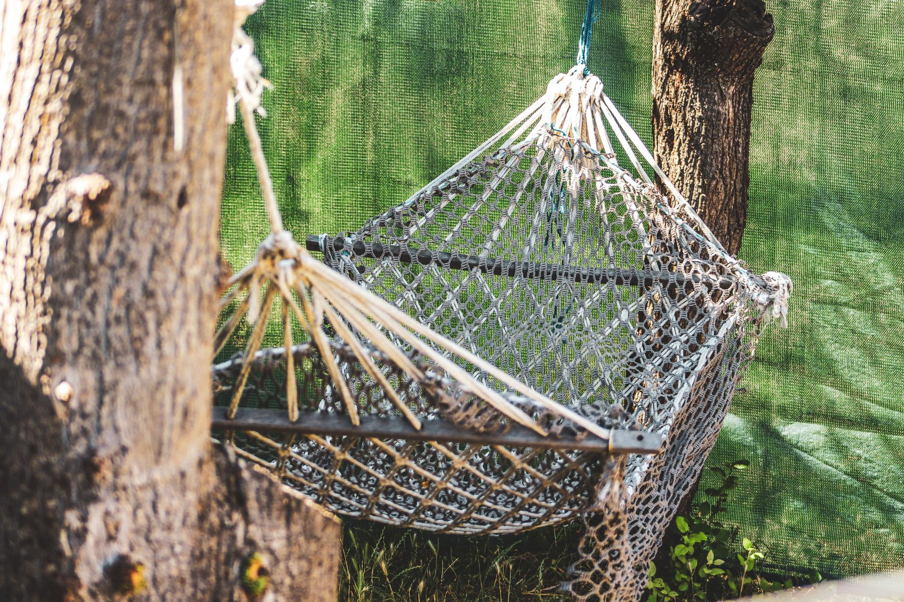

Just because the mornings are cooler doesn't mean the backyard has to go quiet until spring. Most of what keeps people inside once fall sets in isn't the temperature itself — it's wind, damp seating, and no light once the sun goes down early. Fix those three things and a patio or backyard easily stays in regular use through several more weeks of the season, often well into the point where you're wearing a jacket outside.

## Add a Heat Source (Fire Pit, Patio Heater, or Both)

Heat is the piece that makes the biggest difference, and you don't need a major installation to get it. A wood-burning or propane fire pit gives you both warmth and a natural gathering point — people angle chairs toward it without being told to. If you already have a fire pit, fall is the season it earns its keep; if you don't, a portable propane model is a reasonable weekend purchase that needs no permanent installation.

A standalone patio heater is the other common option, and it has real advantages a fire pit doesn't: no smoke, no ash cleanup, and even heat distribution that doesn't depend on which side of the flame someone is sitting on. Propane heaters throw the most heat for the money, while electric infrared heaters are quieter and don't need a fuel tank refilled, at the cost of needing a nearby outlet. For a covered patio, an electric option is usually the safer and more practical choice, since open-flame heaters need clearance from anything overhead.

## Block the Wind Before You Add Warmth

Heat only works if it isn't being carried away as fast as you produce it, and wind is the biggest reason an otherwise mild fall evening feels unbearable. Before investing in a heater, look at where the wind is actually coming from on your patio — it's often funneled by a fence line, a gap between the house and a garage, or an open side of a pergola. A single well-placed windscreen, a section of outdoor curtain, or even a dense row of potted shrubs can cut wind speed enough that the same heater output feels noticeably warmer.

Retractable outdoor curtains on a pergola or covered porch are worth the investment if you use the space often — they block wind on the sides that need it while staying open on the sides that don't, and they double as shade earlier in the season. If a permanent install isn't in the budget this year, a couple of freestanding outdoor privacy screens placed on the windward side accomplish most of the same thing for a fraction of the cost.

## Layer in Soft Textiles and Lighting

A patio that felt fine on bare metal chairs in July starts feeling cold and uninviting in September, even before the air temperature actually drops much. Outdoor-rated cushions, a few weatherproof throw blankets kept in a covered bin nearby, and a thick outdoor rug under the seating area all change how the space feels to sit in, independent of the actual temperature. Wool and acrylic blends hold up far better than cotton throws left outside, since cotton absorbs moisture and stays damp long after the air has dried.

Lighting matters more in fall than any other season, since the usable daylight hours shrink fast and most of your outdoor time shifts to early evening. String lights on a timer, a couple of solar path lights, and one warm-toned lantern near the seating area go a long way toward making the space feel intentional after dark rather than abandoned. Warm white (2700K–3000K) reads as cozy outdoors, where bright white daylight-toned bulbs tend to feel sterile and uninviting once the sun is down.

## Create a Dedicated Cozy Nook

Rather than trying to make your whole patio fall-ready, it's often more effective to set up one smaller, well-protected spot that stays comfortable even as the rest of the yard cools off. A hammock tucked between two trees in a wind-sheltered corner, a pair of chairs angled around a small table near the fire pit, or a covered swing with a blanket draped over the back all work as a single destination that's worth bundling up for. That focused approach tends to get used far more than a large, exposed patio that technically has seating but never feels quite comfortable enough to linger in.

If you're setting up a hammock or a swing for fall use specifically, check the hanging hardware and any exposed rope or webbing for UV wear before the season's first really windy day — components that were fine all summer can be more brittle than they look after months of sun exposure, and a fall storm is a common time to find that out the hard way.

## Rethink Your Seating for Fewer, Longer Evenings

Fall outdoor use tends to look different from summer use — fewer big gatherings, more small groups sticking around later into the evening near a heat source. It's worth temporarily rearranging seating to reflect that: pull a couple of chairs in closer to the fire pit or heater rather than keeping furniture spread out across the whole patio the way it might sit in July. A tighter arrangement traps warmth better between people and just reads as more inviting in photos and in person, which matters if the goal is actually getting people to want to stay outside once it's dark.

## Know When to Start Protecting What You've Added

Extending the season doesn't mean ignoring the calendar entirely. Keep an eye on the extended forecast once you're regularly running a fire pit or heater in the evenings — a hard freeze warning means it's time to bring cushions and blankets inside for the night even if you plan to keep using the space again in a few days. Most of the upgrades in this list (curtains, rugs, string lights, a portable heater) are easy to bring in and set back out as needed, which is exactly what makes them a better fit for stretching the season than a full permanent remodel would be.
