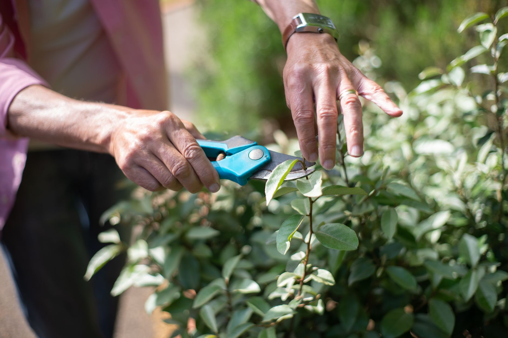

Cool mornings and tired-looking perennials trigger the same urge in most gardeners: grab the shears and tidy up before winter. That's the right move for some plants and harmful for others. Prune the wrong shrub in fall and you can cut off next spring's flowers, or push out tender growth that the first hard freeze kills. A few simple rules tell you what to cut now and what to leave.

**Quick answer:** In fall, remove dead, damaged and diseased growth anywhere, cut down perennials whose foliage carries disease (peonies, bearded iris, garden phlox with mildew), clear spent vegetable plants, and tidy mushy hostas and daylilies. Leave spring-flowering shrubs such as lilac, forsythia and bigleaf hydrangea until after they bloom, save roses, butterfly bush and panicle hydrangeas for late winter or early spring, and leave ornamental grasses and seed heads standing for winter protection and wildlife.

## Why Timing Matters in Fall

**Pruning triggers growth.** A cut in spring gives the plant months to heal and harden new shoots. A cut in early fall can trigger tender growth that doesn't harden before frost and gets damaged over winter.

**Many shrubs have already set next year's buds.** Spring bloomers form flower buds on this year's wood during summer. Cutting them in fall removes those buds, and you lose next spring's flowers even though the plant stays healthy.

**Standing growth has value.** Stems and seed heads catch insulating snow, shelter beneficial insects and feed birds.

## Prune in Fall

| Plant or task | Why | How |
|---|---|---|
| Dead, damaged or diseased wood on any plant | Removes pest and disease hideouts; no growth triggered | Cut back to healthy wood |
| Peonies | Foliage can carry botrytis and other fungi | Cut stems near the ground after frost; bag or trash the foliage |
| Bearded iris | Leaves can hide iris borer eggs and leaf spot | Cut foliage back to a few inches; clean up debris |
| Garden phlox and bee balm with powdery mildew | Reduces overwintering spores | Cut down and dispose of affected stems |
| Hostas and daylilies | Foliage turns to mush after frost; hosts slugs | Remove after it collapses |
| Spent annuals and vegetable plants | Pests and disease overwinter in debris | Pull; compost healthy material only |
| Perennial vegetables and herbs, like asparagus ferns | Browned foliage can harbor pests | Cut once fully yellow or brown |

Dispose of diseased material in the trash or municipal yard waste rather than a home [compost pile](/blog/how-to-compost-at-home/), which may not get hot enough to kill pathogens.

## Leave Until Late Winter or Spring

| Plant | Why wait | When to prune |
|---|---|---|
| Lilac, forsythia, azalea, rhododendron, weigela | Bloom on old wood; buds already set | Right after flowering next spring |
| Bigleaf and oakleaf hydrangeas (*H. macrophylla*, *H. quercifolia*) | Most bloom on old wood | Deadhead lightly; prune after bloom |
| Panicle and smooth hydrangeas (*H. paniculata*, *H. arborescens*) | Bloom on new wood; dried flowers add winter interest | Late winter or early spring |
| Butterfly bush | Stems protect the crown; can die back in cold winters | Early spring, once new buds show |
| Roses | Fall pruning can push tender growth; canes protect the crown | Light trim of long canes to prevent wind damage; main pruning in early spring |
| Ornamental grasses | Foliage insulates crowns; winter interest | Late winter, before new growth |
| Coneflower, black-eyed Susan, sedum | Seed heads feed birds; stems shelter insects | Late winter |
| Marginally hardy perennials (e.g., some salvias, mums) | Old growth protects the crown | Spring, when new growth appears |
| Evergreens like boxwood, holly, yew | New growth may not harden before cold | Late winter to early spring |
| Fruit trees | Winter-dormant pruning is standard | Late winter, while dormant |

## Trees and Hedges

- **Structural tree pruning** is usually best in late winter when trees are dormant and branch structure is easy to see. Fall is fine for removing dead or hazardous branches.
- **Hedges** can get a light trim in early fall where winters are mild, once growth has slowed, but avoid heavy shaping late in the season.
- **Oaks** in areas with oak wilt should generally not be pruned during the warm season; follow your local extension's recommended window.
- **Large limbs, work near power lines,** or anything requiring a ladder and a saw overhead is a job for a certified arborist.

## How to Make a Good Cut

| Tool | Use for |
|---|---|
| Bypass hand pruners | Live stems up to about ½–¾ inch |
| Loppers | Branches up to about 1½ inches |
| Pruning saw | Thicker branches |
| Hedge shears | Soft growth on formal hedges |

- Cut just above an outward-facing bud or side branch, at a slight angle.
- Don't leave stubs; they die back and can invite rot.
- On larger branches, cut just outside the branch collar (the swollen ring where the branch joins the trunk), and use three cuts to prevent bark tearing.
- Clean blades with rubbing alcohol between plants, especially after cutting diseased growth.
- Don't remove more than about a quarter to a third of a shrub's growth in one session.
- Skip wound paint; most trees seal cuts better on their own.

## Fall Cleanup Beyond Pruning

- Leave a light layer of leaves in beds as mulch around healthy perennials; see our guide to [raking leaves](/blog/how-to-rake-leaves-efficiently/).
- Mulch newly planted or [divided perennials](/blog/divide-and-transplant-perennials-in-fall/) after the ground cools.
- Plant [spring bulbs](/blog/how-to-plant-spring-bulbs-in-fall/) while you're working in the beds.
- Clean and oil tools before storing them for winter.

## A Three-Question Checklist

1. **Is it dead, damaged or diseased?** Cut it now.
2. **Does it bloom in spring on old wood?** Leave it until after it flowers.
3. **Does it protect the crown, feed wildlife or add winter interest?** Leave it until late winter.

## FAQ

### Should I cut back perennials in fall or spring?

Both approaches work. Cut back diseased or mushy perennials in fall, and leave healthy ones with seed heads or sturdy stems until late winter for wildlife and crown protection.

### Can I prune hydrangeas in fall?

Only lightly deadhead. Bigleaf and oakleaf types bloom on old wood, so pruning now removes next year's flowers. Panicle and smooth hydrangeas are pruned in late winter or early spring.

### When should I prune roses?

Do the main pruning in early spring, around when buds swell. In fall, just shorten very long canes that could whip in the wind.

### Is it bad to prune trees in fall?

Removing dead or dangerous branches is fine anytime. Save structural pruning for late winter dormancy, when wounds close faster and disease spread is lower for many species.
