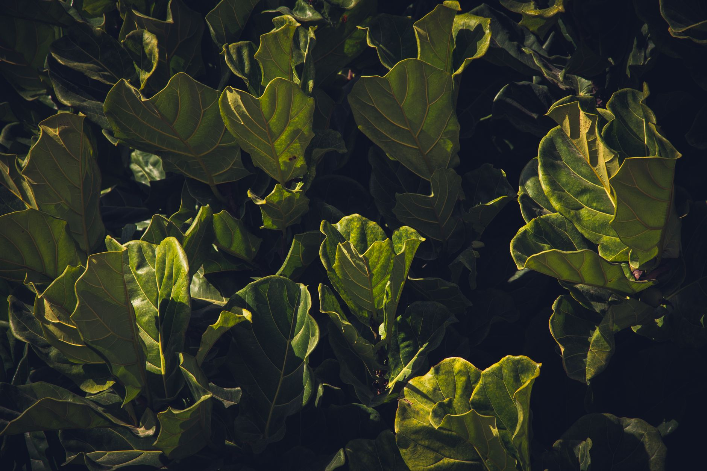

Fiddle leaf figs (Ficus lyrata) are popular for their dramatic, sculptural leaves — and notorious for dropping those same leaves at the slightest inconsistency in care. Most of the drama is avoidable once you understand what the plant actually wants.

## Light: More Than You Think

Fiddle leaf figs need bright, indirect light — a spot a few feet from a large south- or east-facing window is ideal. Low light is the single most common reason for leggy growth and leaf drop; if your plant looks sparse and stretched, light is almost always the first thing to fix. Direct, unfiltered afternoon sun through unshaded glass can scorch leaves too, so the goal is bright but filtered — a sheer curtain, or a spot a few feet back from a south-facing window, usually gets the balance right. If your home genuinely doesn't have a bright enough spot, a grow light on a daily timer is a reasonable substitute and will keep the plant from stretching toward the nearest window.

## Water: Consistency Over Frequency

Water when the top 1-2 inches of soil are dry, then water thoroughly until it drains from the bottom. The pattern that kills these plants isn't underwatering or overwatering specifically — it's inconsistency, swinging between bone-dry and soaking wet. Setting a simple weekly check-in (not necessarily a weekly watering, just a check) helps you catch the plant's actual rhythm rather than watering on autopilot regardless of what the soil is doing. Always let excess water drain fully and empty any saucer underneath — a pot sitting in standing water is one of the most common overwatering mistakes, even when the watering schedule itself is otherwise correct.

## Signs You're Overwatering

Brown spots with yellow halos, and leaves that feel soft or mushy rather than crisp, usually point to overwatering or root rot. Cut back and check that the pot has good drainage. If you suspect root rot has set in, it's worth gently removing the plant from its pot to inspect the roots — healthy roots are firm and light-colored, while rotted roots are dark, mushy, and often smell unpleasant. Trimming away clearly rotted roots and repotting into fresh, well-draining soil can save a plant that's caught early, though a fig with the majority of its root system rotted is a much harder recovery.

## Signs You're Underwatering

Crispy brown edges on leaves, and soil pulling away from the pot's sides, mean the plant needs water more consistently — not necessarily more of it at once. A pot that feels unusually light when lifted is another reliable underwatering signal, since dry soil weighs noticeably less than moist soil. If the plant has gone through a genuine dry spell, resist the urge to flood it all at once to compensate — a thorough, normal watering followed by returning to a consistent schedule works better than an overcorrection.

## Humidity and Temperature

Fiddle leaf figs prefer humidity above 30-40%, which is drier climates and winter heating can easily dip below. A humidifier nearby, or grouping it with other plants, helps, and misting can offer minor short-term relief though it's far less effective than actually raising ambient humidity. Keep it away from cold drafts, heating vents, and air conditioning — sudden temperature swings are another common trigger for leaf drop. A spot near a frequently opened exterior door in winter is a common unnoticed source of temperature swings worth checking for.

## Feeding and Growth Expectations

During the active growing months (typically spring through early fall), a balanced liquid fertilizer diluted to about half strength every four to six weeks supports steady new growth without risking fertilizer burn. Hold off on feeding in the dormant winter months, when the plant's growth naturally slows regardless of how much fertilizer it gets. New growth typically emerges from the top of the plant as a small, tightly furled leaf that unfurls over a week or two — a plant that isn't pushing any new leaves across an entire growing season is worth reassessing for light, watering consistency, or root-bound conditions rather than assumed to simply be a slow grower.

## Pests to Watch For

Spider mites and scale are the two pests most likely to show up on a fiddle leaf fig, especially in dry indoor air during winter. Fine webbing on the underside of leaves or small stippled discoloration on the leaf surface usually points to spider mites, while small brown bumps that don't wipe off easily are typically scale. Wiping leaves down periodically with a damp cloth helps you catch either problem early and also removes dust that can block light absorption, which matters more for a plant already sensitive to inconsistent light.

## Don't Rotate or Repot Too Often

Fiddle leaf figs dislike being moved and can drop leaves in protest after a location change or repotting — even a positive one. Rotate the pot only a quarter turn every few weeks for even growth, rather than moving the whole plant around the house. When repotting genuinely becomes necessary (roots visibly circling the pot's edge, or water running straight through without being absorbed), size up gradually — one pot size larger, not a dramatic jump — since an oversized pot holds excess moisture the roots can't use fast enough, recreating the same overwatering risk the rest of this guide is trying to help you avoid.
