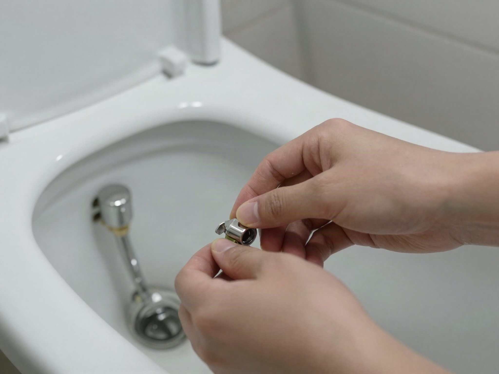

A running toilet isn't just annoying — it can waste hundreds of gallons of water a day. The good news is that almost every case comes down to one of three cheap, easy-to-replace parts inside the tank.

## What You'll Need

- No tools for basic adjustments
- A replacement flapper or fill valve (a few dollars at any hardware store) if adjustment doesn't fix it
- A towel (tanks hold more water than you'd expect)

## Step 1: Open the Tank and Look

Remove the tank lid and set it somewhere safe. Flush the toilet and watch what happens inside the tank — this tells you which of the three usual suspects is the problem.

## Cause 1: The Flapper Isn't Sealing

The flapper is the rubber piece at the bottom of the tank that lifts to release water on flush, then should drop and seal. If it's warped, cracked, or not sitting flat, water leaks continuously into the bowl. Check the chain connecting it to the flush handle — if it's too short, the flapper can't fully close; if too long, it can get pinched under the flapper itself.

## Cause 2: The Fill Valve Float Is Set Too High

If the float (either a ball on an arm or a cylinder around the fill valve) is set too high, water keeps filling past the overflow tube and continuously drains out.

Most fill valves have a clip or screw to lower the float — adjust it so the water level sits about 1 inch below the top of the overflow tube.

## Cause 3: The Fill Valve Itself Is Worn Out

If adjusting the float doesn't stop the running, the fill valve's internal seal may simply be worn out. These are inexpensive to replace: shut off the water supply valve behind the toilet, drain the tank, unscrew the old valve, and install a new one following the packaging instructions — most are a straightforward twist-and-connect design.

## When You're Done

Turn the water back on, flush once, and listen for a full minute after the tank refills. If it's silent, you've fixed it — if you still hear a faint hiss, double-check the flapper seal and float height before assuming you need a second replacement part.
