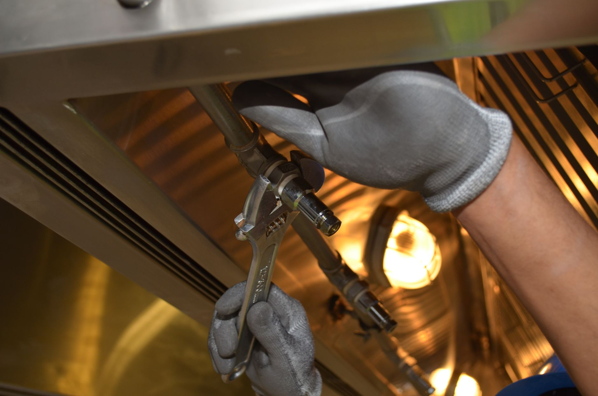

Most furnaces sit idle for months, and the first cold snap is the worst time to discover something went wrong. Over the summer, filters load up with dust, vents get blocked by furniture, and batteries in thermostats and detectors quietly run down. None of the checks below require opening sealed parts of the furnace; they're the basics a homeowner can safely handle before the season, leaving combustion testing and internal inspection to a licensed technician.

**Quick answer:** Before heating season, replace the air filter, clear 2–3 feet around the furnace, open all supply and return vents, check the outdoor intake and exhaust pipes on high-efficiency furnaces, and make sure the condensate drain flows. Test the thermostat, then run a full heating cycle and watch for unusual smells, sounds or short cycling. Test smoke and carbon monoxide detectors. Book a professional tune-up if the furnace is older, you noticed anything odd, or the manufacturer requires yearly service.

## Safety First

- **Turn off power** at the furnace switch (it looks like a light switch on or near the unit) before removing any access panels.
- **Never adjust gas valves, burners or the heat exchanger.** Those are jobs for a licensed technician.
- **If you smell gas,** don't use switches or flames. Leave the house and call your gas utility from outside.

## The Pre-Season Checklist

| Task | Time | Why |
|---|---|---|
| Replace the air filter | 5 min | Restores airflow and efficiency |
| Clear space around the furnace | 10 min | Fire safety and service access |
| Open and clear all vents and returns | 15 min | Balanced airflow, less strain on the blower |
| Check intake and exhaust pipes (high-efficiency units) | 5 min | Blocked pipes shut the furnace down |
| Check the condensate drain | 5 min | Clogs trigger shutdowns or leaks |
| Test the thermostat | 10 min | Confirms the system starts and heats |
| Watch a full heating cycle | 15 min | Spots warning signs early |
| Test smoke and CO detectors | 10 min | Life-safety check |

## Step 1: Replace the Filter

A clogged filter forces the blower to work harder, raises energy use and can cause the furnace to overheat and shut off on its safety limit.

1. Turn the thermostat off.
2. Slide out the filter, noting the size printed on the frame and the airflow arrow.
3. Install a new filter with the arrow pointing toward the furnace (in the direction of airflow).

| Filter type | Typical replacement |
|---|---|
| 1-inch pleated | Often every 1–3 months during heating season |
| 4–5 inch media filter | Often every 6–12 months |
| Washable filters | Clean per the manufacturer's instructions |

Check more often with pets, construction dust or allergies. Very high MERV filters can restrict airflow in some systems; follow the furnace manufacturer's recommendation.

## Step 2: Clear the Area Around the Furnace

Remove boxes, paint, cleaning products, laundry and anything flammable from the area. Leave space for air and for a technician to work. Many manufacturers specify minimum clearances in the manual; when in doubt, keep a few feet clear on all sides.

## Step 3: Open Vents and Returns

Walk through the house and make sure every supply register is open and return grilles aren't blocked by furniture, rugs or curtains. Vacuum dusty registers. Closing vents in unused rooms usually doesn't save much energy and can raise pressure in the ducts, so keep most of them open.

## Step 4: Check Outdoor Pipes and Condensate (High-Efficiency Furnaces)

High-efficiency furnaces usually vent through two plastic pipes on an outside wall or roof.

- Make sure the intake and exhaust pipes are free of leaves, nests, snow and ice.
- Keep shrubs and snow drifts well clear through winter.

These furnaces also produce condensate water. Check that the drain line and condensate pump (if you have one) aren't clogged and water flows freely to the drain. A blocked drain can shut the furnace down.

## Step 5: Test the Thermostat

- Replace the batteries if the thermostat uses them.
- Switch to heat and set it a few degrees above room temperature.
- Within a few minutes, the furnace should start and warm air should reach the vents.
- Confirm the schedule, and set a comfortable setback temperature for nights or time away.

Early fall is also the easiest time to install a programmable or smart thermostat, before you rely on the heat daily.

## Step 6: Watch and Listen Through a Full Cycle

| What you notice | Likely meaning | What to do |
|---|---|---|
| Faint dusty smell for the first few minutes of the season | Dust burning off | Normal; should fade quickly |
| Burning plastic, electrical smell or lingering odor | Possible electrical or component problem | Shut the system off; call a pro |
| Gas smell | Possible gas leak | Leave the house; call the gas utility from outside |
| Loud banging, grinding or squealing | Ignition delay, motor or belt problem | Call a pro |
| Furnace turns on and off every few minutes | Short cycling: dirty filter, sensor or sizing issue | Replace filter; call a pro if it continues |
| Cool air from the vents | Ignition or safety lockout, filter, thermostat settings | Check settings and filter; call a pro |
| Water around the unit | Condensate clog or leak | Clear the drain; call a pro if it returns |
| Yellow, flickering burner flame (visible through a window) | Possible combustion problem | Call a pro; don't use the furnace until checked |

## Step 7: Test Smoke and Carbon Monoxide Detectors

A furnace burns fuel, so working CO detectors are essential. Press the test button on every smoke and CO alarm. Replace batteries as needed, and replace the whole unit when it reaches the end of life printed on it, often around 7–10 years. Install CO alarms near sleeping areas and on every level, following the manufacturer's guidance.

## Step 8: Seal Heat Leaks

A furnace works harder when warm air escapes. [Weatherstripping doors and windows](/blog/how-to-weatherstrip-doors-and-windows/) and sealing obvious duct leaks in accessible basements or attics with foil tape or mastic are simple ways to cut heating costs.

## Backup Heat and Power

If the heat goes out during a storm, a safe backup plan matters. Our [space heater buying guide](/blog/space-heater-buying-guide/) covers safe room heating, and the [portable generator guide](/blog/portable-generator-buying-guide/) explains how to size a generator for a furnace blower. Never run a generator indoors or in a garage.

## When to Call a Professional

- The furnace is over several years old and hasn't had a tune-up recently
- Anything unusual in the checklist above
- Rising energy bills with no other explanation
- Uneven heating from room to room
- Your warranty requires annual professional maintenance

A technician can check combustion, test safety controls, inspect the heat exchanger for cracks, clean the flame sensor and burners, and verify gas pressure. Booking in early fall usually means faster appointments than during the first cold snap.

## FAQ

### How often should I replace my furnace filter?

For standard 1-inch filters, often every one to three months during heating season. Thicker media filters last longer. Check monthly and replace when dirty.

### Is a burning smell normal when I first turn on the heat?

A light dusty smell that fades within minutes is common. A strong, lingering or electrical smell isn't; turn the system off and call a pro.

### Do I need an annual furnace tune-up?

Many manufacturers and technicians recommend it, especially for gas furnaces, and some warranties require it. It's the only way to check combustion and the heat exchanger safely.

### Should I close vents in rooms I don't use?

Usually not. Closing many vents can increase duct pressure and reduce efficiency. Keep most vents open.
