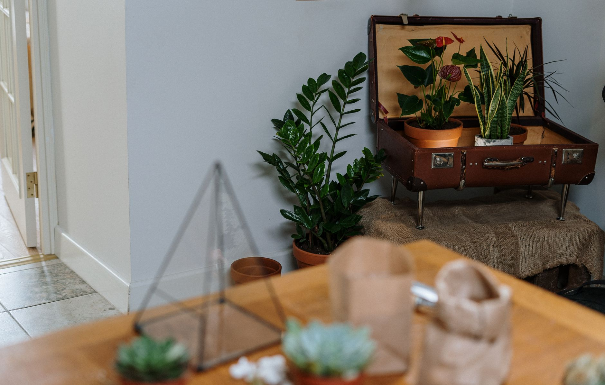

A drooping, yellowing houseplant almost always gets the same first response: more water. That instinct is exactly backward if the real problem is root rot, which quietly kills more houseplants than any pest or light problem — by the time the leaves look bad enough to worry about, the damage has usually been building underground for weeks. The good news is that it's rarely an instant death sentence. Caught early, most plants recover fully; caught late, you can often still save part of the plant even when the original root system is too far gone to keep.

**Quick answer:** Root rot happens when soil stays wet long enough that roots are starved of oxygen and fungal pathogens take hold, turning healthy white roots brown, black and mushy. The clearest sign isn't one symptom but a mismatch: a plant that looks thirsty (drooping, yellowing, dropping leaves) despite soil that's still wet, often with a sour smell at the drainage hole. Confirm it by sliding the plant out of its pot and checking the roots — firm and pale is healthy, soft and dark is rotted. Trim the rotted roots with sterilized scissors, repot into fresh, fast-draining soil in a pot no bigger than the root system needs, and hold off on watering until the plant is ready.

## Why Root Rot Happens in the First Place

Roots need oxygen almost as much as they need water, normally drawn from air pockets in the soil. When soil stays saturated — from overwatering, poor drainage, a pot with no drainage hole, or a pot oversized for the plant's current roots — those air pockets fill with water instead, and roots sitting in it begin to suffocate within days. The moment root tissue weakens, fungi already present in most potting soil (commonly *Pythium* or *Phytophthora*) move in and start breaking down the dying tissue, then spread to nearby healthy roots — which is why rot gets worse quickly once it starts rather than staying contained.

This is also why fall and winter are the riskiest season for it. Most houseplants slow their growth as light drops, so they pull far less water from the soil — but it's easy to keep watering on the same schedule out of habit, leaving soil wet longer than the plant can handle. If you haven't scaled back your watering routine yet, our guide on [adjusting houseplant care for fall and winter](/blog/adjust-houseplant-care-for-fall-winter/) walks through how much to cut back and when.

## The Early Warning Signs (Before You See the Roots)

Its above-ground symptoms look almost identical to underwatering, which leads straight to the wrong fix. Watch for this combination instead of any single sign on its own:

- **Yellowing that starts at the base or interior of the plant**, often on lower, older leaves first, rather than scattered randomly across the plant.
- **Leaves that feel soft or limp rather than dry and crisp** — underwatered leaves usually crisp up at the edges or tips; rot-related yellowing tends to leave leaves mushy or deflated.
- **Wilting or drooping even though the soil is visibly wet** a day or more after watering. This mismatch — a thirsty-looking plant sitting in damp soil — is the single biggest tell.
- **A sour, swampy, or "pond water" smell** coming from the drainage hole or the soil surface. Healthy soil smells like, at most, mild earth; rotting roots smell distinctly off.
- **Stunted or stalled new growth** over several weeks, even in a plant that's getting adequate light.
- **A sudden increase in fungus gnats**, since the larvae thrive in the same chronically wet soil that encourages rot. If gnats showed up alongside these other signs, treat it as a clue rather than a coincidence — our guide to [getting rid of fungus gnats](/blog/how-to-get-rid-of-fungus-gnats/) covers the pest, but the underlying fix is the same: let the soil dry out.
- **The plant feels loose in the pot**, with little resistance when tugged gently at the base, because rotted roots no longer anchor it the way healthy ones do.

One or two of these alone can mean something else — a single yellow leaf is often just normal aging. It's the cluster, especially wilting plus wet soil plus smell, that should send you to check the roots rather than guess.

## How to Inspect the Roots Safely

Checking the roots takes five minutes and ends the guesswork.

1. **Water lightly a day beforehand** if the soil is bone dry, so the root ball slides out cleanly rather than crumbling apart.
2. **Turn the pot on its side and gently slide the plant out**, supporting the base of the stem. If it's stuck, run a butter knife around the inside edge of the pot first.
3. **Rinse the loose soil off the roots** under lukewarm running water so you can see them clearly instead of guessing through dirt.
4. **Look and feel for the difference.** Healthy roots are firm, flexible, and white, tan or light yellow. Rotted roots are brown or black, mushy, and often slip off in your fingers or leave a hollow, stringy core when squeezed — a healthy root holds its shape under light pressure.
5. **Smell the roots and rinsed-off soil.** A sour or rotten-egg smell confirms fungal decay; a neutral, earthy smell points to something else, like underwatering or low light.

Work over an old towel or outside, and have your rescue supplies (clean pot, fresh soil, sterilized scissors) ready before you start so the roots aren't exposed to air longer than necessary.

## How Bad Is It? Matching the Damage to a Plan

Not every case needs the same response. Use the roots' condition, not the leaves, to decide how aggressive to be.

| Root condition | What you'll see | Best course of action |
|---|---|---|
| **Mild** | Under 25% of roots brown/mushy; most of the mass is firm and pale | Trim affected roots, repot into fresh soil in a similar-size pot, resume lighter watering |
| **Moderate** | Roughly 25-50% affected; some healthy white roots remain, plant looks stressed | Trim rot back to healthy tissue, repot into a smaller pot than before, expect a slow recovery |
| **Severe** | More than half the roots are mushy or gone; stem base may be soft too | Trim hard to any healthy tissue left; with little root remaining, take stem cuttings instead |
| **Total loss** | No firm roots remain, stem is soft at the base, smell is strong throughout | The plant likely can't be saved — propagate from any firm, unaffected tissue above the rot |

If you land in the severe or total-loss row, don't treat it as wasted effort — a stem cutting taken well above the rot line often roots just fine even when the original root system is beyond saving. Our guide to [propagating houseplants from cuttings](/blog/propagate-houseplants-from-cuttings/) covers both the water and soil methods for starting a new root system from a healthy piece of the plant.

## The Step-by-Step Rescue Method

Once you know roughly how much root is affected, work through the rescue in order:

1. **Sterilize your scissors or pruning snips** with rubbing alcohol or diluted bleach before cutting anything — unsterilized blades can carry the same pathogens into tissue you're trying to save.
2. **Cut away every brown, black or mushy root**, trimming a little into visibly healthy, firm, pale tissue beyond where the damage ends. Leaving infected root behind gives the rot a foothold to restart.
3. **Trim any affected leaves or stem tissue** the same way, since rot can travel upward into the lower stem before it shows above the soil line.
4. **Let the trimmed roots air-dry for an hour or two** in a shaded spot before repotting, so the cut surfaces callous slightly and resist new infection.
5. **Discard the old soil entirely** rather than reusing it — it likely still carries the pathogens that caused the problem.
6. **Repot into fresh, fast-draining mix** in a clean pot (wash a reused one with diluted bleach first) no larger than the remaining roots need. An oversized pot holds more water than reduced roots can use, which is how root rot often starts in the first place.
7. **Hold off on watering for several days to a week**, until the top inch or two of soil is dry — fewer roots mean the plant needs noticeably less water than before.
8. **Keep it in bright, indirect light**, out of direct sun, while it recovers; it has less root capacity to support vigorous new growth right now.
9. **Skip fertilizer for four to six weeks.** A near-rootless plant can't process nutrients normally, and fertilizer salts can burn what roots are left.

Recovery is usually visible within two to four weeks as new growth or firmer leaves, though a severely cut-back plant can take a full growing season to look like its old self again.

## Common Mistakes That Make Root Rot Worse

| Mistake | Why it backfires | Better approach |
|---|---|---|
| Watering more because the plant looks wilted | Adds to the waterlogging that caused the rot | Check soil moisture and roots before adding water |
| Reusing the old soil after trimming roots | Pathogens persist in soil even after visible rot is removed | Repot into fresh, sterile potting mix |
| Repotting into a much bigger pot "for room to grow" | Excess soil holds water the smaller root system can't use | Match pot size to the current root mass |
| Leaving rotted tissue behind while trimming | Remaining infection spreads to new, healthy growth | Cut back into clearly healthy tissue |
| Fertilizing right after the rescue | Salt buildup stresses already-compromised roots | Wait four to six weeks, then resume at half-strength |
| Choosing a pot with no drainage hole | Water has nowhere to go, so soil stays saturated | Use pots with drainage, or a liner pot with holes |

## Preventing Root Rot From Coming Back

Rescuing a plant once is worth far less than not needing to rescue it again. A few habits make the biggest difference:

- **Check the soil before you water, every time**, rather than on a fixed schedule. Stick a finger an inch or two down and only water when it's dry there — summer schedules are often wrong by fall, as our guide to [adjusting houseplant care for fall and winter](/blog/adjust-houseplant-care-for-fall-winter/) covers in more depth.
- **Use pots with drainage holes, always.** A decorative pot without one can work as a cover, but keep the plant in a nursery pot with holes and empty any water that collects in the cover pot.
- **Match the soil mix to the plant.** A succulent or snake plant in a dense, moisture-retentive mix struggles even with careful watering; adding perlite or coarse sand for drainage matters as much as how often you water.
- **Size pots to the current root system**, not the plant's eventual mature size, and size up gradually over a few years — the same sizing principle covered in our guide to [repotting a houseplant](/blog/how-to-repot-a-houseplant/).
- **Empty saucers and cover pots after watering** rather than letting the plant sit in standing water for days.

## Safety Notes

Root rot itself isn't a hazard to you, but wash your hands after handling rotted roots and soil, since the fungi involved can occasionally irritate skin or trigger allergies. Wear gloves if the plant's sap is irritating. And if rot keeps recurring across several plants in the same room, consider whether a leaking pipe, poor ventilation, or a household habit of overwatering is the real cause, rather than treating each plant as an isolated case.

## FAQ

### Can a plant with root rot be saved, or should I just start over?

Most cases can be saved, especially when some healthy roots remain. Even when the root system is largely gone, a cutting from unaffected stem or leaf tissue can start a new plant, so the effort isn't lost even if the original root ball isn't salvageable.

### How long does recovery take after a root rot rescue?

A mild case with most roots intact often shows new growth within two to three weeks. A severe case needing heavy trimming can take two to three months, since the plant is rebuilding its root system before it can support much new top growth.

### Is root rot contagious to other houseplants nearby?

Not through the air, but it spreads through shared tools, reused soil, or water draining from one pot into a tray holding others. Sterilize tools between plants, never reuse soil from a rotted one, and avoid letting multiple pots sit in shared standing water.

### How is root rot different from just underwatering?

The two look nearly identical from the leaves alone. The difference is in the soil and roots: underwatering means dry soil and firm, pale roots; root rot means wet or recently wet soil and soft, dark roots. If the soil is still damp and the plant looks thirsty anyway, suspect rot before reaching for the watering can.
