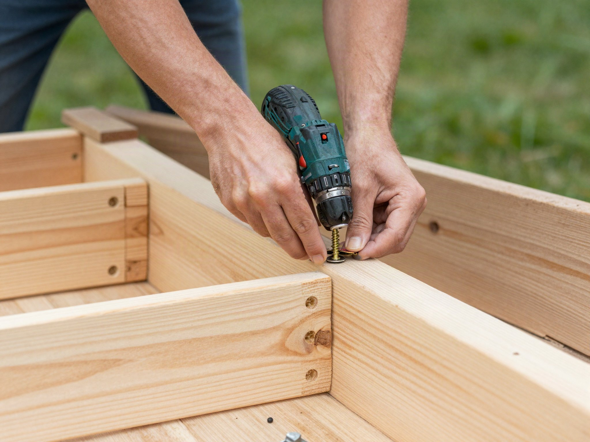

Raised garden beds are one of the fastest ways to go from bare yard to productive garden. They warm up faster in spring, drain better than in-ground beds, and keep weeds and foot traffic out of your growing space. Here's how to build one in an afternoon.

## Why Raised Beds Outperform In-Ground Gardens

Beyond faster spring warming and better drainage, raised beds give you complete control over soil quality from day one — no fighting compacted clay, rocky ground, or years of depleted nutrients in existing yard soil. They also reduce back strain since the growing surface sits higher, and the defined edges make it much easier to keep grass and invasive weeds from creeping into your growing space compared to an open in-ground bed with no physical barrier.

## What You'll Need

- 6 cedar boards, 2"x10"x8' (untreated — avoid pressure-treated wood near edibles)
- 4 corner posts, 4"x4"x18"
- 3" deck screws
- Drill/driver
- Circular saw (or have the lumber yard cut it for you)
- Landscape fabric (optional, for weed suppression underneath)
- Level
- Tape measure and pencil
- Wheelbarrow for moving soil

## Step 1: Choose and Prep the Site

Pick a spot that gets at least 6 hours of direct sun — watch the intended spot over the course of a day if you're not sure, since shade from a nearby structure or tree can shift more than expected between morning and afternoon. Clear grass and level the area with a rake — you don't need it perfectly flat, just even enough that the bed sits stable. Also consider proximity to a water source; a bed that requires dragging a hose across the whole yard every time it needs watering is a bed that gets watered less consistently than one within easy reach.

## Step 2: Cut Your Boards

For an 8' x 4' bed:
- 4 boards at 8' (long sides, doubled for height)
- 4 boards at 4' (short sides, doubled for height)

If you don't have a saw or want to skip the cutting step entirely, most lumber yards will make straight cuts for you at time of purchase, often for free or a small fee — worth asking about even if you own a saw, since it saves setup and cleanup time.

## Step 3: Assemble the Frame

Attach the boards to the 4x4 corner posts using two screws per board-to-post connection, stacking two boards high per side for roughly 20" of depth. Pre-drill to avoid splitting the cedar, particularly near the ends of boards where splits are most likely to start. Check each corner with a square as you go — a frame that's slightly out of square when empty becomes a much bigger problem once it's filled with several hundred pounds of soil.

## Step 4: Place and Fill

Set the frame in position, lay landscape fabric on the bottom if you're building over grass, then fill with a mix of 60% topsoil, 30% compost, and 10% perlite or coarse sand for drainage. Fill in stages rather than dumping everything at once — spreading and lightly tamping a few inches at a time helps avoid large air pockets that cause the soil level to drop unevenly after the first watering.

## Estimating How Much Soil You Need

For an 8' x 4' bed at roughly 20" of depth, you're looking at somewhere in the neighborhood of 40-45 cubic feet of soil mix, which is a substantial amount — often easier and cheaper to source in bulk from a local landscape supplier rather than buying dozens of individual bags. If you're filling a deeper bed and want to save on soil cost, a layer of coarse woody debris or untreated logs at the very bottom (a technique sometimes called hugelkultur) can fill space cheaply while still improving drainage and slowly breaking down to feed the bed over time.

## Step 5: Plant

Let the soil settle for a day, water it in, and you're ready to plant. Raised beds are especially forgiving for root vegetables and tomatoes since the soil stays loose and well-drained all season. Because raised bed soil warms up faster in spring than ground-level soil, you can often start planting slightly earlier than the general planting guide for your area suggests — just keep an eye on your local last-frost date for anything genuinely cold-sensitive.

## Watering Considerations

Raised beds drain well, which is a benefit for root health but also means they dry out faster than in-ground beds, especially in hot weather or with a lighter soil mix. Check soil moisture a couple inches down with a finger rather than judging by the surface alone, which can look dry even when the root zone underneath is still adequately moist. A layer of mulch on top of the soil helps slow evaporation and reduces how often you need to water.

## Maintenance Over Time

Raised bed soil settles and compacts somewhat every season as organic matter breaks down, so plan to top off the bed with fresh compost each spring before planting rather than assuming the original fill level will last indefinitely. Untreated cedar will gray naturally over time from sun and moisture exposure — this is cosmetic, not structural, and doesn't affect how well the bed functions, though an exterior wood oil applied every year or two will keep the boards looking fresher for longer if that matters to you.
