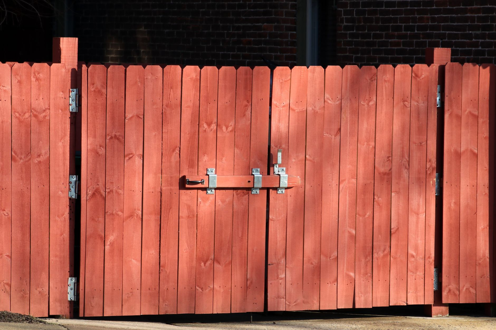

A wood fence is a bigger project than most weekend builds on this site, but it's well within reach if you break it into stages: planning, setting posts, then attaching rails and pickets. Here's the process for a standard 6-foot privacy fence section.

## What You'll Need

- Pressure-treated 4x4 posts
- 2x4 rails (top and bottom, sometimes a middle rail for taller fences)
- Fence pickets (pressure-treated or cedar)
- Fast-setting concrete
- Post hole digger or auger
- Level, string line, and stakes
- Galvanized or stainless deck screws

## Choosing Between Pressure-Treated and Cedar

Pressure-treated pine is the more budget-friendly option and holds up well structurally for posts and rails, since those parts are typically hidden or less visually prominent than pickets. Cedar costs more but resists rot naturally, doesn't require the chemical treatment process, and generally looks better left exposed, which is why many builds mix pressure-treated posts and rails with cedar pickets for the visible surface — a reasonable middle ground between cost and appearance.

## Step 1: Check Property Lines and Call Before You Dig

Confirm your property line before setting any posts — a fence built even a few inches over a boundary can become a real dispute with neighbors. In the US, call 811 (or your local utility locating service) before digging; it's free and prevents you from hitting buried gas, electric, or water lines.

## Step 2: Plan Post Spacing

Space posts 6-8 feet apart on center. Wider spacing needs thicker rails to avoid sagging. Use a string line between end points to keep the entire run straight, and mark each post location with a stake. If your yard has any slope, decide upfront whether you want a stepped fence (each section stays level, with a step down between sections) or a racked fence (pickets follow the slope continuously) — this decision affects how you cut pickets later, so it's worth settling before you dig a single hole.

## Step 3: Dig and Set the Posts

Dig each hole about 1/3 the height of the post (so a 6-foot fence needs roughly 2-foot-deep holes), plus a few inches for a gravel base to help drainage. Set the post, check it's plumb on two adjacent sides with a level, then pour in fast-setting concrete according to the product's instructions. Brace the post with scrap wood stakes while the concrete cures — most products set enough to remove bracing in about 4-6 hours, though full cure takes longer.

## Step 4: Let the Concrete Cure Fully

Don't attach rails until the concrete has fully cured — check the product packaging, but this is typically 24-48 hours. Rushing this step risks knocking a post out of plumb while it's still setting.

## Step 5: Attach the Rails

Attach a top and bottom rail (and a middle rail for fences taller than 6 feet) between each pair of posts, either by face-mounting with brackets or notching the posts. Check each rail is level before securing it — small errors compound quickly across a long fence run.

## Step 6: Attach the Pickets

Starting from one end, attach pickets to the rails with consistent spacing (a scrap block of wood cut to your desired gap width makes a quick, repeatable spacer). Use a level every few pickets to catch any drift in height before it becomes visible across the whole fence.

## Step 7: Build the Gate (If Needed)

A gate needs a slightly sturdier frame than a standard section — diagonal bracing across the frame prevents it from sagging over time, which is the most common gate failure. Use heavy-duty hinges rated for the gate's weight, plus a self-latching mechanism.

## Finishing

Let pressure-treated wood weather for a few weeks to a couple of months before staining or sealing — fresh pressure-treated lumber is often too saturated with moisture for stain to properly absorb. Cedar can typically be sealed sooner. A simple water-bead test tells you when treated wood is ready: sprinkle a few drops on the surface, and if they soak in quickly rather than beading up, the wood has dried enough to accept a finish.

## Setting Posts on a Slope or in Rocky Soil

Sloped yards and rocky soil are the two most common complications beyond a standard flat, diggable yard. On a slope, plan your post heights so the top rail either steps down section by section or follows the grade continuously, and set a string line at the intended top-of-fence height before digging so every post gets cut to the correct final height rather than guessed at after the fact. In rocky soil, a post hole digger alone may not cut it — a gas-powered auger saves significant time and effort, though even that can hit larger buried rocks that need to be worked around or removed by hand. If a hole location repeatedly hits rock, it's usually faster to shift the post a few inches than to fight the same spot indefinitely.

## Maintenance Over the Fence's Life

A wood fence needs periodic attention to get a long lifespan out of it. Check posts every year or two for any wobble at the base, which can indicate the concrete footing has cracked or the post itself has started rotting below the soil line — a problem much easier to catch early than after a whole section leans. Reapply stain or sealant every few years depending on your climate and how much direct sun and rain the fence gets; a fence in full sun with no cover will need refinishing more often than one in a shadier yard. Trim back any vegetation growing directly against the fence line, since plants held tight against wood trap moisture and accelerate rot in exactly the spots you can't easily see.

## Common Mistakes to Avoid

Skipping the call-before-you-dig step is the most consequential mistake on this list — hitting a buried utility line is a real safety risk and can be expensive to repair, and it's entirely avoidable with a free phone call. Not letting concrete cure fully before attaching rails is a close second, since a post knocked out of plumb while the concrete is still green is much harder to fix than to simply wait an extra day. And underestimating post depth for your local frost line is a mistake that won't show up until the following winter, when frost heave can push an under-set post out of the ground — check your local building code for the minimum recommended post depth in your climate before digging.
