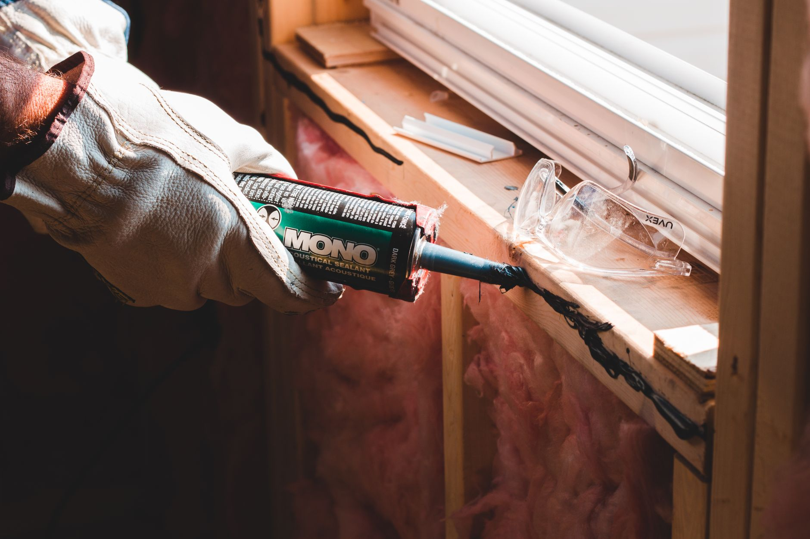

Cracked, yellowed, or moldy caulk around a bathtub is one of the fastest things to make an otherwise clean bathroom look neglected — and it's also one of the cheapest weekend fixes available.

## What You'll Need

- 100% silicone caulk (kitchen & bath formula, mold-resistant)
- Caulking gun
- Caulk removal tool or a utility knife
- Rubbing alcohol and a rag
- Painter's tape
- A caulk smoothing tool or your finger with a wet, soapy paper towel

## Step 1: Remove the Old Caulk

Use a caulk removal tool or utility knife to slice along both edges of the old bead, then pull it away in strips. Get every trace off — new caulk won't bond well to old residue, and mold trapped underneath will just come back.

## Step 2: Clean and Dry Thoroughly

Wipe the entire seam with rubbing alcohol to remove any soap scum, oil, or mold spores, then let it dry completely. Run the bathroom fan or leave a window open for an hour if humidity is high.

## Step 3: Tape the Edges

Run painter's tape along both sides of the seam, leaving a small gap for the caulk line. This step is what separates an amateur-looking bead from a crisp, professional one.

## Step 4: Apply the Caulk

Cut the tube's tip at a 45-degree angle for a bead that matches your gap width. Run a steady, continuous line along the seam in one motion rather than stopping and starting.

## Step 5: Smooth and Remove Tape

Smooth the bead immediately with a caulk tool or a wet finger, then peel the painter's tape away right away, before the caulk skins over — waiting too long will tear the fresh bead when you remove the tape.

## Step 6: Let It Cure

Avoid using the tub or shower for at least 24 hours (check your product label — some require up to 72 hours) so the caulk fully cures before it gets wet.
