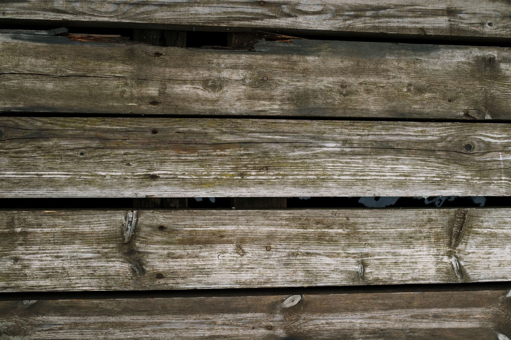

Stain applied over dirt, mildew, or old finish residue won't bond properly — it peels or blotches within a season. Cleaning first is the step that determines whether your stain job lasts years or months.

## What You'll Need

- Stiff-bristle deck brush
- Deck cleaner or oxygen bleach (avoid chlorine bleach — it can discolor wood and kill nearby plants)
- Garden hose, or a pressure washer if you have one
- Plastic sheeting to protect nearby plants
- Safety glasses

## Signs Your Deck Needs Cleaning Before Staining

- Gray, weathered wood tone instead of the natural color
- Visible mildew or algae (dark or greenish patches, especially in shaded spots)
- Water beads up strangely or absorbs unevenly in different spots — a sign of old finish residue

## Choosing the Right Cleaner for Your Deck's Condition

Not every deck needs the same cleaning product. A deck that's just dusty and lightly weathered often does fine with a basic oxygen bleach cleaner, which brightens wood without the harshness of chlorine bleach. A deck with heavy mildew or algae buildup, especially in shaded or damp-prone spots, may need a cleaner specifically formulated to kill mold spores rather than just lift surface dirt — check the label for mildewcide or a similar active ingredient. And a deck with old, failing stain or sealer sometimes needs a dedicated stain stripper before a standard cleaner will even be effective, since a cleaner alone often can't break down a film of old finish sitting on top of the wood.

## Step 1: Clear and Sweep

Remove furniture, planters, and rugs. Sweep away loose leaves, dirt, and debris — cleaning solution works much better on a swept surface than one full of loose grit.

## Step 2: Protect Nearby Plants

Wet down nearby grass and plants with plain water first, and drape plastic sheeting over anything directly beneath the deck edge. Deck cleaners, even oxygen-based ones, can stress or kill plants in concentrated runoff.

## Step 3: Apply Deck Cleaner

Mix and apply according to the product's instructions, working in manageable sections. Let it sit for the recommended dwell time (usually 10-15 minutes) — don't let it dry on the surface, which can leave residue.

## Step 4: Scrub

Scrub with a stiff deck brush, working with the wood grain. Pay extra attention to shaded, damp areas where mildew tends to concentrate.

## Step 5: Rinse Thoroughly

**With a pressure washer:** Use a fan tip (25-40 degrees, never a narrow 0-degree tip) and keep it moving steadily, 8-12 inches from the surface. Holding it too close or too long in one spot gouges the wood, which shows through stain badly.

**Without a pressure washer:** A garden hose with a high-pressure nozzle works fine for most residential decks — it just takes more passes and slightly more scrubbing effort to get the same result.

## Step 6: Let It Dry Completely

This is the step most people rush. Wood needs to dry fully before stain will absorb properly — typically 24-48 hours in warm, sunny weather, longer in humid or cool conditions. Do a quick water-bead test: sprinkle a little water on the wood; if it beads up instead of soaking in, the wood is still too wet (or has old sealer residue) and isn't ready to stain yet.

## Step 7: Sand Rough Spots and Check for Damage

Once the deck is clean and dry, walk the full surface and check for raised grain, splinters, or protruding nail and screw heads — pressure washing can raise wood grain even on a well-maintained deck, and stain applied over rough or splintering wood won't look as smooth as it should. A light pass with a sander (80-120 grit) on rough boards, and re-setting any popped fasteners, takes an extra hour but makes a visible difference in the finished result. This is also the point to check for any soft, spongy boards that might indicate rot — those need to be addressed or replaced before staining, since stain won't fix a structural problem underneath it.

## Weather Windows for Staining

Once the deck is clean, dry, and sanded, timing the actual stain application matters almost as much as the prep work. Avoid staining in direct, hot midday sun, which can cause the stain to dry too fast and lap-mark between sections. Check the forecast for at least 24-48 hours of dry weather after your planned application, since rain on freshly applied stain before it's cured can wash it out unevenly or leave a blotchy finish that's difficult to fully correct without redoing the affected boards.

## Now You're Ready to Stain

A clean, fully dry deck is what lets stain penetrate evenly instead of sitting on the surface and peeling. Skipping straight from a quick rinse to staining is the single most common reason a deck stain job fails early. Between choosing the right cleaner, scrubbing thoroughly, giving the wood enough time to dry, and sanding any rough spots, the prep work in this guide typically takes longer than the staining itself — but it's also what determines whether the finished stain job lasts several seasons or needs to be redone within a year.
