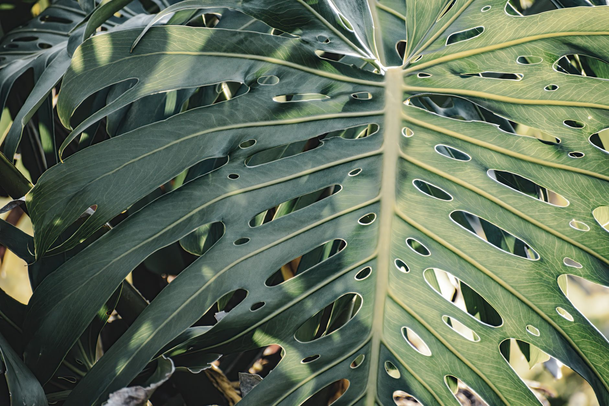

Fertilizer is one of the most misunderstood parts of houseplant care, partly because it's easy to assume more is better. It isn't. A plant that's never fed eventually runs short of nutrients and stalls, but a plant fed too often or too strongly can end up worse off: burned roots, crusty soil and brown leaf tips. Once you understand what fertilizer does, how to read a label and when to back off, feeding becomes one of the simpler parts of plant care.

**Quick answer:** Feed most houseplants only while they're actively growing, usually spring through early fall, with a balanced liquid fertilizer diluted to about half the label strength every 2–4 weeks for fast growers and much less often for slow growers like snake plants, ZZ plants and succulents. Water first, then feed. Flush the pot with plain water every few months to clear salts. Taper off in fall as growth slows and pause through winter, restarting when new growth appears in spring.

## What the Three Numbers Mean

Every label shows three numbers, such as 10-10-10 or 3-1-2. They're the percentages of nitrogen (N), phosphorus (P) and potassium (K) by weight.

| Nutrient | Main role | Signs of shortage |
|---|---|---|
| Nitrogen (N) | Leafy, green growth | Older leaves turning pale or yellow, slow growth |
| Phosphorus (P) | Roots, flowers, energy transfer | Poor flowering, dull or purplish leaves |
| Potassium (K) | Water regulation, strength, stress tolerance | Brown or scorched leaf edges on older leaves |

Good houseplant fertilizers also contain micronutrients like iron, magnesium and calcium. A balanced or slightly nitrogen-leaning formula suits most foliage plants. Special formulas make sense for flowering plants, orchids, citrus and succulents.

## Choose a Format

| Format | Pros | Cons | Best for |
|---|---|---|---|
| Liquid concentrate | Easy to dilute and adjust; fast-acting | Must be applied regularly | Most houseplants |
| Water-soluble powder | Economical; adjustable | Needs measuring | Larger collections |
| Slow-release granules | Feeds for weeks or months | Hard to undo if overapplied | Busy owners, large pots |
| Fertilizer spikes | Convenient | Nutrients concentrate near the spike; uneven | Very forgiving plants only |
| Organic options (worm castings, fish emulsion, compost tea) | Gentle; improve soil life | Variable strength; some smell | Top-dressing, mild feeding |

For most people, a liquid fertilizer diluted at each watering gives the most control and is easiest to adjust through the seasons.

## How Often to Feed

Houseplants indoors usually receive far less light than outdoor plants, so they grow more slowly and need less fertilizer. Diluting to half or even quarter strength, or following the label's houseplant rate, is a safe starting point.

| Plant type | Examples | Growing-season feeding |
|---|---|---|
| Fast-growing foliage | Pothos, philodendron, monstera, spider plant | Every 2–4 weeks at half strength |
| Moderate growers | Fiddle leaf fig, rubber plant, peace lily | Every 4–6 weeks at half strength |
| Slow growers | Snake plant, ZZ plant | 2–3 times per growing season |
| Succulents and cacti | Aloe, echeveria, jade | A few times a season with a succulent formula |
| Flowering plants | African violet, anthurium, hoya | Regularly with a bloom-appropriate formula, per the label |
| Orchids | Phalaenopsis | Weak, frequent feeding while growing ("weakly, weekly"), per orchid fertilizer guidance |
| Ferns and calatheas | Boston fern, prayer plant | Light feeding every 4–6 weeks; sensitive to salts |

Adjust to what you see: a plant putting out new leaves regularly can handle regular feeding; a plant barely growing needs little.

## How to Feed

1. **Water first,** or feed on moist soil. Fertilizer on dry roots can burn them.
2. **Measure and dilute** according to the label or at half strength.
3. **Pour evenly** over the soil surface, not on the leaves, until a little drains out.
4. **Empty the saucer** so salty water doesn't soak back in.

## Over- vs. Under-Fertilizing

| Symptom | Too much fertilizer | Too little fertilizer |
|---|---|---|
| White crust on soil or pot rim | Yes | No |
| Brown, crispy leaf tips and edges | Common | Less common |
| Wilting with moist soil | Possible (root burn) | Rare |
| Pale new leaves, yellowing older leaves | Rare | Common |
| Slow growth | Possible | Common |
| Weak, leggy growth | Possible if light is low | Possible |

Many symptoms overlap with watering and light problems, so check those first. Our guide to [adjusting care for fall and winter](/blog/adjust-houseplant-care-for-fall-winter/) covers light and watering changes.

## Flushing Salts

Fertilizer and tap water leave mineral salts in the soil. Every few months, or if you see crust:

1. Take the plant to a sink or tub.
2. Pour plain water slowly through the soil, several times the volume of the pot, letting it drain freely.
3. Let it drain completely before returning it to its saucer.

If salt buildup is heavy, scrape off the crusty top layer and replace it with fresh mix, or [repot](/blog/how-to-repot-a-houseplant/) into fresh soil.

## Why Fall Is the Time to Ease Off

As days shorten, most houseplants slow down. Light, more than temperature, drives the change. A plant that's barely growing can't use much fertilizer, and unused nutrients build up as salts. Taper feeding in early fall and pause for most plants once growth clearly slows, typically somewhere between late September and November, depending on your climate and home. Stopping a little early is safer than feeding too long.

**Exceptions:**
- Plants growing actively under strong grow lights can get light feedings through winter.
- Orchids and other flowering plants may follow their own bloom cycles; follow their specific care guidance.
- Recently repotted plants should go several weeks without fertilizer in any season.

## Restarting in Spring

Watch for new growth, such as unfurling leaves or lengthening stems, rather than a date. Start again at a weak dilution and increase gradually as growth picks up. There's no need to make up for skipped winter feedings.

## Common Mistakes

- Feeding a struggling plant to "perk it up." Fix light, water and roots first.
- Fertilizing dry soil.
- Using garden fertilizer at outdoor rates on houseplants.
- Feeding every week at full strength.
- Adding spikes and liquid fertilizer at the same time.
- Feeding right after repotting.

## FAQ

### Can I fertilize houseplants in winter?

Most don't need it while they're resting. Plants actively growing under grow lights are the exception and can get diluted feedings.

### Is coffee or eggshell good fertilizer?

Coffee grounds can compact and grow mold in pots, and eggshells break down very slowly. A proper diluted fertilizer or a thin top-dressing of worm castings is more reliable.

### How do I know if my plant needs fertilizer?

Pale new growth and slowing growth during the growing season, with good light and watering, suggest it's time. A white crust on the soil suggests the opposite.

### Should I fertilize a newly bought plant?

Usually not right away. Most nursery plants contain slow-release fertilizer. Wait a month or two, or until it's settled and growing. For sensitive plants like [fiddle leaf figs](/blog/fiddle-leaf-fig-care/), start gently.
