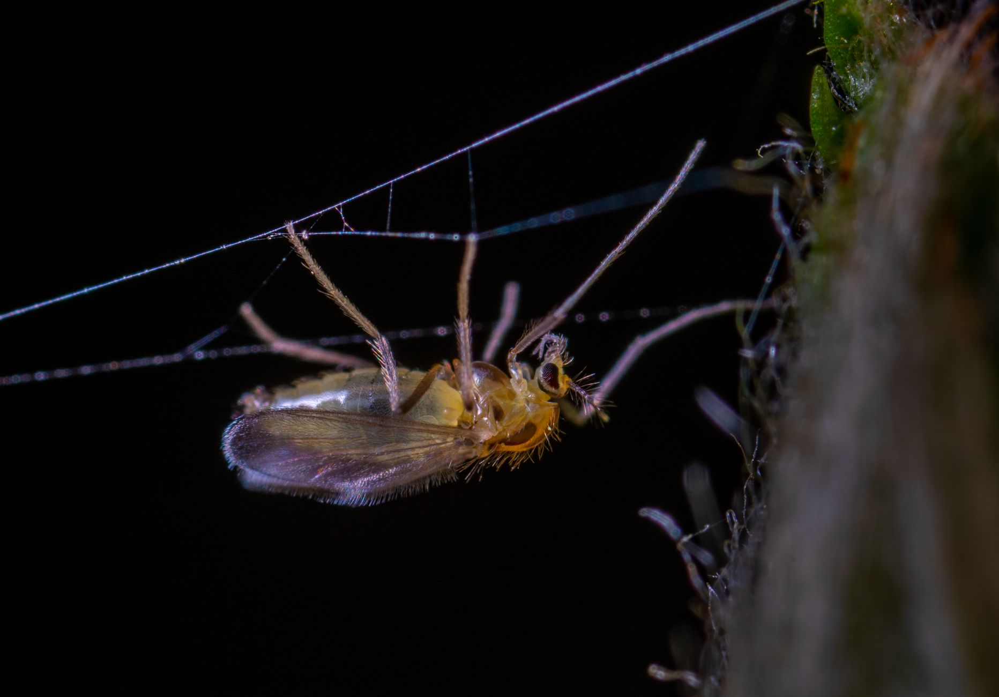

Fungus gnats are the tiny black flies that seem to appear out of nowhere around houseplants — and once you have them, they multiply fast. The good news: they're almost always a symptom of overwatering, and fixable without chemicals.

## Why You Have Them

Fungus gnats lay eggs in consistently moist soil, and their larvae feed on organic matter and fungi in the top layer. Overwatered plants with soil that never fully dries out are the perfect breeding ground.

## Step 1: Let the Soil Dry Out

This is the single most effective fix. Let the top 1-2 inches of soil dry completely between waterings — this breaks the gnat life cycle since larvae can't survive in dry conditions.

## Step 2: Set Sticky Traps

Yellow sticky traps placed in the soil catch adult gnats before they can lay more eggs, and also give you a visual read on how bad the infestation actually is.

## Step 3: Top-Dress With Sand or Diatomaceous Earth

A thin layer of coarse sand, aquarium gravel, or food-grade diatomaceous earth on top of the soil makes it harder for adult gnats to lay eggs and can dehydrate larvae near the surface.

## Step 4: Use a Bt Soil Drench (For Bad Infestations)

Products containing *Bacillus thuringiensis israelensis* (Bt-i) target gnat larvae specifically without harming your plant. Mix according to the label and water it in — this is the closest thing to a guaranteed fix for a persistent infestation.

## Prevention Going Forward

- Water only when the top inch or two of soil is dry — check with a finger before watering on a fixed schedule.
- Use pots with drainage holes so excess water doesn't sit at the bottom.
- Avoid overly rich, organic-heavy potting mixes for gnat-prone plants; a mix with more perlite dries faster and hosts less fungal growth.
