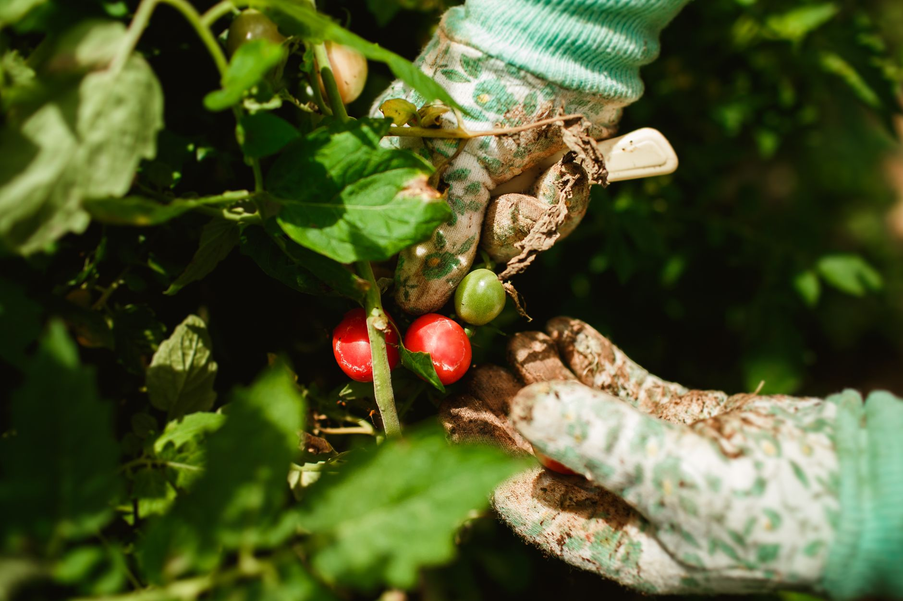

Tomatoes are one of the most rewarding vegetables to grow in containers — they don't need a full garden bed, and a single well-tended plant can produce for months. The difference between a thriving potted tomato and a struggling one usually comes down to four things: pot size, soil, water, and sun.

## What You'll Need

- A container at least 18-24 inches in diameter (5+ gallons) for full-size varieties; smaller pots work for dwarf or "patio" varieties
- Potting mix formulated for containers (not garden soil, which compacts too densely)
- A tomato cage or stake
- Slow-release or liquid tomato fertilizer

## Step 1: Choose the Right Container Size

This is the single most common mistake. A tomato plant in a pot that's too small dries out fast and stunts badly. Full-size (indeterminate) varieties need at least a 5-gallon container; determinate/bushier varieties can get by with slightly less, but bigger is almost always better for consistent moisture.

## Step 2: Pick a Variety Suited to Containers

Determinate varieties (which stop growing at a set height) and "patio" or "dwarf" varieties are bred specifically for pots and stay more compact. Indeterminate varieties (most heirlooms) keep growing all season and need a larger container plus a sturdy cage.

## Step 3: Use the Right Soil

Fill your container with a quality potting mix, not soil dug from the yard. Garden soil compacts in a container, drains poorly, and can introduce pests or disease. A mix with perlite or vermiculite keeps roots aerated.

## Step 4: Place It Where It Gets Full Sun

Tomatoes need 6-8 hours of direct sun daily. A south-facing patio or balcony is usually ideal. Less sun means fewer, smaller fruit — this is the second most common reason container tomatoes underperform.

## Step 5: Water Consistently

Containers dry out much faster than garden beds, especially in summer heat — daily watering is often necessary once the plant is established. Water at the soil level rather than overhead, and water deeply enough that it runs out the drainage holes.

## Step 6: Feed Regularly

Container plants exhaust the nutrients in their soil faster than in-ground plants. Feed with a tomato-specific fertilizer every 2-3 weeks once flowering starts, following the product's dosage.

## Step 7: Stake or Cage Early

Install your cage or stake when you plant, not after the plant has sprawled — disturbing established roots to add support later stresses the plant unnecessarily.

## Pruning Suckers

For indeterminate varieties especially, small shoots called "suckers" grow in the joint between the main stem and each branch. Pinching these off while they're small redirects the plant's energy toward fruit production rather than extra foliage, and it also improves airflow through the plant, which helps prevent fungal issues in a container where plants are often spaced closer together than they would be in a garden bed. Determinate varieties generally need less aggressive pruning, since removing too many suckers can reduce their (already limited) total fruit set.

## Pollination in Container Settings

Tomatoes are self-pollinating, but a light breeze or the natural vibration from pollinators visiting the flowers usually does the job outdoors without any extra effort. On a sheltered balcony with little airflow, pollination can sometimes lag, which shows up as flowers that form but don't set fruit. Gently shaking the plant's stem for a few seconds every day or two once it's flowering, or using a small fan nearby, can noticeably improve fruit set in a still, wind-protected spot.

## Harvest

Pick tomatoes when they've reached full color and give slightly under gentle pressure. Regular harvesting actually encourages the plant to keep producing more fruit.

## Common Problems

- **Blossom end rot** (dark, sunken spots on the fruit bottom): usually caused by inconsistent watering, not a lack of calcium as often assumed. Water more consistently before adding supplements.
- **Yellowing lower leaves**: normal as the plant matures — remove them, but it's not usually a sign of disease unless it spreads upward rapidly.
- **Leggy, sparse growth**: almost always insufficient light.
- **Cracked fruit**: usually a sudden heavy watering after a dry spell, which causes the fruit to swell faster than the skin can stretch. Consistent watering prevents this the same way it prevents blossom end rot.
- **Wilting despite moist soil**: check for root-bound roots circling the bottom of the pot, or root rot from a container without adequate drainage — both can cause wilting that looks like underwatering even when soil moisture is fine.

## End-of-Season Considerations

As the growing season winds down, a plant with lots of unripe green fruit and cooling nighttime temperatures on the horizon is a candidate for a few different strategies: continuing to let it ripen on the vine as long as temperatures allow, picking mature green tomatoes to ripen indoors on a windowsill, or, for a determinate variety that's largely finished producing, simply composting the spent plant once yields drop off. In mild climates, a container's portability is a real advantage here — moving pots to a sheltered spot or indoors temporarily can extend the harvest window past what an in-ground tomato plant could manage.
