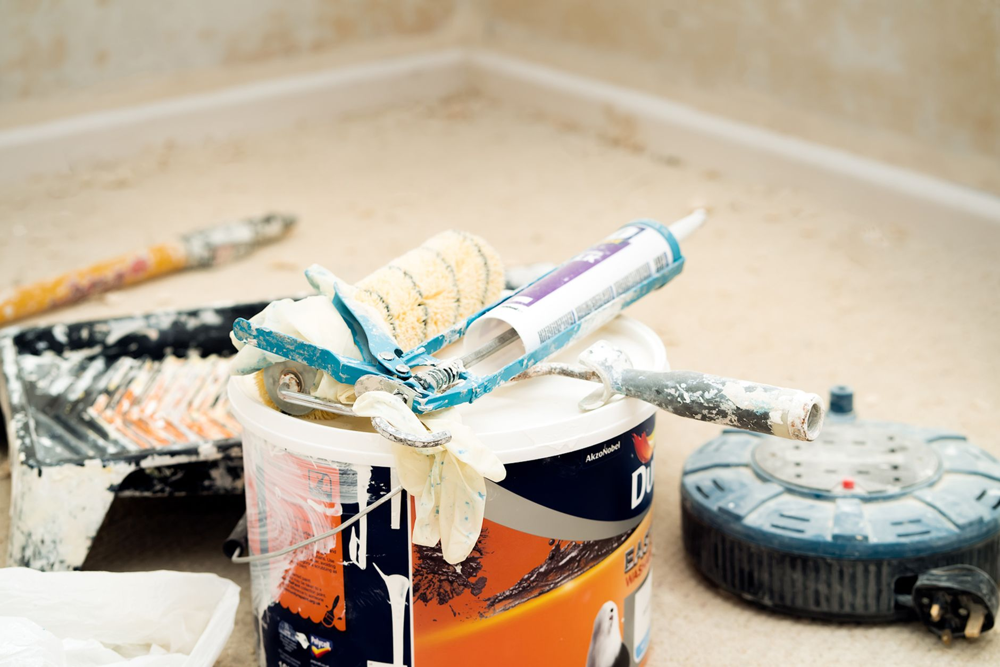

Most first-time painters start with the walls because that's the part they actually care about — and end up with roller marks on the ceiling or drips on freshly painted trim. Painting in the right order avoids almost all of that.

## What You'll Need

- Painter's tape
- Drop cloths
- Angled sash brush (for cutting in edges)
- Roller with an extension pole
- Paint tray
- Primer (if changing colors dramatically or painting over stains)
- Paint: ceiling, wall, and trim colors as needed

## The Order: Ceiling, Then Walls, Then Trim

This is the sequence professional painters use, and it's not arbitrary — each step protects the work you just finished:

1. **Ceiling first** — any drips or splatter fall onto floors you'll cover anyway, not onto finished walls.
2. **Walls second** — you'll inevitably get a little wall paint near the trim while cutting in; that's fine, because trim gets painted last and covers it.
3. **Trim last** — since trim paint is usually glossier and shows imperfections more, painting it last means you're not risking wall paint splatter on your freshly finished trim.

## Step 1: Prep the Room

Remove furniture or move it to the center and cover it. Remove outlet covers and switch plates. Lay drop cloths along the floor edges. Fill any nail holes or dings with spackle and let it dry before painting.

## Step 2: Tape Off Edges

Run painter's tape along trim, ceiling lines, and any adjacent surfaces you're not painting. Press the tape edge down firmly — a loose edge is the most common reason paint bleeds underneath it.

## Step 3: Paint the Ceiling

Cut in around the edges with a brush first, then roll the main area in overlapping "W" or "N" patterns rather than straight lines, which helps avoid visible roller marks. Most ceilings need two coats.

## Step 4: Paint the Walls

Cut in around the ceiling line, corners, outlets, and trim with a brush, then roll the open wall area. Work in manageable sections (roughly 3x3 feet) so the cut-in edges stay wet and blend smoothly with the rolled paint rather than drying into a visible line.

## Step 5: Paint the Trim

Remove the tape from the wall/trim line before it fully dries (usually right after you finish the walls) to avoid peeling wet paint. Use a smaller angled brush for trim, working in the direction of the wood grain on doors and baseboards.

## Step 6: Let It Cure Before Reassembling

Paint is usually dry to the touch within a few hours but can take up to two weeks to fully cure. Wait at least 24 hours before rehanging pictures or pushing furniture back against walls to avoid soft paint marking or sticking.

## A Few Things That Actually Matter

- **Two thin coats beat one thick coat** — thick paint drips, sags, and takes longer to dry evenly.
- **Prime dramatic color changes** — going from dark to light (or the reverse) without primer often means 3-4 coats instead of 2.
- **Buy a little extra paint** — running out mid-wall and buying more later risks a slight color/sheen mismatch between batches.
