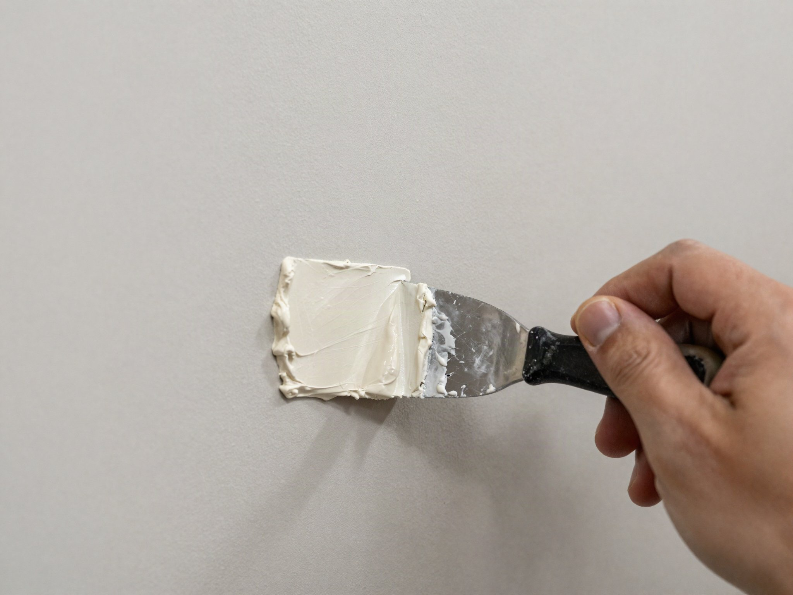

Doorknob dents, nail holes, and the occasional accidental fist-sized hole are some of the most common home repairs — and also one of the easiest to botch if you rush the drying and sanding steps. Here's how to get a patch that disappears once it's painted.

## What You'll Need

- Joint compound (spackle for small holes, or a patch kit for anything bigger than 2 inches)
- Putty knife (a 4" and a 6" cover most jobs)
- Fine-grit sanding sponge (220 grit)
- Self-adhesive mesh patch (for holes larger than a coin)
- Primer and matching paint
- A scrap piece of drywall and some construction adhesive or screws, for holes larger than about 6 inches
- Utility knife, for trimming damaged drywall edges cleanly

## Matching the Repair Method to Hole Size

Not every hole needs the same approach, and using an oversized fix for a small hole (or an undersized one for a large hole) wastes time either way. Nail holes and small dents under about half an inch often need nothing more than a dab of spackle and light sanding — no mesh patch required. Holes between roughly half an inch and 6 inches are the classic mesh-patch-and-joint-compound job this guide focuses on. Holes larger than about 6 inches usually need a small cutout of new drywall glued or screwed to a backing strip behind the existing wall, since a mesh patch alone doesn't have enough to bond to across a gap that size — this is a more involved repair and worth researching separately if you're dealing with something that large.

## Step 1: Clean and Prep the Hole

Remove any loose drywall paper or debris around the edges. For holes larger than about an inch, press a self-adhesive mesh patch over the opening so the compound has something to bond to instead of open air. Trim any ragged, torn edges of paper facing with a utility knife first — compound applied over loose, curling paper edges tends to bubble or crack once dry, undoing some of your work.

## Step 2: Apply the First Coat

Load your putty knife with joint compound and spread it over the patch in a thin, even layer, feathering the edges out about 2 inches beyond the hole so there's no hard ridge to sand down later. Working the compound in one direction with steady pressure, rather than scrubbing it back and forth, gives a smoother result with fewer ridges to sand out afterward.

## Step 3: Let It Dry, Then Sand

Most compounds need 24 hours to fully dry — resist the urge to sand early, since wet compound just gums up your sandpaper. Once dry, sand lightly in circular motions until the patch is flush with the surrounding wall. Wipe away dust with a slightly damp cloth. A bright work light held at a low angle across the wall after sanding makes it much easier to spot any remaining high or low spots that are hard to see under normal room lighting.

## Step 4: Second Coat (If Needed)

Larger patches usually need a second, thinner coat to fully disappear. Repeat the dry-and-sand cycle. It's common to need this second pass even on patches that looked fine after the first coat once you check them under raking light — don't be discouraged if a patch that seemed finished still shows a faint outline once you look closely.

## Matching Wall Texture

If your wall has any texture beyond a flat smooth finish — orange peel, knockdown, or a heavier stipple pattern — a perfectly smooth patch will stand out even after painting, since the surrounding texture catches light differently than a smooth patch does. Texture-matching spray products are available for common patterns and can be practiced on a scrap piece of cardboard first to dial in the right distance and technique before applying it to the actual patch. For a heavily textured wall, this step often matters more to the final look than the paint color match does.

## Step 5: Prime and Paint

Skipping primer is the most common reason patches show through paint — the compound absorbs paint differently than the surrounding wall, leaving a visible "flashing" spot even after painting. Prime the patch first, let it dry, then paint the full wall (not just the patch) if you want a perfectly even finish, since paint sheen can shift slightly even with the same can if it's an old touch-up. Small spot-touch-ups without repainting the whole wall can work for flat finishes in low-visibility areas, but higher sheens (satin, semi-gloss) show spot touch-ups far more readily under angled light.

## Tool Cleanup and Storage

Rinse putty knives and any mixing containers before compound dries on them — dried compound is difficult to remove and can leave debris that shows up in your next repair. Leftover joint compound in a bucket or tub can be kept usable for a while if the surface is smoothed flat and covered with a thin layer of water before sealing the lid, which prevents it from drying out between projects.

## When to Call a Professional

Holes larger than a dinner plate, water-damaged drywall, or repairs near electrical boxes are worth handing to a pro — patching over an unresolved leak or exposed wiring just hides a bigger problem. If a hole was caused by a leak, resolving the source of the moisture always comes before patching, since drywall patched over an active leak will just fail again, often faster and messier the second time.
