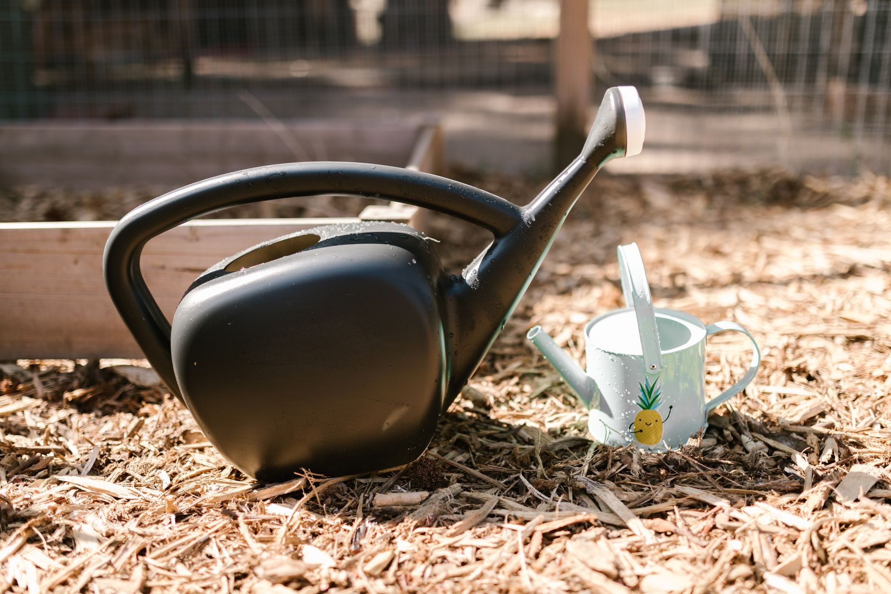

Garlic is one of the few vegetable crops that actually wants to go in the ground in fall rather than spring, and once you've grown it this way it's hard to go back. You plant individual cloves a few weeks before the ground freezes, they push out a little green growth before winter shuts things down, then they sit quietly under mulch until spring hands them the rest of the growing season to bulk up into full bulbs. It's a low-effort crop for most of its life cycle, but the fall planting window is where the decisions that determine bulb size actually get made.

## Why Fall Planting Beats Spring

Garlic needs a sustained period of cold — generally a month or more of soil temperatures below 40°F (4°C) — to trigger the process that splits a single clove into the multi-clove bulb you actually want to harvest. Skip that cold exposure by planting in spring instead, and you'll often end up with small, single-clove-like bulbs that never properly divided. Fall planting also gives the clove a head start: roots begin developing in the cool, still-workable soil of autumn, so the plant has an established root system ready to take off the moment the soil warms in spring, rather than starting from scratch after a spring planting.

## When to Plant

The general target is planting garlic 2-4 weeks before your ground typically freezes solid, which is late enough that cloves won't send up much top growth before winter, but early enough that roots have time to establish. In most regions this lines up with sometime in mid-to-late fall. If you're not sure when your ground freezes, local frost date guides for your area are a more reliable reference than a fixed calendar date, since it varies significantly by region and by how exposed or sheltered your particular garden bed is.

## Choosing and Preparing Cloves

Buy seed garlic from a garden center or seed supplier rather than planting cloves from a grocery store bulb — grocery garlic is often treated to prevent sprouting, and it may carry diseases that aren't a concern with dedicated seed stock. Broadly, garlic falls into two types: hardneck varieties, which produce a flower stalk (called a scape) and tend to have fewer, larger cloves with a more complex flavor, and softneck varieties, which store longer and are the type typically braided. Hardnecks generally perform better in colder climates, while softnecks are more forgiving in milder ones, though both can be grown across a wide range of conditions.

Right before planting, break the bulb apart into individual cloves, keeping the papery skin on each one intact. Only plant the largest, healthiest-looking cloves — size at planting time has a direct relationship to bulb size at harvest, so it's worth setting aside smaller or damaged cloves for cooking rather than planting them.

## Planting Depth and Spacing

Plant each clove pointed end up, flat root end down, about 2 inches deep with roughly 2 inches of soil covering the tip. Space cloves 4-6 inches apart in rows spaced about 8-12 inches apart, which gives each plant enough room to bulk up without crowding its neighbors. Garlic does best in loose, well-draining soil with a good amount of organic matter worked in before planting — heavy, compacted, or waterlogged soil is one of the more common reasons for disappointing bulbs, since garlic roots don't push through dense soil well and the cloves themselves are prone to rot if they sit in standing moisture over winter.

## Mulching for Winter

Once cloves are planted and the bed is watered in, apply a thick layer of mulch — straw is the traditional choice, though shredded leaves work well too — over the entire planting area. This layer, typically several inches deep, insulates the soil against extreme temperature swings and freeze-thaw cycles that can otherwise heave cloves partway out of the ground over winter. Mulch also suppresses early weed growth in spring, which matters more for garlic than for a lot of other crops since garlic doesn't compete well with weeds for nutrients and light. Leave the mulch in place through winter; you generally don't need to pull it back until new green shoots are pushing up in spring, at which point a thinner layer left around the plants continues to help with moisture retention and weed control.

## What Happens Over Winter and Into Spring

Don't be surprised if you see a few inches of green shoot growth before the ground freezes for good — that's normal and not a sign anything went wrong. Growth will pause once the soil gets consistently cold, then resume in spring once temperatures rise, often earlier than most other vegetables in the garden. From spring onward, garlic mostly takes care of itself: keep the bed weeded, water during dry stretches, and if you're growing a hardneck variety, cut off the curling flower scapes when they appear in early summer, which redirects the plant's energy into bulb growth instead of seed production rather than leaving it to flower. The bulbs themselves won't be ready to dig until many months after planting, once several of the lower leaves have browned and died back while the upper leaves are still green — but the work that gets you there largely happens now, in the few weeks it takes to get cloves into the ground before the first hard freeze.
