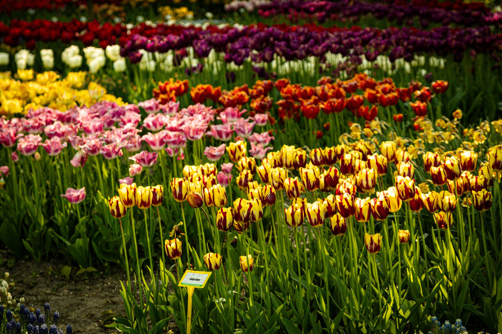

Spring-blooming bulbs — tulips, daffodils, crocuses, hyacinths — all get planted in fall, not spring. It feels backward the first time you do it, but the bulbs need a stretch of cold soil over winter to trigger the bloom, and getting the timing and depth right now is most of what determines how well they come up in a few months.

## Time It by Soil Temperature, Not the Calendar

The general target is planting once soil temperature at planting depth is consistently below 60°F (15°C), which usually lines up with 6–8 weeks before your area's ground typically freezes solid. Plant too early and bulbs can sprout before winter, wasting the energy they need for spring. Plant too late and they may not root well before the ground locks up. If you're not sure where that window falls for your area, a soil thermometer pushed a few inches down gives a more reliable answer than guessing from the date.

## How Deep and How Far Apart

A simple rule covers most bulbs: plant at a depth of about three times the bulb's height, measured from the base. In practice that works out to roughly 6–8 inches for tulips and daffodils, and 3–4 inches for smaller bulbs like crocus and grape hyacinth. Spacing follows the same logic — bigger bulbs need more room, generally 4–6 inches apart, while small ones can go closer together for a fuller-looking cluster.

## Pointy End Up (and What to Do If You Can't Tell)

Most bulbs have an obvious pointed tip that should face up, with the flatter, sometimes root-scarred end going down. Some bulbs, though, are close to round with no clear orientation. When in doubt, plant it on its side — the stem will find its way to the surface regardless, just with a little extra effort.

## Feed and Mulch After Planting

Working a bulb fertilizer or bone meal into the soil at planting time gives roots something to draw on as they establish over winter. A 2–3 inch layer of mulch on top helps regulate soil temperature through freeze-thaw cycles and holds moisture, though it's not strictly required in every climate.

## Mistakes That Cost You Blooms

- **Planting too shallow** — bulbs planted too close to the surface are prone to heaving out of the ground during repeated freezing and thawing.
- **Cutting foliage back too soon in spring** — the leaves that follow the bloom are recharging the bulb for next year; removing them early weakens or skips next season's flowers.
- **Planting in soil that stays wet** — bulbs rot quickly in poor drainage, so low or consistently damp spots in the yard are worth avoiding or amending with grit before planting.
