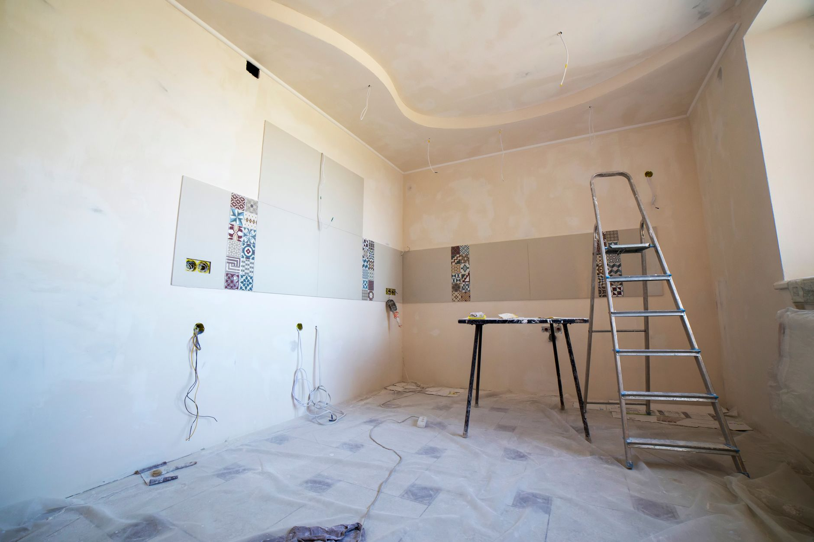

If you had a ridge of ice along your gutters last winter, or water stains creeping across a ceiling in late January, you had an ice dam. It looks like a roofing problem, but it's almost always a heat problem: warm air leaking into the attic melts snow on the upper roof, the meltwater refreezes when it reaches the cold overhang, and the ice that builds up eventually backs water under your shingles. Gutter guards, roof rakes and heat cables can buy you time, but none of them fix the reason the dam formed in the first place. Late fall, before the first real snow load, is the window to deal with the actual cause.

**Quick answer:** Ice dams form when attic heat melts roof snow that refreezes at the cold eaves. The lasting fix is stopping that heat loss: air-seal the attic floor (bypasses around lights, pipes, the attic hatch and top plates), then make sure insulation meets your climate's recommended depth and soffit-to-ridge ventilation is clear so the whole roof deck stays cold. Short-term, a roof rake removes snow load before it can melt and refreeze, and calcium chloride (never rock salt) can cut a channel through an existing dam. Heat cables are a stopgap, not a fix. Call a professional if you see sagging, active leaking, or need to work on a steep or icy roof.

## Why Ice Dams Actually Form

A roof with even, cold surface temperatures doesn't build ice dams — the snow on it just sits there until it sublimates or melts all at once in a thaw. The problem starts when part of the roof is warmer than the rest. Heat escaping from the living space below rises into the attic through gaps most homeowners never see: the attic hatch, recessed lights, bathroom exhaust fans, plumbing stacks, and the top plates where interior walls meet the attic floor. That warm air heats the underside of the roof deck near the ridge, which melts the snow directly above it.

The meltwater runs down under the snowpack until it reaches the eaves, which stay cold because they overhang unheated space and get no attic heat from below. There, it refreezes. Night after night, the ice ridge grows, and once it's tall enough, meltwater backs up behind it and finds its way under the shingles, through the roof deck, and into your attic insulation, ceiling and walls.

Two things make a roof dam-prone: heat loss into the attic, and anything that traps meltwater once it starts moving — clogged gutters, a low-slope roof section, or valleys where two rooflines meet. That's why [cleaning your gutters](/blog/how-to-clean-gutters-safely/) before the snow flies is part of prevention, even though it isn't the root cause.

## The Real Fix: Air-Sealing, Insulation and Ventilation

Heat cables and roof rakes manage symptoms. The lasting fix is keeping the whole roof deck close to outdoor temperature, which takes three things working together.

| Fix | What it does | Notes |
|---|---|---|
| **Air-sealing the attic floor** | Stops warm, moist house air from leaking directly into the attic | Usually the highest-impact, lowest-cost step; a DIY job in most attics |
| **Insulation to recommended depth** | Slows heat conduction through what does reach the attic floor | Cold climates typically call for R-49 to R-60 in the attic; check your region's current recommendation |
| **Soffit-to-ridge ventilation** | Flushes any heat that gets through with outside air, keeping the roof deck uniformly cold | Needs clear airflow path; insulation stuffed into soffits blocks it |

All three matter because they solve different failure modes. Air-sealing without enough insulation still lets heat conduct through the attic floor. Insulation without ventilation can trap the residual heat and humidity that does get through, which risks both dams and attic condensation. Ventilation without air-sealing is trying to flush an endless supply of warm air rather than a small amount — it helps, but it's fighting an uphill fight.

If you're only doing one thing this fall, air-seal. It's the part most attics are missing entirely, and unlike adding insulation, it doesn't require buying much material.

### Where Attics Actually Leak

- **Attic hatch or pull-down stair** — usually the single biggest gap; weatherstrip the edges and add rigid foam to the back of the hatch panel
- **Recessed (can) lights** — seal only fixtures rated IC (insulation contact) for direct insulation contact; others need a code-rated cover
- **Bathroom and kitchen exhaust ducts** — seal where the duct penetrates the attic floor, and make sure the duct actually vents outside, not just into the attic
- **Plumbing and electrical penetrations** — small gaps around pipes and wires add up; seal with fire-rated caulk or expanding foam
- **Top plates over interior walls** — foam these where framing meets the attic floor, a common overlooked leak

Use fire-rated sealant or foam near anything that gets warm (chimneys, flues, light fixtures) and check your local code, since some penetrations need special clearance rather than direct sealing.

## A Basic Attic Check You Can Do This Weekend

You don't need to hire someone to find the worst offenders. This takes an hour and tells you whether you have an air-sealing problem, an insulation problem, or both.

1. **Pick a cold morning after the heat's been running.** Frost or dark, matted patches on attic insulation show exactly where warm, moist air has been escaping — that's your leak map.
2. **Check insulation depth with a ruler.** Measure at several spots, not just near the hatch; depth is often uneven. Compare to your climate zone's recommended R-value.
3. **Look at the soffit vents from inside the attic.** If you can see insulation pressed against the roof deck at the eaves, airflow is blocked; baffles (rigid channels installed before you add insulation) hold that gap open.
4. **Confirm the ridge or roof vents aren't painted over or blocked** from a previous re-roof.
5. **Seal what you can reach** — hatch, visible pipe and wire penetrations, top plates — with caulk or canned spray foam, then top up insulation to the recommended depth once the gaps are sealed.

Wear a respirator rated for insulation dust, long sleeves and gloves, and step only on joists or a plank laid across them — attic floors between joists won't hold your weight. If the hatch itself needs [weatherstripping](/blog/how-to-weatherstrip-doors-and-windows/) around its frame, that's the same technique used on exterior doors.

## Short-Term Options for This Winter

If a full attic fix isn't happening before the snow flies, these buy time without making the underlying problem worse.

| Option | What it does | Limits |
|---|---|---|
| **Roof rake** (long-handled tool used from the ground) | Removes snow load from the lower roof edge before it can melt and refreeze | Only reaches single-story eaves from the ground; doesn't address the cause |
| **Calcium chloride in a stocking or sock** | Laid across an existing dam, melts a channel so water drains instead of backing up | Emergency measure, not prevention; never use rock salt, which damages shingles and metal |
| **Electric heat cables** | Zig-zagged along the eave and in gutters, melt a channel through snow and ice | Add to your electric bill every season; professionally installed cables are safer than DIY runs on an aluminum ladder |
| **Better attic ventilation and insulation** | Removes the heat source instead of managing the ice | The only option that actually reduces dam formation year over year |

A roof rake is the safest of the emergency options for a homeowner, since it's used standing on the ground. Never climb onto a snow- or ice-covered roof to chip at a dam — that's a fall risk even for people who are comfortable on ladders and roofs in dry conditions, and it's easy to damage shingles while doing it.

## Common Mistakes

| Mistake | Why it backfires | Better approach |
|---|---|---|
| Chipping or hammering at an ice dam | Cracks and lifts shingles, causing the leak you're trying to prevent | Use calcium chloride to melt a channel, or call a professional |
| Using rock salt on the roof | Corrodes metal flashing and gutters, and damages shingle granules | Use calcium chloride made for roof and ice-dam use |
| Adding insulation without air-sealing first | Traps warm, moist air against the roof deck, sometimes making dams and condensation worse | Air-seal bypasses first, then insulate to the recommended depth |
| Blocking soffit vents with insulation | Cuts off the airflow that keeps the whole roof deck cold and uniform | Install baffles at the eaves before adding or topping up insulation |
| Relying on heat cables alone, year after year | Manages symptoms indefinitely instead of fixing the cause, and adds a recurring cost | Use cables as a stopgap while you air-seal and insulate |
| Ignoring a small water stain because it "dried up" | Ice dam leaks are often seasonal and reappear each winter, sometimes worse | Investigate the attic above the stain before the next cold season |

## Safety Notes and When to Call a Professional

- **Never go onto a snow- or ice-covered roof.** Use a roof rake from the ground, or hire it out.
- **If you use a ladder** to reach an eave or install cables, set it on firm, level, ice-free ground, and see our [ladder buying and safety guide](/blog/how-to-choose-a-ladder/) for sizing and duty ratings before you buy or borrow one.
- **Watch for a sagging roofline, cracking sounds, or water actively coming through a ceiling** — these mean structural water damage or a heavy ice/snow load, and need a roofing contractor or structural professional right away, not a DIY fix.
- **Don't cut into or remove roofing materials yourself** to chase a leak; a roofer can find the entry point without making it worse.
- **If your attic already shows mold, soaked insulation, or damaged decking** from a previous season's dam, have it assessed before you insulate over the problem.
- Heat loss into the attic that's serious enough to cause consistent dams is sometimes tied to your whole home's heating efficiency; a [furnace fall tune-up](/blog/get-furnace-ready-for-winter/) won't fix an air-sealing problem, but it's worth ruling out as a contributing factor.

## FAQ

### Do gutter guards prevent ice dams?

No. Gutter guards keep leaves and debris out of gutters, but they don't stop the attic heat loss that causes ice dams, and a dam can still form on top of a guard. Clean gutters help meltwater drain rather than pool, but they're a minor factor next to attic air-sealing and insulation.

### Will new shingles or a metal roof stop ice dams?

Not on their own. Roofing material affects how a dam looks and how much damage a leak causes, but the dam itself is driven by heat escaping from inside the house, not by what's on top of the roof deck. A metal roof shedding snow faster can even create its own hazards near entrances and walkways.

### How much insulation do I actually need in my attic?

It depends on your climate zone; cold-winter regions typically call for R-49 to R-60 across the attic floor, which is roughly 14 to 20 inches of blown-in fiberglass or cellulose, though depth varies by material. Measure your current depth with a ruler and compare it to your region's current building-code recommendation before buying more.

### Is it worth paying for a professional energy audit instead of doing this myself?

A blower-door energy audit finds air leaks a visual attic check can miss, and it's worth it if you've addressed the obvious gaps and are still getting dams, or if your attic is hard to access safely. For a straightforward attic with a visible hatch and clear joists, the weekend check above catches most of what causes ice dams.
