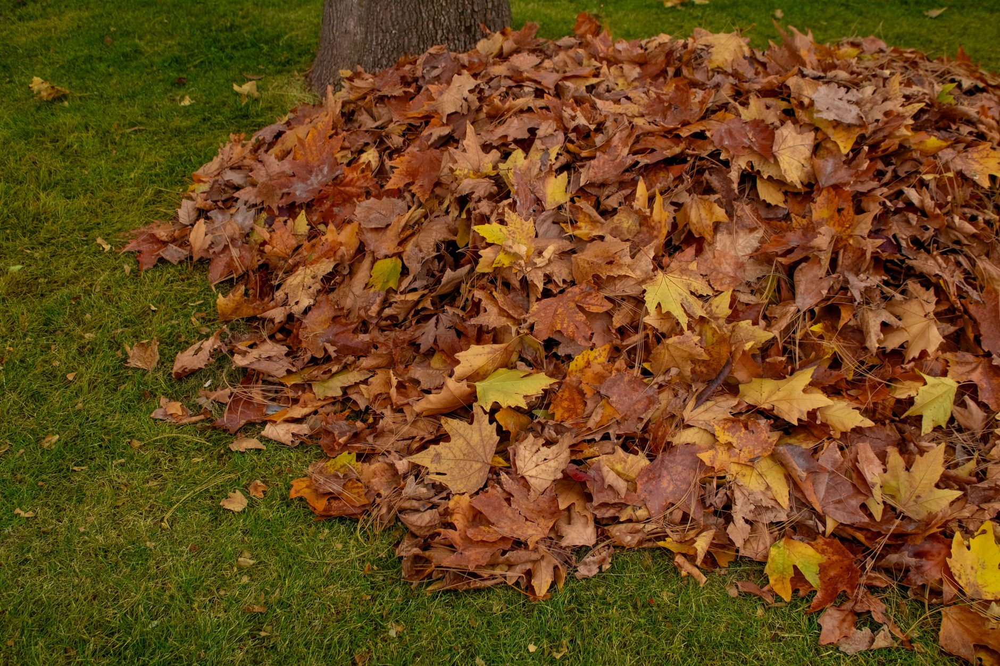

Raking sounds simple until you're an hour in with a sore back and a lawn that still looks half-covered. A few adjustments to timing and technique make the job faster and a lot easier on your body — and what you do with the leaves afterward matters just as much as the raking itself.

## Time It Around the Leaf Drop, Not the Calendar

Raking too early just means doing the job twice, since more leaves keep coming down. Waiting until the trees are fully bare has its own cost: a thick, wet layer left too long mats down and starts smothering the grass underneath. The best window is usually when 70–80% of the leaves are down and before the next heavy rain — that's enough volume to make the effort worthwhile without letting the lawn suffer. If your yard has several trees that drop at different times, it's often more efficient to do one thorough pass rather than chasing every tree's individual timing, accepting that you might catch some trees slightly early or late.

## Choosing the Right Rake

Not all rakes are built the same, and the wrong one makes the job harder than it needs to be. A wide, flexible-tine leaf rake (typically plastic or bamboo, 24-30 inches wide) covers more ground per pull and is gentler on grass than a rigid metal rake, which is better suited to more aggressive tasks like dethatching. A narrower rake is easier to maneuver in tight spots like around flower beds or between shrubs, so it's worth having both a wide rake for open lawn and a smaller one for detail work if you have the storage space.

## Use Your Legs, Not Just Your Arms

Most of the back strain from raking comes from reaching too far and pulling with the arms alone. Keep the rake close to your body, take short pulls, and let your legs and core do the work of the motion instead of your lower back. Work in straight rows across the lawn rather than randomly chasing leaves — it covers the same ground with far less backtracking. Switching which hand leads every 10-15 minutes also helps distribute the strain more evenly and delays fatigue, since raking with the same grip and stance for an hour straight tends to overwork the same handful of muscles.

## Bagging, Mulching, or Composting: Pick Based on What You'll Do Next

- **Bagging** — paper lawn bags break down in most municipal compost programs; plastic bags don't, and some cities won't even collect leaves in them.
- **Mulch mowing** — running a mower over a dry, thin layer shreds leaves fine enough to feed the lawn instead of removing them. If you can still see grass through the shredded layer, it's thin enough to leave in place.
- **Composting** — shredded leaves are a "brown" material that balances out nitrogen-heavy kitchen scraps and grass clippings in a compost pile, so save a few bags of them for later in the season even if you don't have space to compost right now.

## Two Tools Worth Having

A tarp or a set of leaf scoops (the large claw-shaped hand tools) moves piles to the curb far faster than carrying armloads, and saves your grip and forearms in the process. For gutters, fence lines, and other tight corners a rake can't reach cleanly, a cordless leaf blower clears them in a fraction of the time raking would take. A tarp specifically is worth the small investment even if you already own a wheelbarrow — dragging a loaded tarp across grass is noticeably easier than pushing a heavy wheelbarrow load, especially over an uneven or sloped yard.

## Working With Wet Leaves When You Have No Choice

Sometimes the weather doesn't cooperate and you're stuck raking a lawn full of rain-soaked leaves anyway — a looming freeze, an upcoming trip, or a homeowners association deadline can all force the issue. If you're in that situation, a wider, sturdier rake helps push through the extra weight, and working in smaller sections rather than trying to gather a full normal-sized pile at once reduces strain. Give yourself more time than a dry-leaf session would take, and take more frequent breaks, since wet leaf raking is measurably more physically demanding.

## Protecting Garden Beds While You Work

If leaves have blown into flower beds or around shrubs, resist the urge to rake them out entirely — a light layer of leaves left in garden beds actually functions as a free winter mulch, insulating perennial roots and slowly breaking down to improve soil. The exception is beds with disease-prone plants (roses and some perennials susceptible to fungal issues are common examples), where leftover leaf litter can harbor spores through winter; those beds are worth clearing more thoroughly.

## What to Skip

Raking right after rain turns a light job into a heavy one — wet leaves weigh noticeably more and clump instead of gathering cleanly, so waiting for a dry day pays off. And however tempting it is to leave a pile "for later," leaving wet leaves on the lawn for more than a few days invites mold and gives pests a place to settle in before you get back to it.
