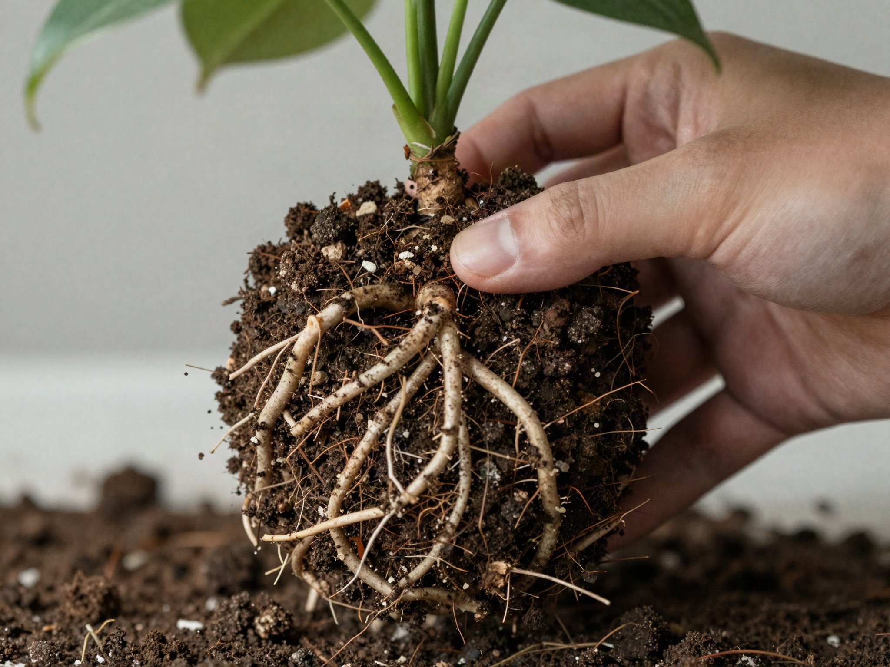

Repotting stresses a plant no matter how carefully you do it, which is why so many houseplants get repotted too often "just in case." Here's how to tell when it's actually necessary, and how to do it with minimal shock.

## Signs Your Plant Needs Repotting

- Roots growing out of the drainage holes or circling visibly at the surface
- Water runs straight through the pot without the soil absorbing it
- The plant dries out much faster than it used to
- Growth has stalled despite otherwise good care
- The plant looks visibly too large for its pot

If none of these apply, leave it alone — most houseplants only need repotting every 12-18 months. A plant that was recently purchased or repotted within the last several months almost never needs it again yet, even if one of the signs above seems to apply, since it can take time for a plant to settle into a new pot and show its true growth pattern.

## Choosing the Right Time of Year

Spring and early summer, when most houseplants are entering their active growth period, is the best window for repotting — the plant has the energy and growing momentum to recover from the disturbance relatively quickly. Repotting during dormancy (typically late fall through winter for most common houseplants) is riskier, since the plant has less active growth to draw on for recovery, and root damage during dormancy tends to heal more slowly. If a plant is in genuine distress from being severely root-bound, it's still worth repotting outside the ideal window rather than waiting months for the "right" season — an emergency repot beats leaving a struggling plant in a pot it's clearly outgrown.

## Step 1: Choose the Right New Pot

Size up by only 1-2 inches in diameter. A pot that's dramatically larger holds excess moist soil the roots aren't using yet, which increases root rot risk. Also check that the new pot has drainage holes — a decorative pot without them should be used as an outer cachepot rather than the actual growing container, with the plant kept in a plain nursery pot with drainage placed inside it.

## Step 2: Water the Day Before

Watering 24 hours ahead of repotting makes the root ball easier to remove and reduces transplant shock compared to repotting completely dry or freshly-soaked soil. Dry soil tends to crumble away from the roots during removal, exposing more of them to potential damage, while soil that's freshly soaked is heavy and harder to work with cleanly.

## Step 3: Remove and Loosen the Roots

Gently squeeze the sides of the old pot to loosen it, then ease the plant out by the base — never by pulling on the stem. Once out, gently loosen the outer roots with your fingers, especially if they're circling the root ball. For a plant that's severely root-bound, with roots wound so tightly they've formed a dense mat, a few shallow vertical cuts into the root mass with a clean, sharp knife can encourage new roots to grow outward into the fresh soil rather than continuing to circle in the old pattern.

## Step 4: Position and Fill

Add a layer of fresh potting mix to the new pot, center the plant so it sits at the same depth it was before, then fill in around the sides with more mix, pressing gently to remove large air pockets. Planting noticeably deeper than the plant's original soil line can bury the base of the stem, which invites rot in many species — matching the original depth is worth double-checking before you finish filling in around the sides.

## Choosing the Right Soil Mix

Not every houseplant wants the same soil. A standard all-purpose potting mix works for most common houseplants, but succulents and cacti need a fast-draining mix with extra perlite or coarse sand, while orchids typically need a chunky bark-based mix rather than traditional potting soil at all. Using the wrong mix for a plant's actual needs is a common, easy-to-miss mistake — a succulent repotted into a dense, moisture-retentive mix is set up for root rot no matter how well you otherwise follow the rest of this process.

## Step 5: Water and Rest

Water thoroughly right after repotting, then keep the plant out of direct sun for about a week while it recovers. Don't fertilize for at least a month — fresh potting mix usually has enough nutrients, and new roots are too sensitive for added fertilizer salts right away. Some temporary drooping or a few dropped leaves in the days after repotting is normal and not necessarily a sign anything went wrong; give the plant a couple of weeks to settle before judging whether the repot was successful.

## Aftercare and What to Watch For

Over the following weeks, resume your normal watering routine but pay closer attention than usual, since a plant in fresh soil can dry out at a different rate than it did in its old, more compacted mix. New growth — a fresh leaf, a lengthening stem — is the clearest sign the plant has settled in well. If a plant shows ongoing wilting, yellowing, or no new growth after a month or more, double-check that the pot size, soil type, and watering routine actually match what that particular species needs, since a struggling post-repot plant is more often a mismatch in one of those basics than a sign the repotting itself was done incorrectly.
