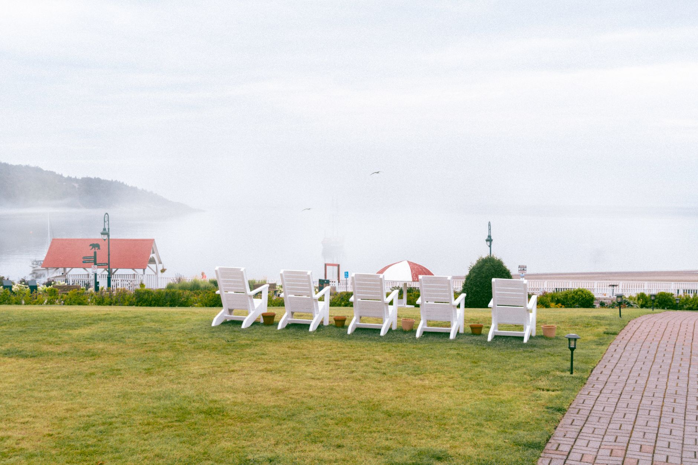

Wood straight off the tree doesn't burn — it hisses, smokes, and struggles to keep a flame going no matter how much kindling you throw at it. That's because freshly cut wood is still full of water, and a fire has to boil that off before it can actually burn cleanly. Seasoning is what turns a log that fights you into one that lights fast and burns hot.

## Why Seasoning Matters

Freshly cut ("green") wood can be 45–50% water by weight. Burning it wastes most of the fire's energy just evaporating that moisture, which means less heat, more smoke, and a longer, smokier smolder before it catches properly. Worse, the unburned smoke condenses inside your chimney or flue as creosote — a sticky, flammable buildup that's the leading cause of chimney fires. Wood that's properly seasoned down to around 20% moisture or less lights faster, burns hotter, and leaves a lot less residue behind.

## How Long It Actually Takes

Seasoning time depends heavily on the type of wood, and rushing it is the most common mistake:

- **Softwoods** (pine, fir, spruce) — around 6 to 12 months. They're less dense and dry out relatively quickly.
- **Hardwoods** (oak, hickory, maple) — 12 to 24 months. Oak in particular is dense enough that a full two years isn't unusual for it to season properly.
- **Split wood dries faster than rounds.** Splitting exposes more surface area to air, which is often the difference between wood that's ready by next winter and wood that's still green.

If you're buying wood instead of cutting your own, ask specifically how long it's been split and stacked — "seasoned" on a sign doesn't always mean it's actually dry.

## Stacking and Storing It Right

How you stack a woodpile matters almost as much as how long you wait:

- **Get it off the ground.** Stack on pallets, rails, or a raised rack — wood sitting on bare soil wicks up moisture and starts rotting from the bottom before it ever dries.
- **Stack loosely, not tight.** Airflow between pieces is what actually dries the wood; a tightly packed pile traps moisture in the center.
- **Cover only the top.** A tarp or roof over the top sheds rain and snow, but the sides should stay open — fully wrapping a pile traps humidity and can slow drying to a crawl.
- **Pick a sunny, breezy spot** if you have the option. Full sun and wind both speed up drying dramatically compared to a shaded, still corner of the yard.

## How to Tell When It's Ready

A few quick checks beat guessing:

- **Look at the cut ends** — seasoned wood develops visible cracks (called "checking") radiating out from the center.
- **Check the bark** — it should be loose or starting to peel, not tightly attached like on a fresh cut.
- **Knock two pieces together.** Dry wood makes a sharp, hollow crack; green wood makes a dull, heavy thud.
- **Weigh it in your hand.** Seasoned wood is noticeably lighter than a freshly cut piece of the same size.
- **Use a moisture meter** if you want a real number — press the pins into a freshly split face (not the weathered exterior) and look for a reading under 20%.

## Choosing Wood Species for Heat Output

Not all seasoned wood burns the same once it's ready. Dense hardwoods like oak, hickory, and hard maple pack more energy per log and burn longer, making them the better choice for overnight burns or a fire meant to provide sustained heat. Softwoods and lighter hardwoods like pine or birch light faster and are excellent for kindling and getting a fire established quickly, but they burn through faster and produce more resinous smoke, particularly in the case of pine, which is part of why many wood-burners keep a supply of both — softwood to start a fire, hardwood to sustain it.

## Splitting Technique and Safety

If you're splitting your own wood rather than buying it pre-split, a few basics make the job safer and more efficient. Use a maul rather than a standard axe for splitting rounds — a maul's wedge-shaped, heavier head is designed specifically to force wood apart rather than cut through it, which matters for how the tool behaves on impact. Split on a stable, elevated block rather than directly on the ground, both to protect your swing's follow-through and to reduce blade contact with dirt and rocks that dull the edge. Keep your stance balanced with feet shoulder-width apart, and never split with anyone standing close enough to be hit by a piece that splits unpredictably or a maul that glances off at an angle.

## Estimating How Much Wood You Need

For a household burning firewood regularly through a full winter, a "cord" (a stacked pile measuring 4 feet by 4 feet by 8 feet, or the equivalent volume) is the standard unit sold by most suppliers, and typical winter usage for a primary heat source can run several cords depending on climate and how much of the heating load the wood is actually carrying versus a furnace or other backup system. For occasional recreational fires — a fire pit a few times a month rather than a primary heat source — usage is far lower, and planning a season's supply mostly comes down to estimating how many fires you expect to have and roughly how much wood each one burns through.

## Mistakes That Ruin a Good Woodpile

Even well-intentioned setups go wrong in predictable ways: stacking directly against the house, which invites moisture and pests into the siding; wrapping the entire pile in a tarp, which seals in humidity instead of letting it escape; and stacking on grass or dirt without any elevation, which keeps the bottom layer perpetually damp. None of these mistakes show up right away — they just mean that by the time you need the wood, a chunk of the pile still isn't ready to burn.
