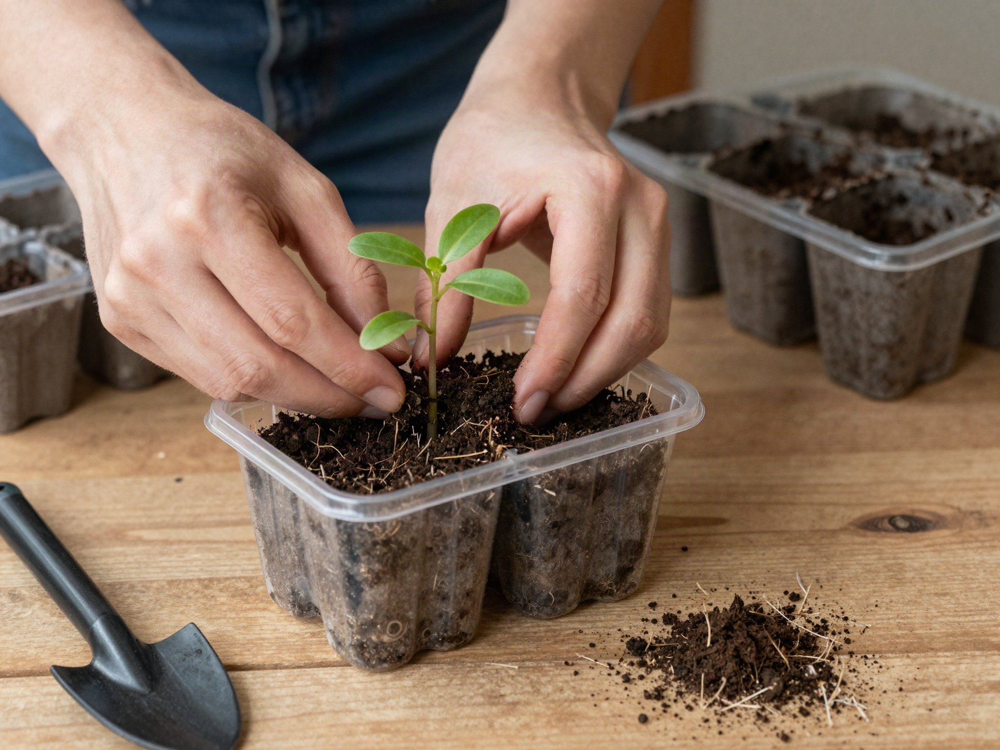

Starting seeds indoors gives slow-growing vegetables like tomatoes and peppers enough of a head start to actually ripen before your growing season ends. It also costs a fraction of buying nursery starts once you're doing it for more than a few plants.

## What You'll Need

- Seed trays or small pots with drainage holes
- Seed starting mix (not regular potting soil — it's too dense for delicate roots)
- A sunny south-facing window or a grow light
- A spray bottle or gentle watering can
- Plastic dome or wrap (to hold humidity while seeds germinate)

## Work Backward From Your Last Frost Date

Every seed packet lists how many weeks before your last frost date to start indoors — typically 6-8 weeks for tomatoes and peppers, 4-6 for most flowers. Look up your local last frost date, then count backward on a calendar to find your start date.

## Step 1: Sow the Seeds

Fill trays with moistened seed starting mix, plant seeds at the depth listed on the packet (usually about twice the seed's diameter), and mist the surface. Cover with a plastic dome to trap humidity until germination.

## Step 2: Provide Light Immediately After Sprouting

The most common seed-starting mistake is leaving trays on a windowsill too long — seedlings need 14-16 hours of strong light a day or they stretch into thin, weak "leggy" stems. A basic grow light positioned 2-3 inches above the trays solves this reliably.

## Step 3: Transplant Once True Leaves Appear

Once seedlings develop their second set of "true leaves" (the first leaves look different — those are just the seed's stored nutrients), transplant into individual pots to give roots more room.

## Step 4: Harden Off Before Planting Outside

About a week before your last frost date, start setting seedlings outside for a few hours a day, gradually increasing exposure to sun and wind. Skipping this "hardening off" step is the second most common reason indoor-started seedlings die within days of transplanting outdoors — they simply aren't used to direct sun and wind yet.
