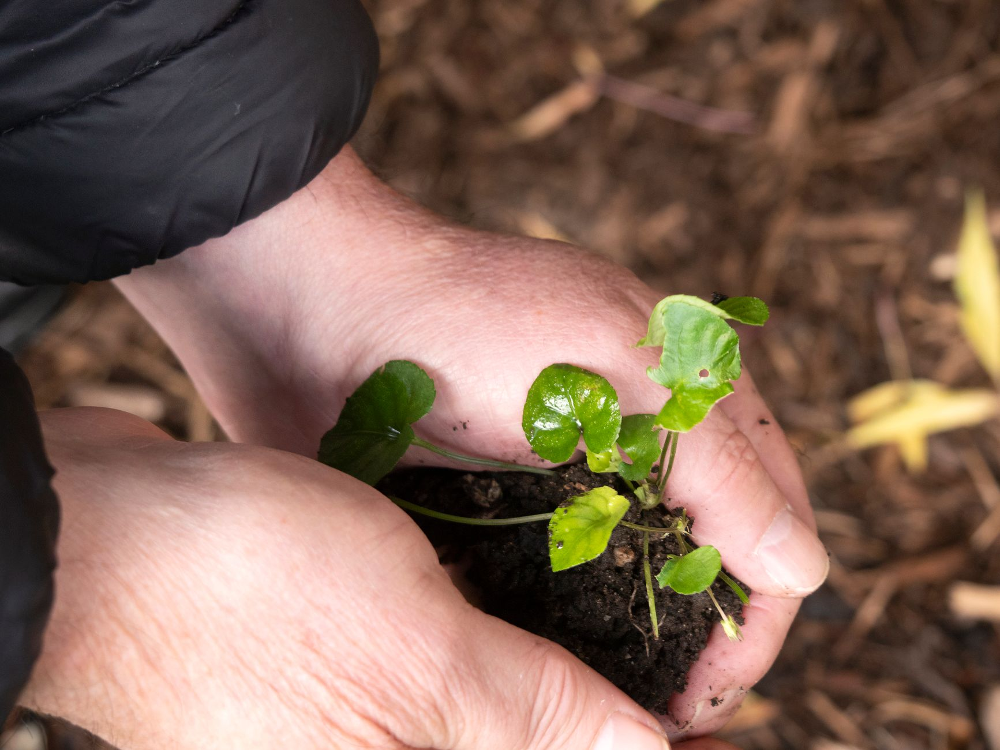

Soil pH controls how available nutrients are to plant roots — even perfectly fertilized soil underperforms if the pH is too far off for what you're growing. Most vegetables and ornamentals want a slightly acidic to neutral range, roughly 6.0 to 7.0.

## Why pH Matters More Than Most Gardeners Realize

At the wrong pH, nutrients can be present in the soil but chemically locked in a form roots can't absorb. This is why a plant can show classic nutrient-deficiency symptoms — yellowing leaves, stunted growth — even in soil that's technically well-fertilized. It's also why adding more fertilizer is sometimes the wrong fix for a struggling plant; if the underlying pH is off, extra fertilizer just sits in the soil unused rather than solving the actual problem, and in some cases can make the imbalance worse.

## Step 1: Test Your Soil

A basic home test kit (strips or a liquid solution) gives a reasonable read for most garden purposes. Take samples from a few different spots in the bed or yard rather than just one, especially in a larger garden, since pH can genuinely vary between different areas depending on past use, nearby plantings, and soil composition — a single sample from one corner isn't necessarily representative of the whole space.

**No kit on hand?** You can get a rough directional read with pantry staples: put two soil samples in separate cups, add water to make mud, then add 1/2 cup of vinegar to one. Fizzing means alkaline soil. With the second cup, add 1/2 cup of baking soda instead — fizzing there means acidic soil. Neither reaction means your soil is closer to neutral. This won't give you an exact number and isn't a substitute for a real test, but it's a fast way to know which direction you're dealing with before you buy anything.

For a more precise reading, a local agricultural extension office will test a soil sample for a small fee and often includes nutrient analysis too. This is worth doing at least once even if you rely on a home kit day to day, since it establishes a reliable baseline you can compare future home tests against.

## Step 2: Understand What You're Growing

- **Acid-loving plants** (blueberries, azaleas, rhododendrons): prefer pH 4.5-5.5
- **Most vegetables and lawns**: prefer pH 6.0-7.0
- **Lavender, clematis**: tolerate more alkaline soil, up to pH 7.5-8.0

Matching plant choice to your existing soil pH, rather than always trying to amend the soil to match a plant, is often the more sustainable long-term approach — pH amendments need to be maintained repeatedly since soil naturally drifts back toward its baseline over time, while choosing plants suited to your native pH requires little ongoing correction at all.

## Step 3: Raise pH (Make Soil Less Acidic)

Work garden lime into the soil in fall or several weeks before planting — it takes time to fully react. Wood ash also raises pH gradually and adds potassium as a bonus, though it acts faster and more strongly than lime, so it's easier to overcorrect with it if you're not careful about quantity. Apply either amendment evenly across the treated area rather than concentrated in one spot, since an uneven application creates pockets of dramatically different pH within the same bed.

## Step 4: Lower pH (Make Soil More Acidic)

Elemental sulfur is the most reliable long-term fix, though it acts slowly (weeks to months) since it relies on soil bacteria to convert it into the acidifying compounds that actually shift pH. For a faster, temporary effect, used coffee grounds or pine needle mulch add mild acidity as they break down, though their effect is much less pronounced and longer-lasting than a proper sulfur application — think of them as a supplement to a real amendment rather than a substitute for one on soil that needs a significant pH shift.

## How Soil Type Affects the Process

Sandy soils respond to pH amendments faster but also drift back toward their original pH faster, since they hold amendments less firmly than denser soil. Clay-heavy soils resist pH change more stubbornly at first but hold the correction longer once it's achieved. This matters for how often you should expect to retest and reapply — a sandy garden bed may need more frequent, smaller adjustments over time, while a clay-heavy bed might need a larger initial correction but less frequent follow-up.

## Retest Before Assuming It Worked

pH amendments take time to fully react with the soil. Retest 4-8 weeks after applying lime or sulfur before adding more — overcorrecting is a common mistake that swings the pH too far the other direction. Keep a simple record of what you applied and when, since it's easy to lose track of the timeline across a growing season and end up guessing whether enough time has passed for a fair retest, or accidentally applying a second round before the first has had a chance to work.
