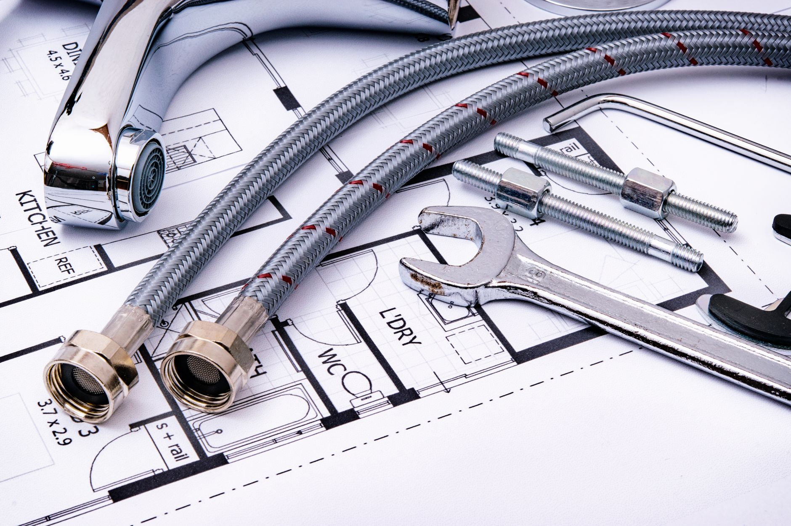

Chemical drain cleaners work, but repeated use can damage older pipes, and they're genuinely hazardous to handle. Most household clogs — hair, soap scum, food debris — clear just fine with mechanical methods first.

## Dealing With Standing Water First

If the sink is already full of stagnant water and nothing is draining, bail most of it out with a cup or small bowl into a bucket before trying anything else — leave just an inch or two. A plunger actually needs a little water to form a seal, but a sink brimming full just sloshes everywhere instead of forcing pressure down the pipe. If you own a wet/dry shop vacuum, it works even better here: set it to liquid mode, seal a rag around the hose where it meets the drain opening, and run it for 30 seconds. It's often strong enough to pull the clog out directly.

## Step 1: Try the Plunger First

A wet/dry sink plunger (the flat-bottomed kind, different from a toilet plunger) can clear many simple clogs. Fill the sink with a couple inches of water first — the water helps create a proper seal for effective suction.

## Step 2: Remove and Clean the Stopper

Many bathroom sink clogs are actually hair wrapped around the stopper assembly just below the drain opening. Pop the stopper out (most twist or lift free) and clean it off — this alone solves a surprising number of "clogged drain" complaints.

## Step 3: Use a Drain Snake

A simple plastic drain snake (a flexible stick with barbs, a few dollars at any hardware store) pulls out hair and gunk that a plunger can't reach. Insert it, twist gently, and pull back out slowly.

## Step 4: Try a Natural Chemical Reaction

For slow drains (not fully blocked), pour 1/2 cup baking soda down the drain followed by 1/2 cup white vinegar. Let the fizzing reaction sit for 15 minutes, then flush with hot water. This won't clear a solid blockage, but it helps with grease and soap buildup on pipe walls.

## Step 5: Check the P-Trap

If nothing above works, the clog may be in the P-trap (the curved pipe under the sink). Place a bucket underneath, unscrew the trap's slip nuts by hand or with pliers, and clear out any debris before reassembling.

## When to Call a Plumber

If water backs up in multiple drains at once, or a snake meets resistance you can't clear, the blockage may be deeper in your main line — that's a job for a professional with a motorized auger.
