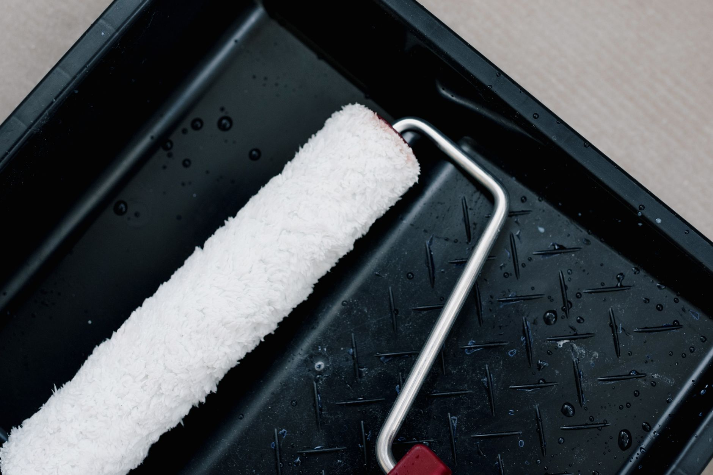

Once the weather turns, small gaps around doors and windows stop being a minor annoyance and start showing up on your heating bill. Weatherstripping is one of the cheapest, fastest fixes in home maintenance — most jobs take under an hour and cost less than a takeout dinner. The trick is matching the material to the gap you're actually sealing.

## Find the Drafts First

Before buying anything, figure out where the air is actually getting in. On a breezy day, run your hand slowly around door and window frames — you'll often feel the leak directly. For subtler gaps, hold a lit candle or a piece of tissue paper near the frame and watch for flickering or movement; a steady flame means a tight seal, a wavering one means air is moving through. Check the usual suspects first: the bottom of exterior doors, the meeting point where double-hung windows overlap, and anywhere a frame has warped slightly with age. Older homes are rarely leaking in just one spot, so it's worth checking every window and door rather than assuming the problem is isolated.

## Choose the Right Material for Each Gap

Weatherstripping isn't one product — different gaps call for different fixes:

- **Foam tape** — cheap, easy to cut, and good for irregular gaps around window sashes. It compresses under pressure, so it works best on lighter contact points rather than a door that slams shut hard.
- **V-strip (tension seal)** — a folded strip of vinyl or metal that springs back after compression, making it a strong choice for the sides and top of doors and double-hung windows that open and close often. It holds up longer than foam under repeated use.
- **Door sweeps** — attach to the bottom of exterior doors to block the gap between the door and the threshold, which is often the single biggest source of draft in a house. Sweeps come in several styles; a simple screw-on sweep works for most standard doors.
- **Felt** — the least durable option but useful for spots with minimal friction, like the track of a sliding window that shouldn't be gummed up with anything thicker.

## Installing It Without Wasting a Roll

Clean the surface first — dust, old caulk residue, and peeling paint will keep any adhesive-backed strip from sticking for more than a season. Measure each gap before cutting, and cut slightly long rather than short; you can always trim excess but can't stretch a strip that came up short. Press foam and V-strip into place while the door or window is closed, so the material compresses to the actual gap rather than an estimate. For door sweeps, close the door first and adjust the sweep height so it just brushes the threshold — too tight and it'll drag and wear out fast, too loose and it won't block anything.

## Don't Skip the Attic Hatch and Outlets

Doors and windows get most of the attention, but they're not the only leak points. Attic access hatches are notoriously under-sealed — a strip of foam tape around the frame closes a gap that's often larger than any window in the house. Electrical outlets and light switches on exterior walls leak air too; foam gasket inserts sold for a few dollars a pack slide behind the cover plate and take about two minutes per outlet. None of these fixes are visible once they're done, but together they close the gaps that a room-by-room draft check would otherwise miss.

## When It's More Than Weatherstripping Can Fix

If a door or window still lets in a strong draft after fresh weatherstripping, the problem may be the frame itself — warping, a settled foundation, or gaps behind the trim that need to be caulked or insulated separately. Weatherstripping seals the moving parts; it can't compensate for a frame that's no longer square. In that case, a bead of exterior caulk around the outside trim is the next step, and a persistent draft after that is worth a look from someone who can check the insulation around the frame itself.
