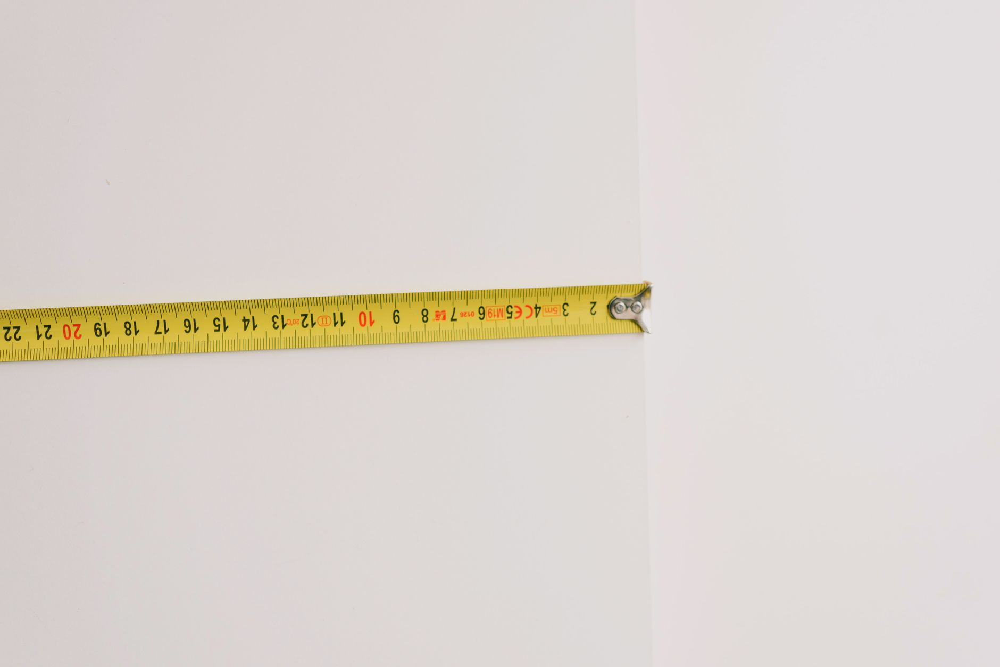

An outdoor faucet is one of the few plumbing fixtures that sits right at the boundary between a heated house and the outside air, which makes it one of the first places a hard freeze finds a way in. Water left sitting in the pipe expands as it freezes, and that expansion has nowhere to go — it splits the pipe from the inside, often at a joint or fitting you can't see. The crack itself does no damage until spring, when you turn the water back on and find it spraying inside a wall or under the house. Winterizing a hose bib takes about fifteen minutes and costs less than a bag of mulch, which makes it one of the better returns on effort in fall home maintenance.

## Why This Matters More Than People Expect

The pipe feeding an outdoor faucet usually runs through an unheated space — a rim joist, a crawl space, or straight through an exterior wall — before it reaches the warmth of the house. That short unheated stretch is enough. Even in a climate that only sees a handful of nights below freezing each winter, one bad night is all it takes if the line wasn't drained. Newer homes often have frost-free sillcocks that are more forgiving, but "frost-free" only works as advertised if a hose isn't left attached, since a connected hose traps water in the pipe exactly where it's not supposed to sit. Older homes with a standard sillcock have no such protection and need the full shutoff-and-drain routine every year without exception.

## Step One: Disconnect Every Hose

Before anything else, walk the perimeter of the house and disconnect every garden hose from every spigot. This is the step people skip most often, and it defeats almost every other winterizing effort — a hose left attached, even to a frost-free faucet, holds water against the valve and blocks it from draining fully. Coil the hoses, drain them out, and store them somewhere they won't crack over winter; a hose left outside all season gets brittle and starts splitting by spring regardless of the faucet behind it.

## Step Two: Find and Shut the Interior Shutoff Valve

Most homes in colder climates have a dedicated shutoff valve for each outdoor faucet, usually located in the basement, crawl space, or utility area near where the pipe exits the house. It looks like a standard valve on a short branch line rather than the main water shutoff for the whole house. Turn it fully to the closed position. If your home doesn't have one of these dedicated valves — common in warmer regions or older construction — a frost-free sillcock with a long stem reaching inside the heated wall cavity may be doing this job automatically, but it's worth confirming rather than assuming.

## Step Three: Drain the Line

After closing the shutoff valve, go back outside and open the faucet fully. This lets any water trapped between the valve and the spigot drain out and relieves the pressure in the line. Leave the faucet open through the winter — a valve you shut but never drained still has standing water in the exposed section, which defeats the purpose. Many shutoff valves have a small bleeder cap or plug next to them; opening this releases any water still trapped on the house side of the valve, which is worth doing if the valve is accessible, since a few ounces of trapped water is still enough to crack a fitting.

## Step Four: Add an Insulated Faucet Cover

Even after shutting off and draining the interior valve, an insulated faucet cover is cheap insurance for the exposed spigot itself and for the last few inches of pipe closest to the outside wall. These foam-lined covers slip over the entire fixture and cinch tight with a drawstring or strap, and they cost only a few dollars each. They're especially worth adding if you're not fully certain the interior shutoff and drain were done correctly, or if the home doesn't have a dedicated interior valve at all — the cover won't save an undrained pipe from a hard freeze on its own, but it buys meaningful protection against a brief cold snap.

## What to Do if You Don't Have an Interior Shutoff

Some homes, particularly ones with only frost-free sillcocks, don't have an easily accessible interior valve for each faucet. In that case, focus on what you can control: disconnect and drain every hose, confirm the sillcock's long stem actually reaches into a heated space rather than terminating in an unheated crawl space, and add an insulated cover as backup. If you're unsure whether a given faucet is a true frost-free type or just looks like one, a quick way to check is to feel how far the handle assembly extends — a frost-free unit has a noticeably longer stem than a standard sillcock. When in doubt, treat it like a standard faucet and take the extra precaution of an insulated cover regardless.

## Signs a Pipe Already Froze (and What to Do)

If a faucet won't produce water on a cold morning, or produces only a trickle before stopping, that's a sign of an ice blockage rather than a leak — leave it alone and don't run the tap continuously trying to force it, which can build pressure behind the ice. Shut off the interior valve if you haven't already, and let the pipe thaw gradually as temperatures rise; a hair dryer on low, held a safe distance from the pipe, can speed up thawing on an accessible section, but never use an open flame. Once thawed, check the line and the faucet itself carefully for any dripping or spraying before considering it resolved, since a freeze that didn't fully crack the pipe can still have weakened a joint enough to fail days later.

## Building It Into a Fall Routine

The faucets that get missed are usually the ones that are hardest to reach — one behind a bush, one on a rarely used side of the house, one on a detached garage. Walking the full exterior once in early fall, with a simple mental checklist of disconnect, shut off, drain, and cover, catches these before the first freeze rather than after a pipe has already split. It's a fifteen-minute task with essentially no cost if done on schedule, against a repair that can run into the thousands if a burst pipe soaks a finished basement or wall cavity over a long weekend when nobody's home to notice.
