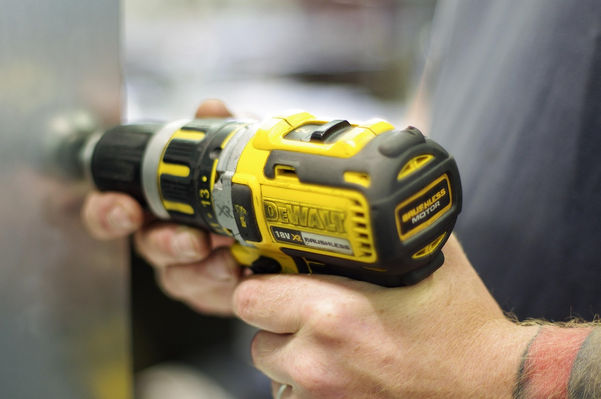

Fall cleanup season is when most people realize their rake alone isn't cutting it anymore, and that's exactly when leaf blower prices tend to creep up too. Picking the right one now, before the leaves are actually falling, saves you from an overpriced, underpowered impulse buy later. Here's what actually separates the options.

## Corded Electric: Cheapest and Lightest, With a Catch

Corded blowers are the least expensive way into powered leaf clearing, and they're usually the lightest to carry since there's no battery or gas tank to haul around. The obvious limit is the cord itself — you're tethered to an outlet, which makes them a poor fit for anything beyond a small front yard or a patio. Dragging an extension cord around trees and flower beds gets old fast, and stepping on the cord mid-job is a common annoyance. If your lot is small and mostly open, though, a corded model gets the job done for the least money.

## Cordless Battery: The Middle Ground Most Homeowners Land On

Battery-powered blowers have gotten a lot more capable in the past few years, and for a typical suburban yard they're usually the best balance of power, weight, and convenience. No cord to manage, no gas or oil to mix, and far less noise than a gas engine — quiet enough that you won't get dirty looks from neighbors at 8 a.m. The tradeoff is runtime: most battery blowers give you 15 to 30 minutes per charge depending on the power setting, so a second battery is worth budgeting for if your yard has a lot of ground to cover. If you already own other tools on the same battery platform, buying a blower in that same ecosystem saves real money since you're not paying for another charger and pack.

## Gas-Powered: More Power, More Maintenance

Gas blowers still win on raw power and unlimited runtime — you're only limited by how much fuel you're willing to carry. That makes them the right call for large properties, thick leaf cover, or professional-level use. The downside is real: they're louder, heavier, need fuel mixed and stored properly, and require basic small-engine maintenance like fresh gas and occasional spark plug checks to keep running well. Many neighborhoods and even some municipalities have started restricting gas blower use on noise or emissions grounds, so it's worth checking local rules before you buy one.

## Handheld vs. Backpack: Don't Overlook Comfort

For anything beyond a quick 15-minute job, arm fatigue from a handheld blower adds up fast. Backpack models shift the weight to your shoulders and hips, which makes a real difference on larger properties or longer sessions, even though they cost more upfront. If you're only ever doing a small patio or walkway, a handheld is plenty — save the backpack style for yards with real acreage or heavy tree cover.

## What to Actually Check Before Buying

Air volume (measured in CFM) and air speed (MPH) both matter, but CFM is the better predictor of how quickly you'll actually move a pile of leaves — a blower with high MPH and low CFM will scatter leaves more than it clears them. Also check whether the unit has a variable speed trigger rather than just on/off; it makes a big difference for precision work like clearing mulch beds or getting leaves out of gravel without blasting it everywhere. Weight matters more than the spec sheet suggests too — try to get a sense of how a model feels held out at arm's length before committing, since a few extra pounds becomes very noticeable by the end of a full yard.
