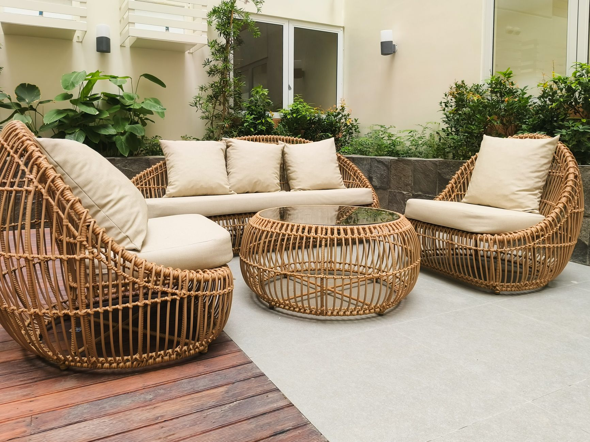

Small outdoor spaces fail for one of two reasons: furniture that's too bulky for the footprint, or so little furniture the space feels unused. Here's how to get the balance right.

## Measure Before You Shop

Sketch your space and note fixed obstacles — railings, doors that swing outward, vents. Leave at least 30 inches of clear walking path around any furniture; anything tighter feels cramped even if the pieces themselves are small.

## Choose Furniture That Does Double Duty

A storage bench seats two and hides cushions or gardening supplies. A bistro table with folding chairs can flatten against a wall when not in use. In small spaces, furniture that serves one purpose is a missed opportunity.

## Scale Matters More Than Style

A single oversized sectional will dominate a small balcony no matter how nice it looks in a catalog photo. Two or three smaller, lighter pieces (a couple of chairs and a side table) usually make a tight space feel more open than one large piece.

## Material Considerations for Small, Exposed Spaces

- **Rattan/wicker (synthetic resin)**: lightweight, weather-resistant, easy to move
- **Metal (aluminum)**: durable and slim-profile, but can get hot in direct sun
- **Wood**: warm look, but needs more maintenance in exposed, rainy climates

## Add Vertical Layers

Wall-mounted planters, hanging chairs, and railing-mounted shelves use space that floor furniture can't. This is often the difference between a small patio that feels bare and one that feels intentionally designed.

## Light It Well

String lights or a couple of small solar lanterns make a tiny space feel finished in the evening — often more impactful per dollar than another piece of furniture.
