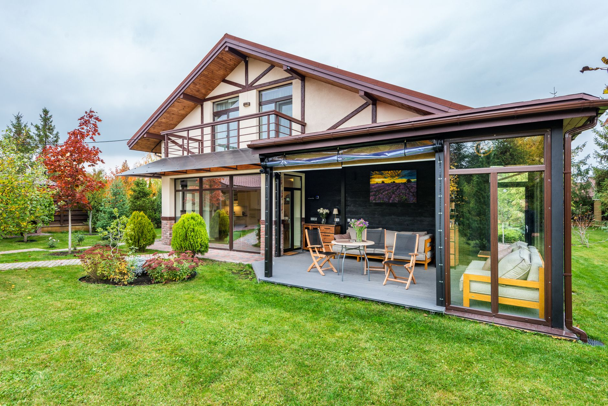

"Patio cover" gets used as a catch-all for four genuinely different structures, and that's where most of the buyer's remorse starts. Someone budgets for a simple pergola, falls in love with a screened porch's bug-free comfort, then discovers it costs four times as much and needs a permit. Or they install a fixed solid roof expecting flexibility, and lose the sunny days they actually wanted the patio for. Each option solves a different problem, and the right one depends less on style and more on what's actually driving you indoors: sun, rain, bugs, or a short season.

**Quick answer:** A pergola gives partial shade and structure at the lowest cost but little rain or bug protection. A retractable awning is the most flexible for sun control and works on almost any existing patio without a permit in most areas. A solid-roof cover or pavilion blocks sun and rain completely and can carry ceiling fans or lighting, but it's a fixed structure that shades the space every day, sunny or not. A screened porch or sunroom is the only option that also stops insects and adds real square footage to how the house functions, for the highest cost and the most involved build. Match the choice to whichever problem — sun, rain, bugs, or a short season — actually keeps you off the patio.

## The Four Options, Defined

Before comparing them, it helps to be clear on what each structure actually is, since the terms get used loosely.

- **Pergola** — an open framework of posts and horizontal beams, traditionally with gaps between the roof slats. Modern versions add retractable canopy fabric or adjustable louvered roofs that close for shade or rain.
- **Retractable awning** — fabric mounted on a frame that extends from the house wall on an arm mechanism, either hand-cranked or motorized. It rolls back against the wall when not in use.
- **Solid-roof patio cover (pavilion)** — a permanent, fully roofed structure, open on the sides, attached to the house or freestanding. Built from wood, aluminum, or vinyl with shingles or metal panels.
- **Screened porch or three-season sunroom** — a fully enclosed structure with screen or glass walls and a solid roof, usually built on an existing deck or a new foundation, often as a home addition.

## Comparison: What Each One Actually Delivers

| Structure | Sun protection | Rain protection | Bug protection | Typical cost tier | DIY feasibility |
|---|---|---|---|---|---|
| **Pergola (open slat)** | Partial, filtered shade | None | None | Low to moderate | Buildable as a weekend-to-week project |
| **Pergola (louvered/canopy)** | Full when closed, open when you want sun | Full when closed | None | Moderate to high | Usually a kit installed by two people; motorized versions often need an electrician |
| **Retractable awning** | Full when extended, adjustable pitch | Light rain only, not a downpour | None | Low to moderate | Manual awnings are DIY-installable; motorized units often need an electrician |
| **Solid-roof cover** | Full, permanent (no sunny days either) | Full | None (open sides) | Moderate to high | Usually needs a contractor for footings and roof tie-in |
| **Screened porch / sunroom** | Full | Full | Full | High | Contractor project; often needs a permit and foundation work |

## How Much Protection Each One Really Gives

The comparison table above is the short version; the details are where people get surprised after installing.

**A slatted pergola filters light rather than blocking it.** Even at midday, you'll see moving patterns of sun and shade underneath, which is pleasant for lounging but not enough to protect a wood dining table or keep a laptop screen readable. It does nothing in rain — everyone moves inside the moment it starts.

**Retractable awnings handle sun exceptionally well** because you control the angle and can chase shade through the day. Fabric ranges from 8 to 20 feet of projection depending on the model, and quality acrylic fabric resists fading for years. But even water-resistant awning fabric isn't built for sustained rain; a hard downpour will eventually soak through the weave, and heavy standing water can stress the frame. Retract it before a real storm, not just before a drizzle.

**A solid roof is the only open-air structure that fully blocks both sun and rain**, which is why it's the right call for anyone who wants the patio usable on a rainy afternoon without stepping inside. The tradeoff most people don't anticipate: it also blocks sun on the one sunny, mild day you wanted to eat breakfast outside in full light. A solid roof commits you to shade year-round.

**Only a screened porch or sunroom adds bug protection**, which matters more in some climates and seasons than people expect going in. If mosquitoes or evening bugs are what actually keeps your household indoors after dinner rather than sun or rain, none of the other three options solve that problem at any price point.

## Decision Guide: Match the Structure to the Problem

Work through these questions in order — the first one you answer "yes" to usually points to your best option.

1. **Is the main problem bugs, not weather?** Only a screened porch or sunroom fixes this. Nothing else comes close, regardless of budget.
2. **Do you want the patio usable during rain, not just strong sun?** A solid roof or a closed louvered pergola are your only real choices; a fabric awning isn't built for sustained rain.
3. **Do you want full control over sun exposure — shade on hot days, full sun on mild ones?** A retractable awning or an adjustable louvered pergola wins here; a solid roof can't reopen.
4. **Is budget the deciding factor and partial shade is enough?** A basic open-slat pergola delivers the most structure and style per dollar, even without full coverage.
5. **Are you renting, or might you move in a few years?** Favor the retractable awning or a freestanding pergola kit — both are less permanently tied to the specific house than a roof tie-in or foundation addition.

Also weigh how often you'll actually use the space. A structure you'll sit under three evenings a week for years justifies a bigger investment than one for occasional weekend use — the same logic that applies to any big-ticket outdoor purchase.

## Permits, Attachment, and What Installation Actually Involves

- **Open pergola kits** rarely require a permit, though HOA rules sometimes do apply to structure height or placement — check before you order materials.
- **Solid-roof covers and screened porches almost always require a permit** if they're attached to the house, since they affect the roofline, drainage, and sometimes the home's structural load. Your local building department, not the retailer, has the final say.
- **Anything attached to the house** — an awning, a solid roof, a screened porch — needs to tie into the wall framing correctly, not just the siding. A contractor or a structural inspection is worth it before drilling into your house's exterior.
- **Freestanding options** (a standalone pergola, a freestanding awning) avoid the house-attachment question entirely but need their own footings, typically post footings set below your region's frost line so the structure doesn't heave in winter.
- **Motorized components** — retractable awning motors, louvered-roof actuators, screened-porch lighting — need a dedicated outdoor-rated circuit; budget for an electrician even on an otherwise DIY project.

If your project involves building the frame yourself, our guide to [building a DIY fire pit with pavers](/blog/diy-backyard-fire-pit/) covers similar groundwork basics — leveling a base and working with post footings — that carry over to a freestanding pergola.

## Common Mistakes

| Mistake | Why it backfires | Better approach |
|---|---|---|
| Choosing a solid roof without considering year-round shade | Loses the sunny days you wanted the patio for in spring and fall | Consider a louvered or retractable option if you want both sun and shade on demand |
| Buying a fixed-arm fabric awning to solve a heavy-rain problem | Fabric isn't built for sustained downpours and can pool or sag | Choose a solid roof or closed louvered pergola if rain protection is the real goal |
| Skipping the permit check on an attached structure | Can mean a stop-work order or a forced teardown mid-project | Call your local building department before ordering materials, not after |
| Ignoring HOA rules on structure height or visibility | Leads to a costly rebuild or removal after installation | Check covenants first, especially for anything over fence height |
| Undersizing post footings for a freestanding structure | Posts heave or lean after a freeze-thaw winter | Set footings below your region's frost line, not just a shallow surface pour |
| Assuming any awning or pergola keeps bugs out | None of them do — only a fully screened structure does | If bugs are the dealbreaker, budget for a screened porch, not a shade structure |

## Maintenance to Expect After Installation

Whichever you choose, ongoing upkeep is part of the real cost:

- **Open pergolas** need occasional wood sealing or stain touch-ups (every 1-2 years for wood; vinyl and aluminum need only washing) and a seasonal check of hardware for rust or loosening.
- **Retractable awnings** should be retracted before storms and heavy snow load, and the fabric cleaned with mild soap and water a couple of times a season to prevent mildew.
- **Solid roofs** need gutters (if attached) cleared the same as the house roof, and periodic checks of flashing where it meets the house wall.
- **Screened porches** need screens checked for tears each spring and glass or window tracks cleaned; if yours has furniture you bring in for winter, see our guide on [winterizing outdoor furniture](/blog/winterize-outdoor-furniture/) for a room-by-room approach.

Once your cover is up, filling the space well matters as much as the structure itself — our guide to [patio furniture for small spaces](/blog/patio-furniture-for-small-spaces/) has layout ideas that apply under any of these covers, not just tight patios. And if the real goal is simply getting more weeks of use out of the space you already have, a full structure isn't always the first step — see our tips to [extend your outdoor season into fall](/blog/extend-outdoor-season-into-fall/) for lower-cost changes worth trying first.

## Safety Notes and When to Call a Professional

- **Never attach a structure to your house's siding or trim alone** — it needs to reach ledger framing or masonry with proper flashing, or water will find its way into the wall.
- **Get an electrician for any wired component** (motorized awnings, louvered roofs, outdoor lighting or fans) rather than running an extension cord as a permanent solution.
- **Have a structural professional confirm footing depth and post spacing** for anything freestanding in a region with heavy snow load or high wind.
- **Screened porches and sunrooms that involve a new foundation or roofline tie-in are a licensed contractor's job**, not a weekend DIY project, both for the permit process and the structural work involved.
- **If an existing structure is leaning, has rotting posts, or shows a sagging roofline**, stop using it and have it inspected before the next storm, rather than waiting for it to fail.

## FAQ

### Is a pergola or an awning better for a small patio?

A retractable awning usually suits a small patio better, since it needs no floor footprint of its own and folds away completely, leaving the space open when you don't need shade. A pergola adds visual structure and can support climbing plants or string lights, but its posts take up usable patio space permanently.

### Do I need a permit for a freestanding pergola?

Often not, but it depends on your local building department and any HOA covenants, especially once the structure passes a certain height or footprint. Attached structures and anything with a solid roof are far more likely to require one. Always check before ordering materials.

### Can I add a solid roof over an existing pergola instead of building new?

Sometimes, if the existing posts and beams are sized to carry the additional load, but many open pergolas are built lighter than a solid-roof structure requires. Have a contractor assess the existing framing before adding roofing panels; undersized posts and beams are a common reason retrofits fail.

### What's the most budget-friendly way to add shade this season?

A basic open-slat pergola kit or a manually operated retractable awning are the lowest-cost structural options, well below a solid roof or screened addition. If even that's more than you want to spend right now, temporary shade sails or market umbrellas cost a fraction as much and need no installation at all.
