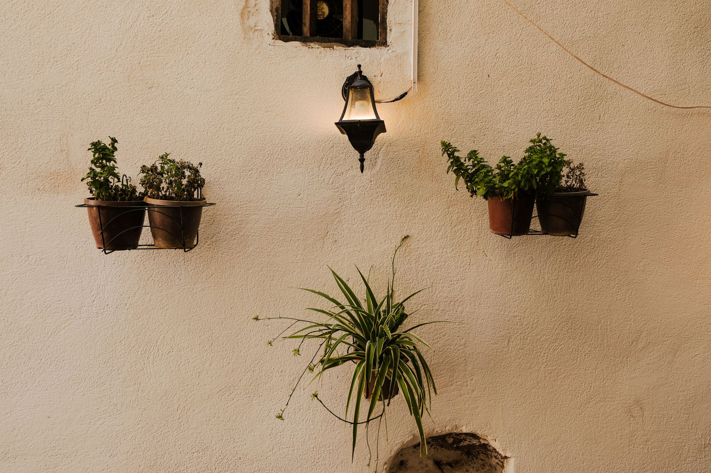

Most of the classic low-light houseplants — pothos, snake plant, ZZ plant — are mildly to seriously toxic if a cat or dog decides to chew on them. If you share your home with pets, that narrows the list considerably. Here are ten low-light options that are both easy to keep alive and safe if a curious pet takes a bite.

A quick note before the list: "non-toxic" here follows the [ASPCA's plant toxicity guidance](https://www.aspca.org/pet-care/animal-poison-control/toxic-and-non-toxic-plants), which is the most widely cited reference for this. Always double-check a specific plant and variety before bringing it home, and call your vet or the ASPCA Animal Poison Control Center if you ever suspect your pet has eaten something it shouldn't have.

## Why Some Common Houseplants Are Toxic in the First Place

Many popular houseplants, including several of the toughest low-light options, contain calcium oxalate crystals or other compounds in their sap and leaves as a natural defense against being eaten by animals in the wild. When a cat or dog chews into the leaf, those crystals or compounds cause anything from mild mouth and stomach irritation to more serious reactions depending on the plant and how much was ingested. This is exactly why a plant's toughness and a plant's pet-safety are two completely separate questions — some of the most forgiving, low-maintenance plants for humans are also among the ones to avoid with curious pets around.

## 1. Spider Plant (Chlorophytum comosum)

Extremely forgiving, tolerates low to medium light, and produces baby "pups" you can propagate for free. Genuinely one of the hardest houseplants to kill. Interestingly, cats are sometimes drawn to nibbling spider plant leaves specifically, similar to their attraction to grass — this is generally harmless given the plant's non-toxic status, though it can leave the plant looking a little worse for wear if a cat treats it as a regular snack.

## 2. Parlor Palm (Chamaedorea elegans)

A classic low-light palm that's been a houseplant staple for over a century, partly because it tolerates dim corners so well. Slow-growing, so it won't outgrow its spot quickly.

## 3. Areca Palm (Dypsis lutescens)

Slightly more light-hungry than a parlor palm but still workable in medium-low light. Its feathery fronds make it one of the more attractive pet-safe palms.

## 4. Calathea (various species)

Grown for dramatically patterned leaves that fold up at night. Calatheas prefer consistent moisture and humidity, but tolerate low light well — just keep them away from cold drafts.

## 5. Boston Fern (Nephrolepis exaltata)

A humidity-loving classic that does fine in bright indirect light and can tolerate lower light with less frequent watering demands. Great for bathrooms with a window.

## 6. Peperomia (various species)

A large family of compact, low-light-tolerant plants with thick, often textured leaves. Peperomias are forgiving of irregular watering, making them a good beginner pick.

## 7. Friendship Plant (Pilea involucrata)

Compact and easy-going, with quilted, deeply veined leaves. Tolerates lower light better than its shinier cousin, the Chinese money plant, though both are pet-safe.

## 8. Bird's Nest Fern (Asplenium nidus)

Unlike many ferns, this one has broad, glossy fronds instead of feathery ones, and handles lower light better than most ferns. Prefers to stay evenly moist, not soggy.

## 9. Polka Dot Plant (Hypoestes phyllostachya)

Grown for its speckled pink, white, or red-splashed leaves. It tolerates moderate-low light, though the pattern stays brightest with a bit more indirect sun.

## 10. Prayer Plant (Maranta leuconeura)

Named for the way its leaves fold upward at night like praying hands. Tolerates low to medium light and pairs well visually with calathea, its close relative.

## Placement Tips Even for Non-Toxic Plants

Even with a pet-safe plant, it's worth discouraging pets from treating it as a regular chew toy, since repeated nibbling stresses the plant and can still cause mild digestive upset simply from eating plant matter in quantity, regardless of toxicity. Placing new plants somewhere slightly less accessible for the first few weeks — a shelf rather than the floor — lets you gauge whether a particular pet is going to take an interest before committing to a permanent spot. Bitter-tasting, pet-safe deterrent sprays (widely available and non-toxic themselves) are another option for a plant a pet won't leave alone, without needing to relocate it entirely.

## Caring for Pet-Safe Plants Around Curious Animals

Beyond toxicity, a few general care habits help pet-safe plants thrive in a household with animals. Water thoroughly but check that pots have solid drainage and a saucer to catch runoff, since pets sometimes drink from standing water in a plant saucer, which is generally not harmful for non-toxic plants but worth keeping fresh regardless. Avoid using systemic pesticides or fertilizer spikes on plants pets have regular access to, since a plant's non-toxic status doesn't extend to products applied to it — a pet-safe plant treated with a non-pet-safe product isn't actually pet-safe anymore. And if a plant does get knocked over or partially dug up by a curious cat or dog, cleaning up spilled soil promptly discourages a pet from treating the pot as a litter box or digging spot going forward.

## Plants to Keep Away From Pets

For contrast, the most common low-light houseplants that are **not** pet-safe include pothos, snake plant, ZZ plant, philodendron, and peace lily — all of which can cause anything from mouth irritation to more serious symptoms if chewed or ingested. If you already own these, they're not necessarily worth giving up — just keep them somewhere pets can't reach, like a high shelf, a plant stand out of jumping range for a cat, or a room they don't have access to. Hanging planters suspended well above furniture a pet could jump from are another practical option for keeping a non-pet-safe plant while still limiting real access to it.
