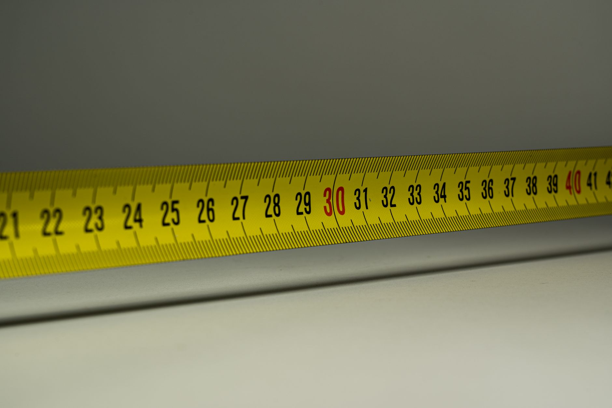

Fall storms and winter ice are common reasons for multi-hour outages, and they tend to arrive when you're least prepared. A generator helps only if it's the right size, has fuel, starts reliably and is set up safely before the power goes out. This guide explains how to size a generator from your own appliances and how the main types compare, based on manufacturer specifications and published safety guidance rather than tests of specific models.

**Quick answer:** List what you truly need to run, add up running watts, then add the highest single starting (surge) wattage. Many homes cover essentials like a refrigerator, sump pump, furnace blower, lights and phone charging with about 3,000–7,500 watts. Choose an inverter model for quiet, clean power and electronics, a conventional model for more watts per dollar, and dual-fuel for fuel flexibility. Run it outdoors only, far from doors and windows, with CO alarms inside, and connect to home circuits only through a transfer switch or interlock installed by an electrician.

## Step 1: Add Up Your Watts

Every motor-driven appliance needs extra power for a second or two when it starts. That surge often determines the generator size.

| Appliance | Typical running watts | Typical starting watts |
|---|---|---|
| Refrigerator | 700–800 | Up to about 2,200 |
| Chest freezer | 500 | Up to about 1,500 |
| Sump pump (⅓–½ hp) | 800–1,050 | Up to about 2,200 |
| Gas furnace blower (½ hp) | 800 | Up to about 2,300 |
| Well pump (¾–1 hp) | 1,000–1,500 | 2,000–4,000+ |
| Window AC (10,000 BTU) | 1,200 | Up to about 1,800 |
| Space heater | 1,500 | 1,500 |
| Microwave | 1,000 | 1,000 |
| Lights (LED, several rooms) | 50–200 | Same |
| Phones, laptop, router, TV | 100–400 | Same |

These are general ranges; check the labels on your appliances for real numbers.

**How to calculate:**
1. Add the running watts of everything you want to run at the same time.
2. Add the single largest starting-watt surge above its running watts, since motors usually don't all start at once.
3. Leave some margin; running a generator near its maximum constantly is hard on it.

**Example:** refrigerator (800) + sump pump (1,000) + furnace blower (800) + lights and electronics (400) = 3,000 running watts. Largest surge: the furnace blower adds about 1,500 more. You'd want a generator with at least 4,500 starting watts and comfortably over 3,000 running watts.

## Step 2: Choose the Type

| | Conventional portable | Inverter | Standby (home) |
|---|---|---|---|
| **Power range** | About 3,000–12,000 W | About 1,000–7,000 W | Often 10,000–26,000+ W |
| **Noise** | Loud | Much quieter, especially at light loads | Moderate; permanently installed |
| **Power quality** | Fine for most appliances | Clean, stable output for sensitive electronics | Clean |
| **Fuel use** | Higher; engine runs at full speed | Lower; engine throttles to the load | Natural gas or propane supply |
| **Cost per watt** | Lowest | Higher | Highest; needs professional installation |
| **Best for** | Powering big essentials cheaply | Electronics, camping, quieter neighborhoods | Automatic whole-home backup |

Many modern furnaces have electronic controls that work best on clean power, which favors inverter models or conventional generators with low total harmonic distortion. Check your furnace manual.

## Step 3: Pick a Fuel

| Fuel | Pros | Cons |
|---|---|---|
| Gasoline | Most power per tank; widely available normally | Degrades in months; can be scarce during outages; storage risks |
| Propane | Stores for a long time; cleaner running | Somewhat less power output; tanks to refill or exchange |
| Dual-fuel (gas + propane) | Flexibility during shortages | Slightly more cost |
| Natural gas (standby) | Continuous supply | Fixed installation only |

Store gasoline in approved containers away from the house, use stabilizer, and rotate stock. Keep propane tanks outdoors and upright.

## Step 4: Plan How You'll Connect

| Method | Use | Notes |
|---|---|---|
| Heavy-duty extension cords | Individual appliances | Use outdoor-rated cords of the correct gauge for the load; keep runs short |
| Manual transfer switch | Selected home circuits | Installed by a licensed electrician |
| Generator inlet with interlock kit | Selected circuits through your breaker panel | Installed by an electrician; often less costly |
| Automatic transfer switch | Standby generators | Part of a professional installation |

Hardwired appliances like furnace blowers and well pumps usually need a transfer switch or inlet to run from a generator. **Never plug a generator into a household outlet** ("backfeeding"). It can electrocute utility workers and neighbors, damage equipment, and is illegal in many places.

## Step 5: Run It Safely

Carbon monoxide from generators is a leading cause of injury and death after storms. It's colorless and odorless.

- **Outdoors only.** Never in a garage, basement, shed, crawl space or porch, even with doors open.
- **Distance:** place it well away from the house, often recommended at least 20 feet, with the exhaust pointed away from doors, windows and vents.
- **CO alarms** on every level of the home and near sleeping areas; test them before storm season.
- **CO shutoff:** many newer models include a CO-sensing shutoff; it's a worthwhile feature.
- **Rain:** keep it dry under an open canopy or cover designed for generators, never in an enclosure that traps exhaust.
- **Refueling:** turn it off and let it cool before adding fuel.
- **Grounding:** follow the manual's grounding instructions.

## Step 6: Keep It Ready

| Task | When |
|---|---|
| Start and run under light load for 15–20 minutes | Every month or two |
| First oil change | Early, often after the break-in hours listed in the manual |
| Regular oil changes | Per the manual's hour interval |
| Check air filter and spark plug | Seasonally |
| Add stabilizer or run the tank dry before storage | Every storage period |
| Test cords, inlet and transfer switch | Before storm season |
| Keep a spare spark plug, oil and a funnel | Always |

## Features Worth Paying For

- Electric start with a battery, plus a recoil backup
- CO detection with automatic shutoff
- Fuel gauge and low-oil shutoff
- A 30A or 50A outlet that matches your transfer switch or inlet
- Wheel kit for heavy units
- Parallel capability on inverter models (link two small units for more power)

## FAQ

### What size generator do I need to run a refrigerator?

A refrigerator alone may need 2,000 watts or more to start. Most people choose at least 3,000–4,000 watts so they can run a few other essentials too.

### Can I run my furnace on a portable generator?

Many gas furnaces can run on a properly sized generator, but they're hardwired, so they need a transfer switch or inlet installed by an electrician. Some furnace controls prefer clean inverter power.

### Is it safe to run a generator in the garage with the door open?

No. Carbon monoxide can build to dangerous levels quickly. Run it outdoors, well away from the house.

### How long can a portable generator run?

It depends on tank size and load, often several hours to over half a day per tank. Never refuel while it's hot or running.

**Related reading:** [Space Heater Buying Guide](/blog/space-heater-buying-guide/) and [How to Get Your Furnace Ready for Winter](/blog/get-furnace-ready-for-winter/).
