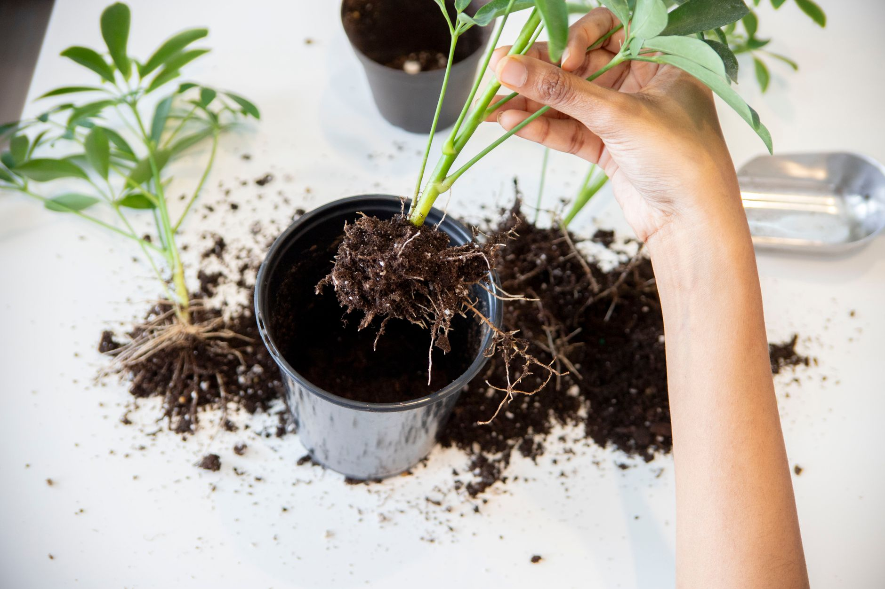

The first cold snap that sends the furnace or space heaters into regular use is also the moment a lot of houseplants quietly start to struggle, and it has nothing to do with watering or light. Heated indoor air is dramatically drier than the air most tropical houseplants evolved in, and that gap only widens as the season goes on. The fix isn't complicated, but it does mean going beyond the watering can — humidity is a separate variable, and once you know what to look for and which tools actually move the needle, it's one of the easier winter plant problems to solve.

## Why Heating Season Is So Hard on Humidity

Cold outdoor air holds very little moisture to begin with, and heating that air indoors to a comfortable temperature drops its relative humidity even further without adding any actual water vapor to it. A home that sits at a reasonably comfortable 30-40% relative humidity in summer can easily fall into the teens once the heat is running steadily, which is far below the 40-60% range that most common tropical houseplants — pothos, calatheas, ferns, and similar — are adapted to in their native environments. This isn't a one-time dip either; it's a sustained condition that lasts as long as the heating season does, which is exactly why the damage shows up gradually over weeks rather than all at once.

## Recognizing a Humidity Problem (and Ruling Out Others)

Low humidity has a fairly distinct signature once you know it: dry, crisp, brown edges and tips on leaves, especially on plants with thin or delicate foliage like ferns, calatheas, and prayer plants. Crucially, the browning tends to be crisp and papery rather than soft or mushy, and it usually starts right at the leaf margin rather than spreading in blotches across the leaf. That distinction matters because both underwatering and overwatering can also cause leaf damage, and treating a humidity problem as a watering problem just compounds the issue. If the soil is moist and the plant is still developing dry, crispy edges, look at humidity before you touch the watering schedule. Curling leaf edges and slowed growth on humidity-loving plants are other common tells, though those overlap more with light and temperature issues, so they're less definitive on their own.

## Grouping Plants and Pebble Trays

Plants constantly release moisture into the air around them through transpiration, so clustering several plants close together raises the humidity in that immediate pocket of air more than any single plant could manage alone — it's a cheap, no-equipment way to create a noticeably more humid microclimate on a windowsill or plant shelf. Pebble trays work on a related principle: a shallow tray filled with pebbles and water, with pots sitting on top of the pebbles rather than in the water itself, lets water evaporate up around the plant as it sits there. The effect from a single tray is modest and localized, so it's best treated as a supplement for one or two plants on a shelf rather than a whole-room solution, but it costs almost nothing and requires no maintenance beyond topping off the water.

## Humidifiers: The Tool That Actually Works at Scale

For a real, room-wide humidity increase, a humidifier beats every DIY trick by a wide margin, because it's the only option that adds meaningful moisture to the whole volume of air rather than a small pocket around individual pots. A basic cool-mist humidifier sized for the room (not the whole house) run for several hours a day near a cluster of humidity-sensitive plants will do more for them than pebble trays and misting combined. Placement matters: keep it a few feet from the plants themselves rather than aimed directly at foliage, since constant direct dampness on leaves can invite fungal issues even while it solves the dryness problem. A hygrometer — a small, inexpensive humidity gauge — takes the guesswork out of this entirely and lets you actually see when you're in that 40-60% range instead of estimating from how the plants look.

## What Doesn't Work as Well as People Think

Misting gets recommended constantly, but its effect is real and almost immediately gone — the moisture evaporates off the leaf surface within minutes, doing little for the surrounding air's actual humidity level over the course of a day. It's not useless as an occasional supplement, but it's not a substitute for one of the methods above, no matter how often it's repeated. Keeping plants right next to a heating vent or radiator is another common mistake, since that spot gets blasted with the hottest, driest air in the room on top of whatever the ambient humidity already is — moving humidity-sensitive plants a few feet away from active vents helps as much as any humidity-boosting step you could add on top.

## Not Every Plant Needs the Extra Effort

Before rearranging a room around humidity, it's worth sorting plants by how much they actually care. Ferns, calatheas, prayer plants, and other plants from consistently humid tropical understories are the ones that show damage fastest and benefit most from intervention. Succulents, cacti, snake plants, and ZZ plants, by contrast, come from arid or seasonally dry environments and tolerate low winter humidity just fine without any extra help — running a humidifier for their benefit is effort spent where it isn't needed. Grouping your more sensitive plants together, near a humidifier or pebble tray, and leaving the hardier ones on their own is a more efficient use of the tools above than trying to raise humidity uniformly across an entire room.
