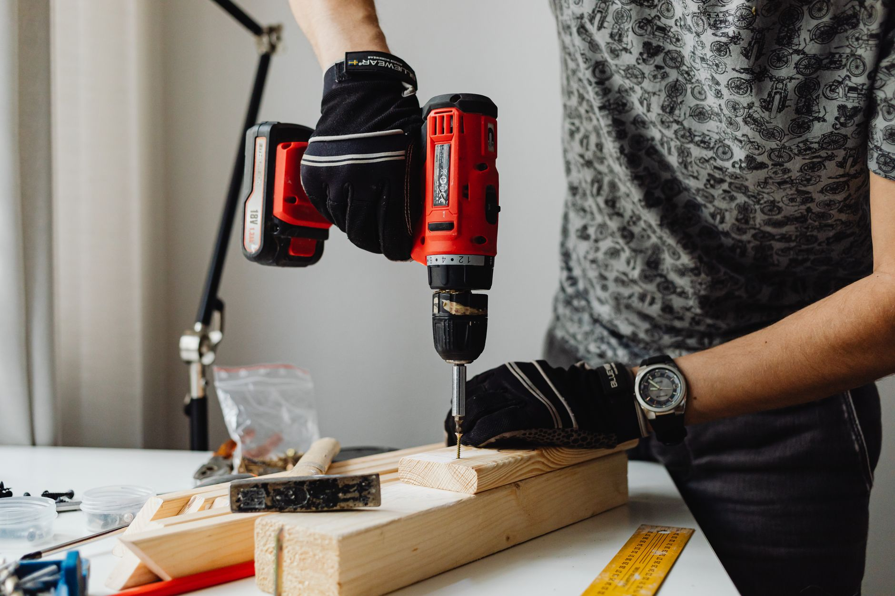

A snow blower is one of the few tools judged entirely on the worst day of the year. It sits idle for ten months and still has to stand between you and a shoveled-out driveway before work, so the wrong size or type shows up exactly when you can least afford it. The category splits along two lines — how it clears snow (single-stage, two-stage or three-stage) and what powers it (gas, corded electric or battery) — and matching both to your driveway, climate and physical limits matters more than any single spec on the box. This guide compares types by how they're engineered and what manufacturers publish, not hands-on testing of specific models, so you can narrow the field before you shop.

**Quick answer:** A single-stage electric or gas blower suits a paved driveway under about 8 inches of light snow and a surface area under roughly 1,500 square feet. A two-stage gas blower handles longer or gravel driveways, heavier snow and drifts up to around 18–20 inches. A three-stage gas blower adds a second accelerating auger for icy, compacted or very heavy snow on large properties. Battery models now cover small-to-midsize single-stage jobs quietly and without fuel, but still lag gas for sustained heavy snowfall. Match clearing width and engine or motor power to your driveway's width and your region's typical snowfall, not the biggest number on the shelf.

## How Clearing Stages Actually Differ

The "stage" number describes the mechanism that moves snow into the discharge chute, and it's the single biggest factor in what a machine can handle.

| | Single-stage | Two-stage | Three-stage |
|---|---|---|---|
| **How it works** | A single rubber-edged auger scoops snow and throws it directly out the chute | An auger breaks up and feeds snow to a separate high-speed impeller, which throws it | Adds an accelerator auger ahead of the impeller to shatter ice and compacted snow before it reaches the impeller |
| **Touches pavement?** | Yes, the auger makes contact with the surface | No, it floats above the surface | No |
| **Best surface** | Smooth pavement or concrete only | Pavement, gravel, grass — anything, since it doesn't scrape the surface | Same as two-stage, plus icy or heavily compacted snow |
| **Snow depth** | Up to about 8 inches, light and fluffy | Up to about 18–20 inches, including wet or heavy snow | Handles the deepest, iciest conditions fastest |
| **Typical power** | 15cc–20cc gas engine or electric motor | 200cc–300cc+ gas engine | 300cc+ gas engine |
| **Weight and storage** | Light, easy to store | Heavier, needs more garage space | Heaviest, largest footprint |

The surface-contact difference matters most. A single-stage auger rides directly on the ground, fine on smooth concrete but prone to chewing into gravel, pavers or an uneven lawn edge and throwing debris along with the snow. A two- or three-stage machine's impeller housing floats on skid shoes above the surface, so it clears gravel without picking up stones.

## Choosing a Power Source: Gas, Corded, or Battery

| | Gas | Corded electric | Battery (cordless) |
|---|---|---|---|
| **Power ceiling** | Highest; only option for two- and three-stage | Limited to single-stage machines | Growing, now covers most single-stage and some light two-stage models |
| **Runtime** | Unlimited with fuel | Unlimited, tied to the cord | Typically 30–45 minutes per battery at moderate snow depth |
| **Start-up** | Pull-start or electric start; can be stubborn in deep cold | Instant, plug and go | Instant |
| **Noise** | Loud | Moderate | Moderate, quieter than gas |
| **Maintenance** | Fuel, oil changes, spark plug, carburetor care, off-season stabilizing | Almost none | Battery care and storage, little else |
| **Cord/range limit** | None | Limited to cord length, awkward around parked cars | None |
| **Best for** | Long driveways, heavy snow, gravel or icy surfaces | Short, open driveways near an outlet | Small-to-midsize paved driveways, quieter neighborhoods |

Gas remains the only realistic choice once you need two-stage or three-stage power, since no current battery platform matches a 300cc engine for sustained output in deep or wet snow. For a shorter driveway with light-to-moderate snowfall, a battery single-stage model skips the fuel, pull-starting and winterizing hassle — the same gas-vs-battery trade-off we cover in our [chainsaw buying guide](/blog/chainsaw-buying-guide/), where gas still wins on sustained power but battery tools have closed the gap for lighter jobs. Corded electric shares the same cord-length limits as a [corded leaf blower](/blog/leaf-blower-buying-guide/): fine for a small, open driveway near an outlet, awkward anywhere you'd need to cross a parked car or long walkway.

## Sizing a Blower to Your Driveway and Climate

Two numbers decide the size you need: typical snowfall per storm, and how much surface you have to clear.

| Your situation | Recommended type |
|---|---|
| Short/narrow paved driveway, under 8 in. average snowfall | Single-stage electric or small gas |
| Medium paved driveway (2-car, moderate length), 8–16 in. snowfall | Two-stage gas, clearing width 24–26 in. |
| Long or wide driveway, gravel surface, or 16+ in. snowfall | Two-stage gas, clearing width 28–30 in., or three-stage |
| Rural property, long driveway, frequent ice or heavy wet snow | Three-stage gas, clearing width 30+ in. |

**Clearing width** (how wide a path the machine cuts per pass) determines how many passes a driveway takes, which matters as much as raw power when clearing before work. A narrow 20-inch single-stage machine might need two or three passes across a two-car driveway; a 28-inch two-stage machine often clears it in one or two. **Intake height** matters separately — a machine rated for 12 inches will struggle in a 20-inch drift even with a generous clearing width, so check both numbers.

If your area gets frequent heavy, wet "concrete" snow rather than light powder, size up a level from the depth chart above; wet snow is far harder to move than the same depth of dry powder.

## Features Worth Paying For

- **Power steering or trigger-controlled auger drive:** On wider two-stage machines, lets one hand turn the machine instead of wrestling the chassis at row's end. Worth it on anything 28 inches or wider.
- **Heated grips:** A genuine comfort upgrade for long sessions in subzero temperatures, not a gimmick.
- **Electric chute and deflector control:** Aims the discharge without stopping to reach the chute by hand, useful when redirecting snow away from a car mid-pass.
- **Track drive vs. wheels:** Tracks grip better on ice, slopes and deep snow but cost more and turn less nimbly on flat, paved surfaces.
- **Electric start:** On gas machines, removes the cold-engine pull-start struggle that's the most common reason a blower won't cooperate when you need it.
- **Headlight:** Genuinely useful for early-morning or after-dark clearing in winter's short daylight hours.

## Decision Guide: Which One Should You Buy

Work through these in order; the first one that fits your situation usually points to the right machine.

1. **Is your surface gravel, pavers, or an uneven lawn edge?** Rule out single-stage — the auger will scrape and throw debris. Go two-stage or three-stage.
2. **Does your driveway regularly get more than 12–16 inches per storm, or heavy wet snow?** Single-stage can't keep up; go two-stage, and consider three-stage if ice is common too.
3. **Is your driveway short, paved, and in a light-snowfall region?** A single-stage electric model is lighter, cheaper, needs no fuel, and easier to store — don't overbuy here.
4. **Do you have a long driveway or a specific time each morning to clear by?** Prioritize clearing width and electric start over raw engine size; a wider path in fewer passes often beats a narrower, more powerful machine.
5. **Is storage space tight, or do you want to avoid small-engine maintenance?** A battery single-stage model trades some power ceiling for simplicity, if your snowfall and surface allow it.

Also weigh how often you'll use it — a machine that only comes out two or three times a winter doesn't need the investment of one running after every storm in a heavy-snow region.

## Common Mistakes

| Mistake | Why it backfires | Better approach |
|---|---|---|
| Buying single-stage for a gravel or paver driveway | The auger scrapes the surface and throws stones with the snow | Choose two-stage or three-stage, which float on skid shoes |
| Choosing by engine size alone | A high-cc engine on a narrow chute still takes many passes | Balance clearing width and intake height against engine power |
| Skipping fuel stabilizer at season's end | Stale gas gums up the carburetor, a leading reason blowers won't start | Run the tank dry or add stabilizer before storage, per the manual |
| Clearing wet, heavy snow on a light single-stage machine | Overloads the auger and motor, risking stalls or belt damage | Size up to two-stage for regularly wet or heavy snowfall |
| Reaching into a clogged chute by hand | A leading cause of serious injuries, even with the engine off, from stored energy in the impeller | Always use the clearing tool that comes with the machine |
| Ignoring skid shoe height adjustment | Scrapes bare pavement (gravel pickup) or leaves snow behind | Adjust skid shoes each season: lower for packed snow, higher for gravel |

## Maintenance and Off-Season Storage

- **Gas models:** Change the oil per the manual's interval, check the spark plug yearly, and run the tank dry or add fuel stabilizer before off-season storage — stale gas is the top reason gas equipment won't start.
- **Belts and shear pins:** Two- and three-stage augers use shear pins designed to break before the gearbox does if the auger hits something solid; keep spares on hand.
- **Battery models:** Store batteries indoors at room temperature, not an unheated garage; cold reduces both runtime and lifespan.
- **Before the season starts:** Start the machine once in fall, so a dead battery or stale fuel is a driveway problem, not a 6 a.m. surprise — a good moment to also check your [gutters](/blog/how-to-clean-gutters-safely/), since both jobs cluster in the same few weeks.
- **After each use:** Clear packed snow from the chute and auger housing so it doesn't freeze solid overnight.

## Safety Notes

- **Never clear a clogged chute with your hand**, even with the engine stopped — the impeller can retain enough stored energy to injure you. Use the clearing tool.
- **Keep hands and feet away from moving parts** while running, and disengage the auger before walking away.
- **Clear only in daylight or with the headlight**, and watch for buried obstacles like hoses or low curbs that can jam or damage the auger.
- **Gas models need outdoor-only operation**, same as any small engine, due to carbon monoxide; never run one in a closed garage.
- **If a driveway regularly needs clearing you can't manage safely** — a steep slope, a health condition, or snowfall beyond any residential machine — a snow removal service is a reasonable call, not a failure to plan ahead.

If winter storms in your area also tend to knock out power, it's worth planning both at once; our [portable generator buying guide](/blog/portable-generator-buying-guide/) covers sizing a backup power source the same way — around your actual needs, not the biggest unit available.

## FAQ

### Do I need two-stage or is single-stage enough?

It comes down to your surface and typical snowfall, not preference. Single-stage works well on a smooth, paved driveway with light snow under about 8 inches per storm. If your surface is gravel, pavers or uneven ground, or storms regularly drop more than that, a two-stage machine clears it without scraping the surface or stalling.

### Are battery-powered snow blowers actually good enough?

For small-to-midsize paved driveways in regions with moderate snowfall, yes — modern battery single-stage models clear snow effectively and skip the fuel and starting hassle. They're not yet a substitute for a two-stage gas machine on a long driveway or in a heavy-snow region, where sustained power and runtime still favor gas.

### What clearing width do I actually need?

Match it to your driveway's width and how fast you need it cleared, not just snow depth. A single-car driveway is fine with 20–22 inches; a standard two-car driveway benefits from 24–26 inches; longer or wider driveways where speed matters most do best with 28 inches or more.

### How do I stop a gas snow blower from refusing to start each fall?

Stale fuel left in the tank and carburetor over the off-season is the most common cause. Either run the engine until the tank is empty at the end of winter, or add fuel stabilizer to a full tank before storage, and start the machine once in early fall to confirm it runs.
